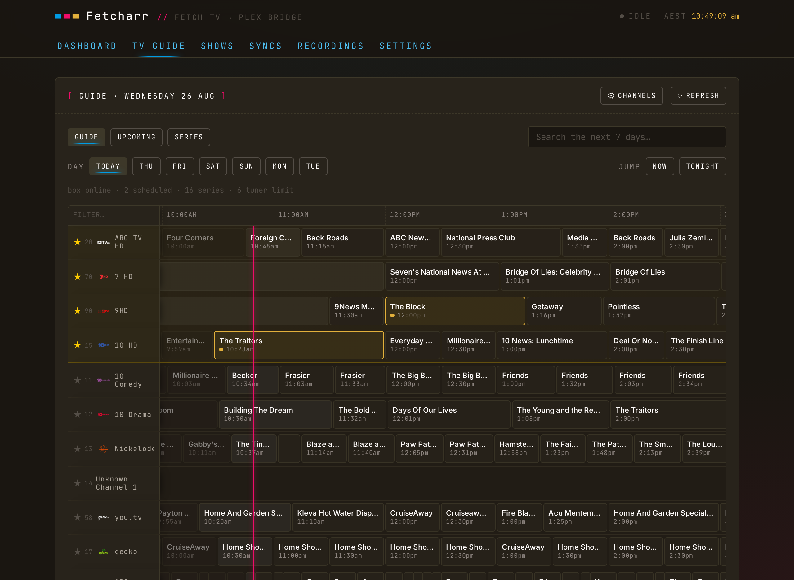
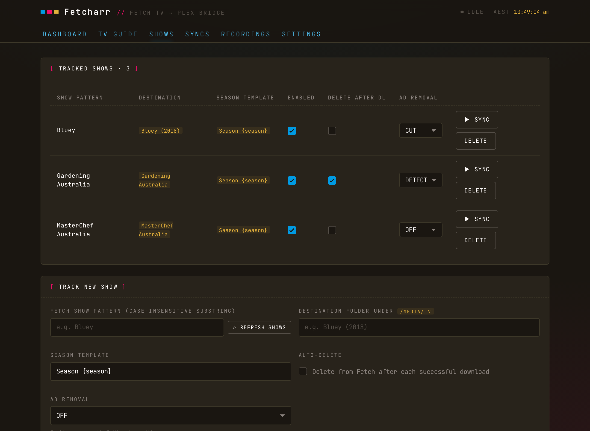
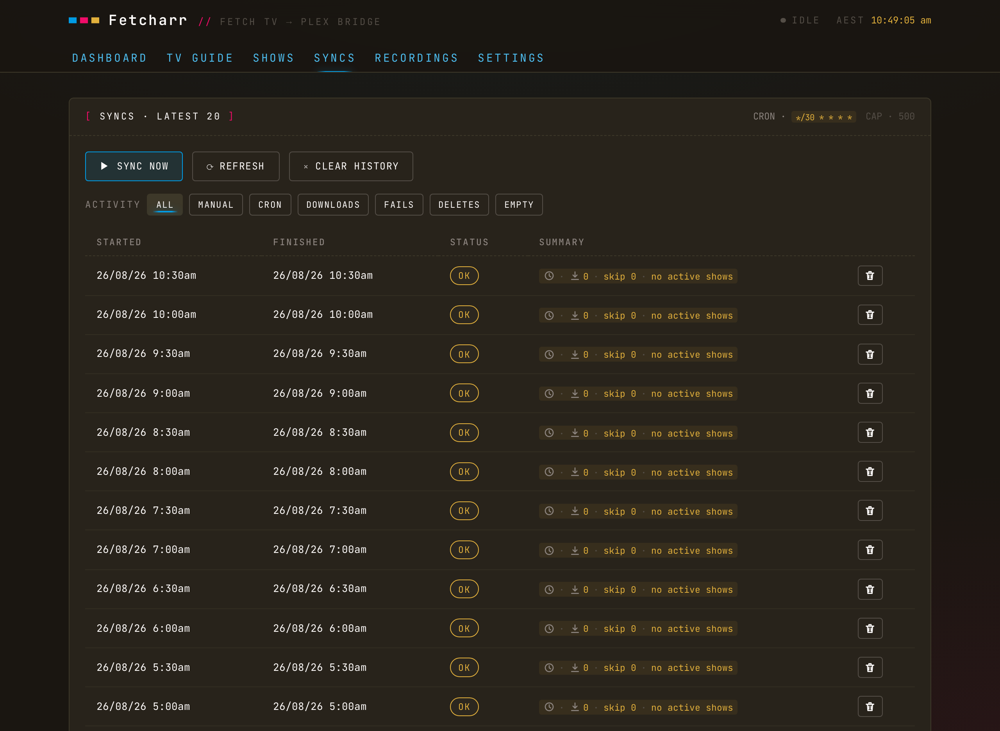
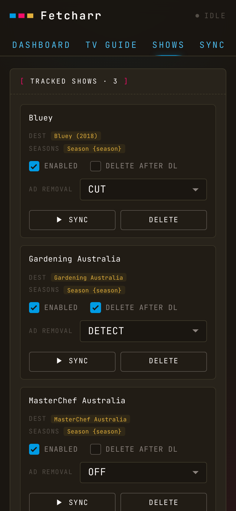
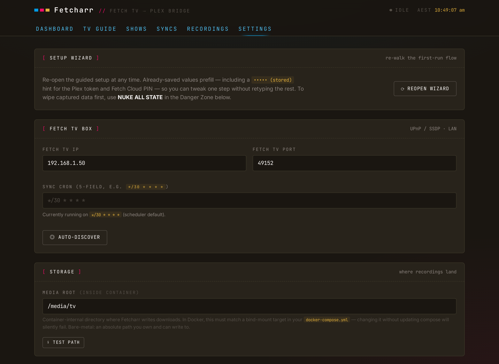

<p align="center">
  
</p>

<p align="center">
  <strong>Sync TVHeadend recordings into Plex.</strong><br/>
  A self-hosted bridge for free-to-air TV, recorded with a TVHeadend-compatible tuner.
</p>

<p align="center">
  
  
  
  
  
  <a href="https://furey.github.io/freetvarr/"></a>
</p>

<p align="center">
  <a href="https://furey.github.io/freetvarr/"><strong>Read the documentation →</strong></a>
</p>

## Contents

- [Screenshots](#screenshots)
- [What Freetvarr is](#what-freetvarr-is)
- [What Freetvarr isn't](#what-freetvarr-isnt)
- [Features](#features)
- [Prerequisites](#prerequisites)
- [Quick start](#quick-start)
- [Configuration](#configuration)
- [Security](#security)
- [Technical deep dive](#technical-deep-dive)
- [Troubleshooting](#troubleshooting)
- [Disclaimer](#disclaimer)
- [Contributing](#contributing)
- [Support](#support)
- [Licence](#licence)

## Screenshots

> [!NOTE]<br>
> Fresh captures are pending. The shots below are from the previous Fetch TV build, so the layout is current but the Fetch-specific labels are not.

<p align="center">
  
  <br/><em>Dashboard</em>
</p>

<p align="center">
  
  <br/><em>TV Guide</em>
</p>

<p align="center">
  
  <br/><em>Shows</em>
</p>

<p align="center">
  
  <br/><em>Recordings</em>
</p>

<p align="center">
  
  <br/><em>Syncs</em>
</p>

<p align="center">
  
  
  
  <br/><em>Mobile</em>
</p>

## What Freetvarr is

TVHeadend records free-to-air TV, then the files sit in its recordings folder with names Plex can't read. **Freetvarr** watches TVHeadend on your LAN, picks up new episodes of the shows you mark to follow, files them into your Plex TV library under names Plex understands, pokes Plex to scan, and optionally removes the TVHeadend copy once Plex confirms the file.

If your media stack is tuner → TVHeadend → Plex, Freetvarr is the automation in between: schedule a series from its built-in TV Guide, and the episodes turn up in Plex named and foldered. Any TVHeadend-compatible tuner counts: a network tuner such as an HDHomeRun, a USB DVB stick, a PCIe card, SAT>IP, or IPTV.

It's a fork of [Fetcharr](https://github.com/furey/fetcharr) with the recorder replaced. Fetch TV's Gen 3 Extended Service Levy made a Fetch-bound tool a dead end; a tuner you own and a free guide cost nothing per year. See [Migrating from Fetch](https://furey.github.io/freetvarr/guide/migrating-from-fetch).

## Where it works

Everywhere TVHeadend works. Freetvarr talks only to TVHeadend's HTTP API and the recordings folder, so the broadcast standard is TVHeadend's problem: DVB-T/T2 (Australia, UK, Europe, New Zealand), DVB-C and DVB-S, ATSC (US and Canada), ISDB-T. Three things differ by country and all three are set up in TVHeadend, not here: the tuner model (a DVB-T tuner in Australia or the UK, an ATSC one in the US), the guide source (a free XMLTV feed in Australia and New Zealand, over-the-air Freeview EIT in the UK, Schedules Direct in the US), and the mux scan list. The docs walk through an Australian setup because that is where the author lives. Every Australian value in them is an example: swap the timezone, the mux list, the guide source, and the tuner model for your own region's. The bundled `comskip.ini` and the HD/SD channel aliases in the guide are tuned for Australian channels but do no harm elsewhere.

Tested with an HDHomeRun Flex Quatro; the [hardware guide](https://furey.github.io/freetvarr/guide/hardware) says why the author recommends it and what else works.

## Why not just TVHeadend

TVHeadend on its own covers most of the job. Its web UI has the guide, one-off and series recording with padding and duplicate detection, and a filename template that can write Plex-readable paths (`$t/Season $s/$t - S$sE$e.$x`) straight into the library folder; its DVR post-processor hook can run a script that calls Plex's refresh URL or comskip. If that is enough, use it and skip Freetvarr.

Freetvarr adds the parts TVHeadend leaves to you: a phone-friendly guide and dashboard, follow-a-show with fuzzy matching to the folders Plex already has, the Plex refresh and delete-after-confirm loop, the comskip detect/cut pipeline with a verified swap and `.orig` rollback, live progress, and a sync history you can read. It is a convenience layer on TVHeadend, not a replacement for it.

## What Freetvarr isn't

- ❌ **An indexer integration** (Sonarr / Radarr / Prowlarr): Freetvarr works with the recordings TVHeadend has made, and its TV Guide schedules what TVHeadend records next. It doesn't search the internet for content.
- ❌ **A tuner:** TVHeadend drives the hardware, scans the muxes, and writes the files. Freetvarr talks to TVHeadend's HTTP API and never touches the tuner.
- ❌ **Authenticated:** designed for a home network you trust. CSRF protection, rate limiting, and a strict content-security policy are in place, but there's no login, so anyone who can reach it can change its settings. Don't expose it to the internet (see [Security](#security)).
- ❌ **A converter:** files arrive from TVHeadend as `.ts` (the raw broadcast format) and stay `.ts`; Freetvarr never re-encodes them. The optional ad-cutting copies the video across untouched, so there's no quality loss and no change of format. Add Tdarr or similar afterwards if you need `.mkv`.
- ❌ **A notifier:** no Discord / ntfy / push integration.

> [!IMPORTANT]<br>
> Tested against TVHeadend `4.3` fed by an HDHomeRun Flex Quatro, with Plex Media Server. Other tuners and TVHeadend versions are unverified.

## Features

- **TV Guide**: a 7-day programme guide in the browser; schedule, cancel, and series-record in TVHeadend (with padding and episodes-to-keep options), search the week, pin and reorder favourite channels, and see what's on now from the dashboard.
- **Series recording as autorec rules**: a series becomes one TVHeadend autorec rule matching title plus channel, with TVHeadend's own duplicate detection by episode number and `2`/`10` minute padding by default, because free-to-air broadcasts run late.
- **First-run wizard**: walks TVHeadend → storage → Plex. Re-openable from Settings; previously-saved values prefill.
- **Per-show follow**: pick a show TVHeadend records, match it by name to an existing folder under your media root (even when the names aren't identical), and set a season template.
- **Hardlink imports**: the recording is already on disk, so the import is a hardlink when the recordings folder and the media library share a filesystem, and a copy when they don't. No download, no second copy of a 3 GB transport stream.
- **Plex-ready filenames**: `Show - S01E02 - Title.ts`, or `Show - YYYY-MM-DD - Title.ts` when the guide gave no episode number.
- **Short-file detection**: an import more than `1 MB` short of what TVHeadend reported stays `partial`, and the next sync redoes it.
- **Scheduled + manual sync**: checks TVHeadend on a schedule you set (a cron expression), plus on-demand Sync now for everything or a single show.
- **Plex integration**: section refresh after every sync that imported something, plus a Refresh Plex now button.
- **Delete-from-TVHeadend that works**: one `dvr/entry/remove` call drops the entry and the file, gated on Plex confirming its copy. No cloud relay, no handshake, no retry loop.
- **Optional ad removal**: ad detection with comskip, a detect-only mode for checking accuracy, cutting that copies the video across untouched (no re-encode), and a `.orig` backup of every cut file. Off by default; detection accuracy on free-to-air varies by channel, so try detect mode before trusting cuts. See [`docs/DEEP_DIVE.md`](docs/DEEP_DIVE.md#ad-removal).
- **Live operation progress**: copies, ad scans, and cuts show inline in the Recordings tab (a copy bar with speed and time left, a scan bar that counts down from an estimate, a cut segment counter); the list refreshes every 2 s while anything's active instead of the idle 60 s. See [`docs/DEEP_DIVE.md`](docs/DEEP_DIVE.md#live-progress-indicators).
- **Self-housekeeping**: sync history trims itself to the latest 500 rows; recording rows drop off 30 days after the TVHeadend copy is deleted.
- **Timezone-aware UI**: the container's `TZ` carries through to the browser, so timestamps show in that zone whatever device hits the page.
- **Phone-friendly UI**: on a narrow screen every view rearranges (tables become cards, filters become swipeable rows of buttons, and touch targets meet Apple's 44 pt guideline), so checking a sync from the couch works as well as from a desk.
- **Danger Zone**: one-click `NUKE ALL STATE` reset back to the welcome wizard. DB only; imported media files untouched.
- **Authless LAN service**: SQLite-backed, single Docker container, no external runtime dependencies once configured.

## Prerequisites

- A **TVHeadend-compatible tuner**, matched to your broadcast standard: a network tuner, a USB DVB stick, a PCIe card, SAT>IP, or IPTV. The [hardware guide](https://furey.github.io/freetvarr/guide/hardware) covers the choice. USB tuners don't work on a Synology or QNAP NAS, whose kernels ship no DVB drivers.
- A **working TVHeadend** with channels scanned, an XMLTV guide loaded, and a user holding admin, streaming, and DVR rights. The [TVHeadend guide](https://furey.github.io/freetvarr/guide/tvheadend) walks all of it.
- **Docker + Docker Compose** on the host running both.
- **The same recordings folder mounted into both containers**, so Freetvarr can read what TVHeadend wrote.
- **Plex Media Server** is optional; Freetvarr runs fine without it, you just won't get the automatic Plex library refresh after a sync.

## Quick start

### 1. Get the code

```sh
git clone https://github.com/furey/freetvarr
cd freetvarr
```

### 2. Configure

Copy `docker-compose.example.yml` to `docker-compose.yml`, then create a `.env` alongside it with your host paths:

```env
CONFIG_PATH=/path/to/your/config
DATA_PATH=/path/to/your/data
CSRF_SECRET=paste-openssl-rand-hex-32
TZ=Australia/Sydney          # example; use your own IANA zone
PUID=1000
PGID=1000
FREETVARR_PORT=8124

# Optional: only if Plex runs on this host and you want the Auto-detect token
# button. Leave it out entirely if not (the mount defaults to a no-op).
# PLEX_PREFS_PATH=/path/to/Plex/Preferences.xml
```

`CONFIG_PATH`, `DATA_PATH`, and `CSRF_SECRET` are required; compose stops with a clear message if any is missing rather than starting with broken mounts.

The compose file defines two services, `tvheadend` and `freetvarr`. They share `${DATA_PATH}/recordings`, which is the whole point: TVHeadend writes a recording there, Freetvarr picks it up from the same folder. Give both the same `PUID`/`PGID`.

### 3. Start it

```sh
docker compose up -d
docker compose logs -f
```

> [!IMPORTANT]<br>
> The example compose uses `network_mode: host` for both services. TVHeadend discovers a network tuner such as an HDHomeRun by broadcasting on the local network, and those broadcasts don't cross Docker's own private bridge network. With host networking there's no `ports:` mapping; each service binds straight onto the host.

### 4. Set up TVHeadend

Browse to `http://<host-ip>:9981` and work through the [TVHeadend guide](https://furey.github.io/freetvarr/guide/tvheadend): first-run wizard, add the HDHomeRun or your own tuner's adapter, scan the predefined muxes for your transmitter, map services to channels, load a free XMLTV guide for your region, set the recording path to `/recordings`, and make a user for Freetvarr.

Do this before step 5. Freetvarr can do nothing until TVHeadend has channels and a guide.

### 5. Run the Freetvarr wizard

Browse to `http://<host-ip>:8124`. The first visit opens a setup wizard that walks you through TVHeadend (the URL is auto-discovered by probing port `9981` on the host, plus the user you just made, with a TEST CONNECTION button), storage (with a TEST PATH button for each path), and Plex. You can change all of it later in Settings, and reopen the wizard from there whenever you like.

Mark shows to follow on the Shows tab and Freetvarr syncs them on the schedule you set.

### Updating

```sh
git pull
docker compose up -d --build freetvarr
```

This rebuilds the image and recreates the container only if the image actually changed. Your database is left alone, and any pending database updates (migrations) run automatically on the next start.

## Configuration

The TVHeadend URL and login, the Plex token, and the storage paths are runtime settings; configure them in the web UI, not via env. The `.env` next to your compose file only carries deploy-level knobs:

| Variable          | Purpose                                                                                                           |
| ----------------- | ----------------------------------------------------------------------------------------------------------------- |
| `CONFIG_PATH`     | Host folder for both containers' config; Freetvarr's database lives in `${CONFIG_PATH}/freetvarr`                 |
| `DATA_PATH`       | Host folder holding both `recordings/` (TVHeadend's output) and `media/tv` (your Plex TV library)                 |
| `PLEX_PREFS_PATH` | Optional. Path to Plex's `Preferences.xml`, used by the Auto-detect token button; omit if Plex is on another host |
| `CSRF_SECRET`     | 32+ random bytes (`openssl rand -hex 32`); required                                                               |
| `TZ`              | Your IANA timezone (e.g. `Australia/Sydney`); the UI renders all timestamps in it                                 |
| `PUID`/`PGID`     | UID/GID to run as; match the owner of your bind-mounted folders, and use the same pair for both services          |
| `FREETVARR_PORT`  | Host port to serve on (default `8124`)                                                                            |
| `TVH_URL`         | Optional. Fixes the address AUTO-DISCOVER TVHEADEND offers; omit to let Freetvarr probe port `9981` on the host |

Freetvarr keeps two settings for one folder: `recordings_root` is where it sees TVHeadend's files, and `tvh_recordings_path` is the path TVHeadend reports in the filenames it hands out. Mount the recordings folder at `/recordings` in both containers and the two are identical. The full environment reference, including the settings fallback chain, is in [`docs/DEEP_DIVE.md`](docs/DEEP_DIVE.md#full-environment-reference).

**Ad removal** is configured at runtime, not via env: turn it on in Settings → AD REMOVAL (off by default), then pick a per-show mode on the Shows tab. `DETECT` notes where the ad breaks are without touching the file; `CUT` removes them and keeps the original as `<file>.ts.orig` for a number of days you choose (default 7). Freetvarr ships a `comskip.ini` tuned for Australian free-to-air, the author's own channels; drop your own `comskip.ini` into the `/config` bind mount to override it.

<p align="center">
  
  <br/><em>Settings</em>
</p>

## Security

Freetvarr has no login; anyone who can reach the port can see everything and change settings, including the TVHeadend password it holds. CSRF protection, rate limiting, a strict CSP, and `noindex` headers are all in place, but the design assumes a home network you trust: don't port-forward or reverse-proxy it to the internet. Supply-chain hardening, the HTTP security headers, and the reasoning behind each measure are covered in [`docs/DEEP_DIVE.md`](docs/DEEP_DIVE.md#security-model); vulnerability reporting and accepted residual risks are in [SECURITY.md](SECURITY.md).

## Technical deep dive

Architecture diagrams, the TVHeadend API surface, the import state machine, the ad-removal pipeline, the full environment reference, Docker deployment, the security model, local development, and more are all in [`docs/DEEP_DIVE.md`](docs/DEEP_DIVE.md), also browsable on the [documentation site](https://furey.github.io/freetvarr/deep-dive).

## Troubleshooting

**TEST CONNECTION fails**

- Under host networking, neither container is on a Docker bridge network, so container names don't resolve. Use `http://<host-ip>:9981`, not `http://tvheadend:9981`.
- An HTTP `401` or `403` means TVHeadend rejected the credentials. Check the access entry has Admin, Streaming, and Video recorder rights, and check its position in the list; access entries are evaluated top to bottom.

**TVHeadend finds no tuner**

- The TVHeadend container has to run with host networking (the example compose already does this). It discovers a network tuner such as an HDHomeRun by broadcasting on the local network, and those broadcasts don't reach across Docker's own private network.
- On an HDHomeRun, check the tuner itself at `http://<hdhr-ip>/tuners.html`; that page is HDHomeRun-only. Nothing there is a power or aerial problem, not a TVHeadend one.
- On any other tuner, open TVHeadend's Configuration → DVB Inputs → TV adapters. An empty list means TVHeadend sees no tuner at all: check the USB passthrough, the driver, or the SAT>IP/IPTV settings.

**A recording came in as `skipped`**

- Either TVHeadend has no finished file yet (a recording in progress, and post-recording padding keeps it there for up to ten minutes after the programme ends), or it reported a path outside the recordings folder Freetvarr can see. The error text on the row says which.

**A recording shows `partial`**

- The imported file came up more than `1 MB` short of what TVHeadend reported. The next sync redoes the import. If it stays short, the source is short; check TVHeadend's own status for that entry, which usually reports data errors from a weak signal.

**Imports are slow**

- A hardlink import is instant. A progress bar means Freetvarr is copying, which means the recordings folder and the media library are on different filesystems. Put them on one filesystem and the copy becomes a link.

**Permission errors, or the TVHeadend file won't delete**

- Set `PUID`/`PGID` to match the owner of the bind-mounted host folders, and use the same pair for both services. Freetvarr hardlinks and deletes files TVHeadend created.

**The guide is empty or one day deep**

- Without an XMLTV feed you get only what the broadcast signal carries. Set one up; the [TVHeadend guide](https://furey.github.io/freetvarr/guide/tvheadend) covers a free Australian feed, a paid one, and the sources to use in other countries. Restart TVHeadend after installing a grabber script; it looks for grabbers at startup only.

**Other containers can't reach Freetvarr by name**

- A side-effect of host networking: Freetvarr isn't on any Docker bridge network. Reach it via the host's LAN IP and `FREETVARR_PORT` instead.

**Ad detection is cutting the wrong things (or missing breaks)**

- Ad detection is educated guessing, never perfect. Comskip's accuracy varies noticeably by channel (logo detection, silence thresholds, and break lengths all differ).
- Run the show in `DETECT` mode first and check the break counts and minutes it reports on the Recordings tab before switching to `CUT`. Scans work the CPU hard: budget ~30 minutes per 75-minute recording on a home NAS.
- Cuts land on the nearest keyframe, so a second or two either side of a break is normal.
- To tune detection, place your own `comskip.ini` in the `/config` bind mount; it overrides the bundled default, which is tuned for Australian channels. Every cut keeps a `<file>.ts.orig` backup for the retention window, so if a cut goes wrong you can rename the `.orig` back to recover it.

**Timestamps show the wrong time**

- Set `TZ` in your `.env` to your IANA timezone; the UI shows every timestamp in the container's zone, whatever device you're browsing from.

## Disclaimer

This project:

- Is licensed under the [GNU GPLv3 License](./LICENSE).
- Is not affiliated with or endorsed by SiliconDust, TVHeadend, or Plex.
- Began as a fork of [Fetcharr](https://github.com/furey/fetcharr), with the Fetch TV backend replaced by TVHeadend.
- Is written with the assistance of AI and may contain errors.
- Is intended for educational and experimental purposes only.
- Is provided as-is with no warranty; use at your own risk.

## Contributing

If you hit a problem or want to compare notes, start a thread in [Discussions](https://github.com/furey/freetvarr/discussions).

## Support

If you've found this project helpful consider supporting my work through:

[Buy Me a Coffee](https://www.buymeacoffee.com/furey) | [GitHub Sponsorship](https://github.com/sponsors/furey)

Your support helps me keep developing the project and adding new features.

## Licence

GPL-3.0-or-later. See [LICENSE](LICENSE).
