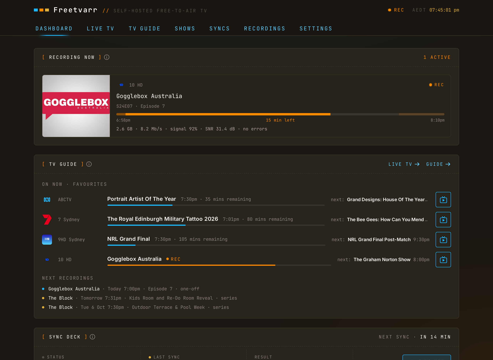
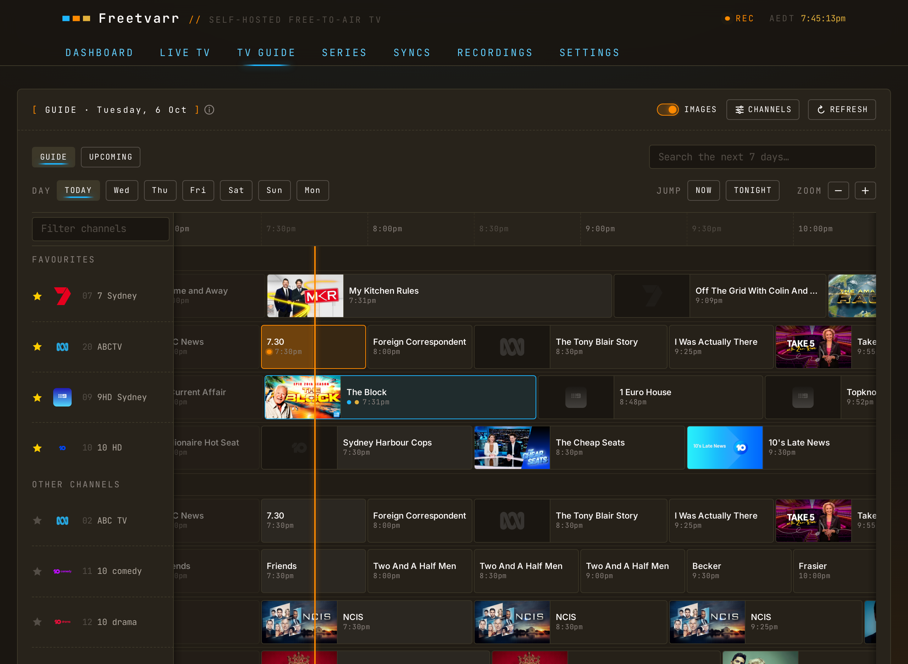
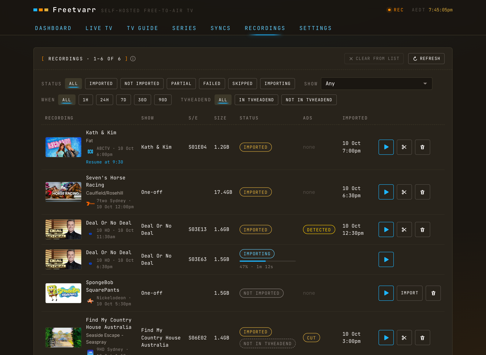
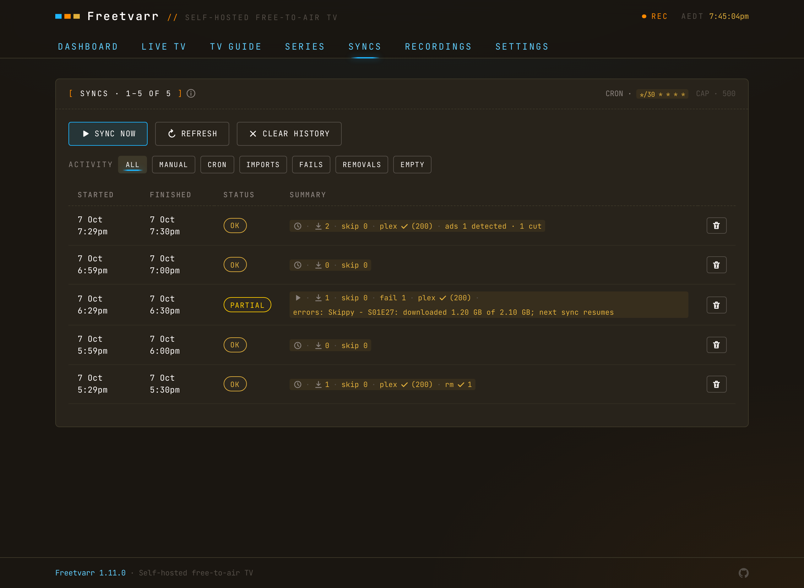
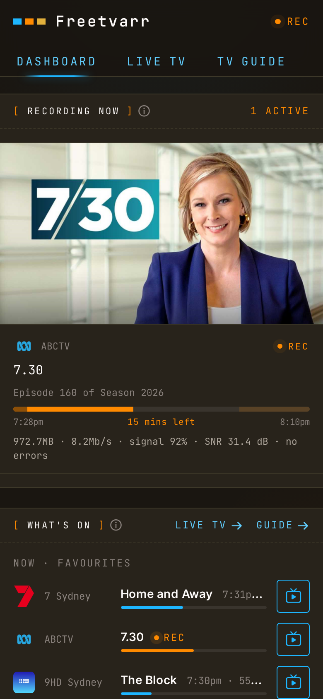
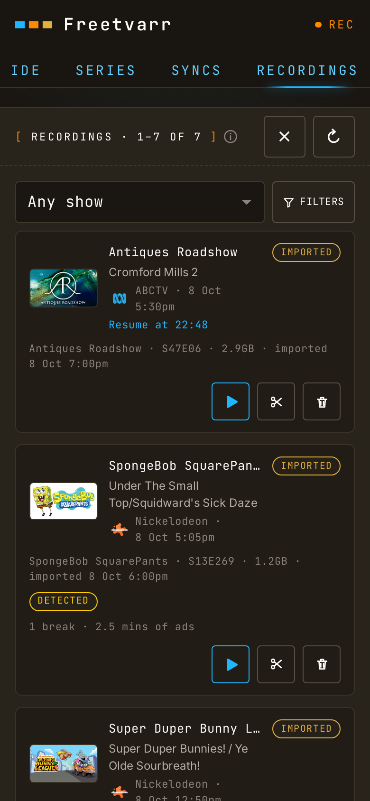
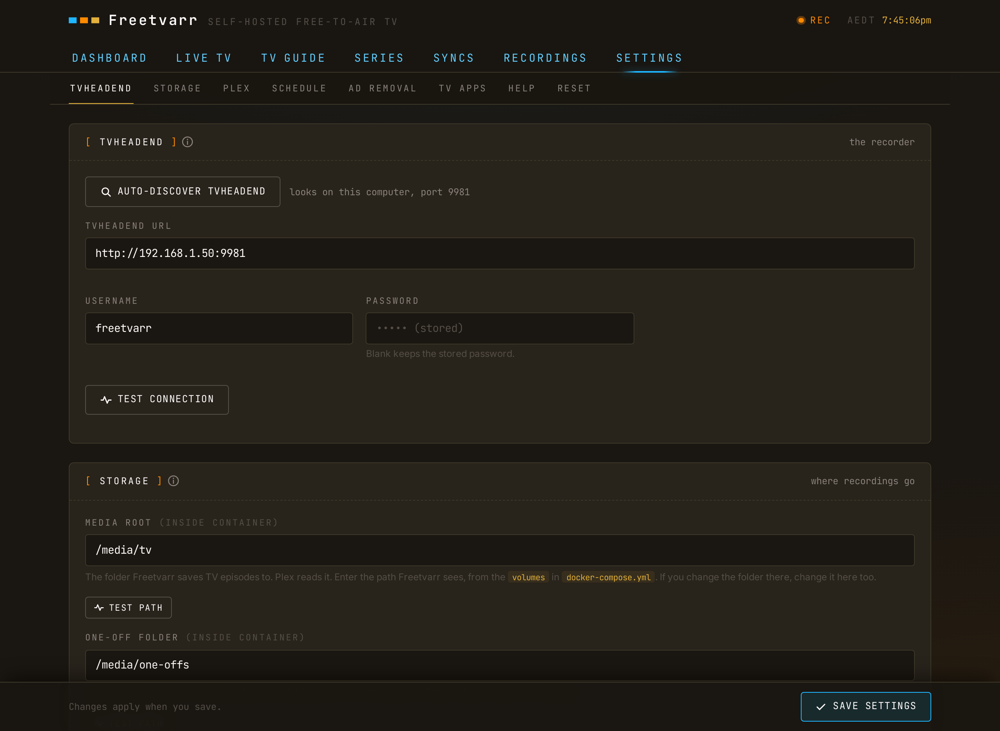

<p align="center">
  
</p>

<p align="center">
  <strong>Watch live TV in your browser. Sync TVHeadend recordings into Plex.</strong><br/>
  A self-hosted companion for TVHeadend and compatible tuner.
</p>

<p align="center">
  
  
  
  
  
  <a href="https://furey.github.io/freetvarr/"></a>
</p>

<p align="center">
  <a href="https://furey.github.io/freetvarr/"><strong>Read the documentation →</strong></a>
</p>

<p align="center">
  Leaving Fetch TV? See the <a href="https://furey.github.io/freetvarr/guide/leaving-fetch">step-by-step guide</a> to owning your setup before the levy.
</p>

<p align="center">
  Have a Plex Pass? Plex's own DVR may be all you need. See <a href="#why-not-just-plex-dvr">Why not just Plex DVR</a>.
</p>

## Contents

- [Screenshots](#screenshots)
- [What Freetvarr is](#what-freetvarr-is)
- [Where it works](#where-it-works)
- [Why not just TVHeadend](#why-not-just-tvheadend)
- [Why not just Plex DVR](#why-not-just-plex-dvr)
- [What Freetvarr isn't](#what-freetvarr-isnt)
- [Features](#features)
- [Prerequisites](#prerequisites)
- [Quick start](#quick-start)
- [Configuration](#configuration)
- [Security](#security)
- [Technical deep dive](#technical-deep-dive)
- [Troubleshooting](#troubleshooting)
- [Disclaimer](#disclaimer)
- [Contributing](#contributing)
- [Support](#support)
- [Licence](#licence)

## Screenshots

<p align="center">
  
  <br/><em>Dashboard</em>
</p>

<p align="center">
  
  <br/><em>Live TV</em>
</p>

<p align="center">
  
  <br/><em>Live TV player</em>
</p>

<p align="center">
  
  <br/><em>TV Guide</em>
</p>

<p align="center">
  
  <br/><em>Shows</em>
</p>

<p align="center">
  
  <br/><em>Recordings</em>
</p>

<p align="center">
  
  <br/><em>Syncs</em>
</p>

<p align="center">
  
  
  
  <br/><em>Mobile</em>
</p>

Video in the screenshots and demo: Big Buck Bunny, © Blender Foundation, CC BY 3.0.

## What Freetvarr is

TVHeadend records free-to-air TV into its recordings folder. By default it names each file after the programme title only, for example `The Block.ts`. Plex's TV library matches a file to an episode only when the name has a season and episode number (`S01E02`) or an air date. **Freetvarr** watches TVHeadend on your LAN, picks up every recording it finishes, files episodes of the shows you follow into your Plex TV library as `Show/Season 01/Show - S01E02.ts` (or by air date when the guide has no episode number), files one-offs such as a sports final into a separate folder, asks Plex to scan, and optionally removes the TVHeadend copy once Plex confirms the file.

It is also a TV app for your home network. Open the Live TV tab on a phone or a desktop and watch any channel in the browser, with now and next for every channel and your favourites first. Pause and rewind up to `30` minutes, then jump back to live.

If your media stack is tuner → TVHeadend → Plex, Freetvarr is the automation in between: schedule a series from its built-in TV Guide, and the episodes turn up in Plex named and foldered. Any TVHeadend-compatible tuner counts: a network tuner such as an HDHomeRun, a USB DVB stick, a PCIe card, SAT>IP, or IPTV.

It's a fork of [Fetcharr](https://github.com/furey/fetcharr) with the recorder replaced. When Fetch TV announced its Gen 3 Extended Service Levy, the author swapped Fetcharr's Fetch pieces for TVHeadend one at a time to get his new HDHomeRun working. Only after all that did he notice that his own Plex Pass already covered [Plex DVR](https://furey.github.io/freetvarr/guide/plex-dvr). Without a Plex Pass, a tuner you own and a free guide cost nothing per year. See [Leaving Fetch TV](https://furey.github.io/freetvarr/guide/leaving-fetch), and [From Fetcharr](https://furey.github.io/freetvarr/guide/from-fetcharr) if you ran Fetcharr.

## Where it works

Everywhere TVHeadend works. Freetvarr talks only to TVHeadend's HTTP API and the recordings folder, so TVHeadend handles the broadcast standard: DVB-T/T2 (Australia, UK, Europe, New Zealand), DVB-C and DVB-S, ATSC (US and Canada), ISDB-T. Three things differ by country and all three are set up in TVHeadend, not here: the tuner model (a DVB-T tuner in Australia or the UK, an ATSC one in the US), the guide source (a free XMLTV feed in Australia and New Zealand, over-the-air Freeview EIT in the UK, Schedules Direct in the US), and the mux scan list. The docs walk through an Australian setup because that is where the author lives. Every Australian value in them is an example: swap the timezone, the mux list, the guide source, and the tuner model for your own region's. The bundled `comskip.ini` and the HD/SD channel aliases in the guide are tuned for Australian channels but do no harm elsewhere.

Tested with an HDHomeRun Flex Quatro; the [hardware guide](https://furey.github.io/freetvarr/guide/hardware) says why the author recommends it and what else works.

## Why not just TVHeadend

TVHeadend on its own covers most of the job. Its web UI has the guide, one-off and series recording with padding and duplicate detection, and a filename template that can write Plex-readable paths (`$t/Season $s/$t - S$sE$e.$x`) straight into the library folder; its DVR post-processor hook can run a script that calls Plex's refresh URL or comskip. If that is enough, use it and skip Freetvarr.

Freetvarr adds the parts TVHeadend leaves to you: a phone-friendly guide and dashboard, follow-a-show with fuzzy matching to the folders Plex already has, the Plex refresh and delete-after-confirm loop, the comskip detect/cut pipeline with a verified swap and `.orig` rollback, live progress, and a sync history you can read. It is a convenience layer on TVHeadend, not a replacement for it.

## Why not just Plex DVR

If you already have a Plex Pass, Plex's own Live TV & DVR may be all you need, and that is a fine choice. It records from a network tuner such as an HDHomeRun straight into your Plex library, with series rules, padding, ad skipping, and live TV in every Plex app. In Australia it needs an XMLTV guide feed, such as [i.mjh.nz](https://i.mjh.nz/au/), because Plex has no built-in Australian guide.

If you don't have a Plex Pass, compare its price (`A$110` a year, or `A$1,190` lifetime, in October 2026) with a free setup. TVHeadend and Freetvarr cost nothing, keep recording when Plex changes, play live TV in any browser, and keep the Teletext captions Australian channels send. [Plex DVR instead](https://furey.github.io/freetvarr/guide/plex-dvr) has the full comparison and a setup guide.

## What Freetvarr isn't

- ❌ **An indexer integration** (Sonarr / Radarr / Prowlarr): Freetvarr works with the recordings TVHeadend has made, and its TV Guide schedules what TVHeadend records next. It doesn't search the internet for content.
- ❌ **A tuner:** TVHeadend drives the hardware, scans the muxes, and writes the files. Freetvarr talks to TVHeadend's HTTP API and never touches the tuner.
- ❌ **Authenticated:** designed for a home network you trust. CSRF protection, rate limiting, and a strict content-security policy are in place, but there's no login, so anyone who can reach it can change its settings. Don't expose it to the internet (see [Security](#security)).
- ❌ **A converter:** files arrive from TVHeadend as `.ts` (the raw broadcast format) and stay `.ts`; Freetvarr never re-encodes them (only the live TV player re-encodes, and only what it streams to the browser). The optional ad-cutting copies the video across untouched, so there's no quality loss and no change of format. Add Tdarr or similar afterwards if you need `.mkv`.
- ❌ **A notifier:** no Discord / ntfy / push integration.

> [!IMPORTANT]<br>
> Tested against TVHeadend `4.3` fed by an HDHomeRun Flex Quatro, with Plex Media Server. Other tuners and TVHeadend versions are unverified.

## Features

- **Live TV in the browser**: watch any channel on a phone or a desktop. Freetvarr checks for a free tuner first and warns when a recording will need it within the hour. Pause and rewind up to `30` minutes, and double-tap to skip on a phone. It converts channels a browser can't play, in hardware through VAAPI when the host has it. See [Live TV](https://furey.github.io/freetvarr/guide/live-tv#in-freetvarr).
- **TV Guide**: a 7-day programme guide. Schedule, cancel, and series-record in TVHeadend, search the week, and put your favourite channels first. Freetvarr keeps the programmes that already aired today (TVHeadend drops them), and each day runs on to 3 am so late-night viewing isn't cut off at midnight.
- **Recording Now panel**: the dashboard shows each active recording and its signal health, then tracks it through import, ad cutting, and the Plex refresh.
- **Programme images**: the guide and the dashboard show a programme's image when the XMLTV feed supplies one.
- **Series recording as autorec rules**: a series becomes one TVHeadend autorec rule matching title plus channel, with TVHeadend's own duplicate detection by episode number and `2`/`10` minute padding by default, because free-to-air broadcasts run late.
- **Doctor**: a read-only health check of TVHeadend, the guide, the folders, Plex, and live TV, with the fix and a docs link for each problem.
- **First-run wizard**: sets up TVHeadend, storage, and Plex. On a fresh TVHeadend it creates the admin and Freetvarr logins and closes TVHeadend's open access, with undo. You can reopen it from Settings.
- **Per-show follow**: pick a show TVHeadend records, match it by name to an existing folder under your media root (even when the names aren't identical), and set a season template.
- **One-off recordings**: a recording that matches no followed show, such as a final or a special, goes to its own folder for a separate Plex library. The RECORD dialog says where each recording will go, and can keep one out of the library.
- **Films**: with a movies folder set, a film with no show rule is filed as `Title (Year)` for a Movies library.
- **Recording playback**: play any finished recording in the browser player, with a seek bar and resume from where you stopped.
- **Saved artwork**: each recording keeps its programme image and channel logo, so the Recordings tab still shows them after the guide moves on.
- **Hardlink imports**: the recording is already on disk, so the import is a hardlink when Freetvarr sees the recordings folder and the media library through one mount, and a copy when it doesn't. A hardlink uses no extra disk space.
- **Plex-ready filenames**: `Show - S01E02 - Title.ts`, or `Show - YYYY-MM-DD - Title.ts` when the guide gave no episode number.
- **Short-file detection**: an import more than `1 MB` short of what TVHeadend reported stays `partial`, and the next sync redoes it.
- **Scheduled + manual sync**: checks TVHeadend on a schedule you set (a cron expression), plus on-demand Sync now for everything or a single show.
- **Plex integration**: section refresh after every sync that imported something, plus a Refresh Plex now button.
- **Remove after import**: once Plex confirms its copy, Freetvarr can delete the recording's file from TVHeadend.
- **Optional ad removal**: ad detection with comskip, a detect-only mode for checking accuracy, cutting that copies the video across untouched (no re-encode), and a `.orig` backup of every cut file. Off by default; detection accuracy on free-to-air varies by channel, so try detect mode before trusting cuts. See [`docs/DEEP_DIVE.md`](docs/DEEP_DIVE.md#ad-removal).
- **Live operation progress**: the Recordings tab shows the progress of each copy, ad scan, and cut. See [`docs/DEEP_DIVE.md`](docs/DEEP_DIVE.md#live-progress-indicators).
- **Self-housekeeping**: sync history trims itself to the latest 500 rows; recording rows drop off 30 days after the TVHeadend copy is deleted.
- **Timezone-aware UI**: the container's `TZ` carries through to the browser, so timestamps show in that zone whatever device hits the page.
- **Phone-friendly UI**: every view works on a phone.
- **About panel**: Settings lists the Freetvarr, TVHeadend, and Node versions for bug reports, and says when a newer Freetvarr release is out.
- **Danger Zone**: a reset in Settings that clears Freetvarr's database and returns to the setup wizard. Imported media files stay.
- **Authless LAN service**: SQLite-backed, single Docker container, no external runtime dependencies once configured.

## Prerequisites

- A **TVHeadend-compatible tuner**, matched to your broadcast standard: a network tuner, a USB DVB stick, a PCIe card, SAT>IP, or IPTV. The [hardware guide](https://furey.github.io/freetvarr/guide/hardware) covers the choice. USB tuners don't work on a Synology or QNAP NAS, whose kernels ship no DVB drivers.
- A **working TVHeadend** with channels scanned, an XMLTV guide loaded, and a user holding admin, streaming, and DVR rights. The [TVHeadend guide](https://furey.github.io/freetvarr/guide/tvheadend) walks all of it.
- **Docker + Docker Compose** on the host running both.
- **The same recordings folder mounted into both containers**, so Freetvarr can read what TVHeadend wrote.
- **Plex Media Server** is optional; Freetvarr runs fine without it, you just won't get the automatic Plex library refresh after a sync.

## Quick start

### 1. Get the code

```sh
git clone https://github.com/furey/freetvarr
cd freetvarr
```

### 2. Configure

Copy `docker-compose.example.yml` to `docker-compose.yml`, then create a `.env` alongside it with your host paths:

```env
CONFIG_PATH=/path/to/your/config
DATA_PATH=/path/to/your/data
CSRF_SECRET=paste-openssl-rand-hex-32
TZ=Australia/Sydney          # example; use your own IANA zone
PUID=1000
PGID=1000
FREETVARR_PORT=3733

# Optional: only if Plex runs on this host and you want the Auto-detect token
# button. Leave it out entirely if not (the mount defaults to a no-op).
# PLEX_PREFS_PATH=/path/to/Plex/Preferences.xml
```

`CONFIG_PATH`, `DATA_PATH`, and `CSRF_SECRET` are required; compose stops with a clear message if any is missing rather than starting with broken mounts.

The compose file defines two services, `tvheadend` and `freetvarr`. They share `${DATA_PATH}/recordings`: TVHeadend writes a recording there, and Freetvarr picks it up from the same folder. Freetvarr mounts the whole of `${DATA_PATH}` once, at `/data`; keep only `recordings/` and `media/` in it, because Freetvarr can write to all of it. Give both the same `PUID`/`PGID` (run `id` on the host to read them), and create the host folders owned by that pair before the first start; Docker creates a missing folder as `root`. [Getting started](https://furey.github.io/freetvarr/guide/getting-started#_2-configure) has the commands.

### 3. Start it

```sh
docker compose up -d
docker compose logs -f
```

> [!IMPORTANT]<br>
> The example compose uses `network_mode: host` for both services. TVHeadend discovers a network tuner such as an HDHomeRun by broadcasting on the local network, and those broadcasts don't cross Docker's own private bridge network. With host networking there's no `ports:` mapping; each service binds straight onto the host.

### 4. Set up TVHeadend

Browse to `http://<host-ip>:9981` and work through the [TVHeadend guide](https://furey.github.io/freetvarr/guide/tvheadend): first-run wizard, add your tuner, scan the predefined muxes for your transmitter, map services to channels, load and link an XMLTV guide for your region, set the recording path to `/recordings`, and make a user for Freetvarr (an access entry for the rights, plus a password entry).

Do this before step 5. Freetvarr can do nothing until TVHeadend has channels and a guide.

### 5. Run the Freetvarr wizard

Browse to `http://<host-ip>:3733`. The first visit opens a setup wizard for TVHeadend, storage, and Plex. Enter the TVHeadend user you just made and press TEST CONNECTION; the wizard does not continue until the connection works. You can change all of it later in Settings.

Freetvarr imports finished recordings on the schedule you set. Follow a show on the Shows tab, or press RECORD SERIES in the guide, to file its episodes into your TV library.

### Updating

```sh
git pull
docker compose up -d --build freetvarr
```

This rebuilds the image and recreates the container only if the image actually changed. Your database is left alone, and any pending database updates (migrations) run automatically on the next start.

## Configuration

The TVHeadend URL and login, the Plex token, and the storage paths are runtime settings; configure them in the web UI, not via env. The `.env` next to your compose file only carries deploy-level knobs:

| Variable          | Purpose                                                                                                           |
| ----------------- | ----------------------------------------------------------------------------------------------------------------- |
| `CONFIG_PATH`     | Host folder for both containers' config; Freetvarr's database lives in `${CONFIG_PATH}/freetvarr`                 |
| `DATA_PATH`       | Host folder holding `recordings/` (TVHeadend's output) and `media/` (your Plex TV library), and nothing else      |
| `PLEX_PREFS_PATH` | Optional. Path to Plex's `Preferences.xml`, used by the Auto-detect token button; omit if Plex is on another host |
| `CSRF_SECRET`     | 32+ random bytes (`openssl rand -hex 32`); required                                                               |
| `TZ`              | Your IANA timezone (e.g. `Australia/Sydney`); the UI renders all timestamps in it                                 |
| `PUID`/`PGID`     | UID/GID to run as; match the owner of your bind-mounted folders, and use the same pair for both services          |
| `FREETVARR_PORT`  | Host port to serve on (default `3733`)                                                                            |
| `TVH_URL`         | Optional. Fixes the address AUTO-DISCOVER TVHEADEND offers; omit to let Freetvarr probe port `9981` on the host   |

Freetvarr keeps two settings for one folder: `recordings_root` is where it sees TVHeadend's files, and `tvh_recordings_path` is the path TVHeadend reports in the filenames it hands out. In the example compose file, TVHeadend sees the folder at `/recordings` and Freetvarr at `/data/recordings`; Freetvarr rewrites the one prefix to the other. The full environment reference, including the settings fallback chain, is in [`docs/DEEP_DIVE.md`](docs/DEEP_DIVE.md#full-environment-reference).

**Ad removal** is configured at runtime, not via env: turn it on in Settings → AD REMOVAL (off by default), then pick a per-show mode on the Shows tab. `DETECT` notes where the ad breaks are without touching the file; `CUT` removes them and keeps the original as `<file>.ts.orig` for a number of days you choose (default 7). Freetvarr ships a `comskip.ini` tuned for Australian free-to-air, the author's own channels; drop your own `comskip.ini` into the `/config` bind mount to override it.

<p align="center">
  
  <br/><em>Settings</em>
</p>

## Security

Freetvarr has no login; anyone who can reach the port can see everything and change settings, including the TVHeadend password it holds. CSRF protection, rate limiting, a strict CSP, and `noindex` headers are all in place, but the design assumes a home network you trust: don't port-forward or reverse-proxy it to the internet. Supply-chain hardening, the HTTP security headers, and the reasoning behind each measure are covered in [`docs/DEEP_DIVE.md`](docs/DEEP_DIVE.md#security-model); vulnerability reporting and accepted residual risks are in [SECURITY.md](SECURITY.md).

## Technical deep dive

Architecture diagrams, the TVHeadend API surface, the import state machine, the ad-removal pipeline, the full environment reference, Docker deployment, the security model, local development, and more are all in [`docs/DEEP_DIVE.md`](docs/DEEP_DIVE.md), also browsable on the [documentation site](https://furey.github.io/freetvarr/deep-dive).

## Troubleshooting

The common snags are below. The [troubleshooting guide](https://furey.github.io/freetvarr/guide/troubleshooting) has the full list, keyed by symptom, including the wizard's path checks, missing channels, missing logos, and Plex refreshes.

### `TEST CONNECTION` failure

- Under host networking, neither container is on a Docker bridge network, so container names don't resolve. Use `http://<host-ip>:9981`, not `http://tvheadend:9981`.
- `TVHeadend rejected the credentials (HTTP 401)` with no username means TVHeadend wants a login. `HTTP 403` means a wrong password (TVHeadend keeps it under Configuration → Users → Passwords, not on the access entry), an allowed-networks prefix that leaves out the host, or a missing right. Check the access entry has Admin, Streaming, and Video recorder rights, and check its position in the list; access entries are evaluated top to bottom.

### No tuner found

- The TVHeadend container has to run with host networking (the example compose already does this). It discovers a network tuner such as an HDHomeRun by broadcasting on the local network, and those broadcasts don't reach across Docker's own private network.
- On an HDHomeRun, check the tuner itself at `http://<hdhr-ip>/tuners.html`; that page is HDHomeRun-only. Nothing there is a power or aerial problem, not a TVHeadend one.
- On any other tuner, open TVHeadend's Configuration → DVB Inputs → TV adapters. An empty list means TVHeadend sees no tuner at all: check the USB passthrough, the driver, or the SAT>IP/IPTV settings.

### `skipped` recordings

- Either TVHeadend has no finished file yet (a recording in progress, and post-recording padding keeps it there for up to ten minutes after the programme ends), or it reported a path outside the recordings folder Freetvarr can see. The error text on the row says which.

### `partial` recordings

- The imported file came up more than `1 MB` short of what TVHeadend reported. The next sync redoes the import. If it stays short, the source is short; check TVHeadend's own status for that entry, which usually reports data errors from a weak signal.

### Slow imports

- A hardlink import is instant. A progress bar means Freetvarr is copying, which means Freetvarr sees the recordings folder and the media library through separate mounts, or on different disks. Put both under one mount on one disk and the copy becomes a link; see [One shared mount](https://furey.github.io/freetvarr/guide/configuration#one-shared-mount).

### Permission errors

- Set `PUID`/`PGID` to match the owner of the bind-mounted host folders, and use the same pair for both services. Freetvarr hardlinks and deletes files TVHeadend created.

### Empty or thin guide

- Without an XMLTV feed you get only what the broadcast signal carries. Set one up; the [TVHeadend guide](https://furey.github.io/freetvarr/guide/tvheadend) covers a free Australian feed, a paid one, and the sources to use in other countries. Restart TVHeadend after installing a grabber script; it looks for grabbers at startup only.

### Container name lookups

- A side-effect of host networking: Freetvarr isn't on any Docker bridge network. Reach it via the host's LAN IP and `FREETVARR_PORT` instead.

### Wrong ad cuts

- Ad detection is never exact. Comskip's accuracy varies by channel.
- Run the show in `DETECT` mode first and check the break counts and minutes it reports on the Recordings tab before switching to `CUT`. A scan uses a lot of CPU: allow about 30 minutes per 75-minute recording on a home NAS.
- Cuts fall on the nearest keyframe, so a second or two either side of a break is normal.
- To tune detection, place your own `comskip.ini` in the `/config` bind mount; it overrides the bundled default, which is tuned for Australian channels. Every cut keeps a `<file>.ts.orig` backup for the retention window, so if a cut goes wrong you can rename the `.orig` back to recover it.

### Wrong timestamps

- Set `TZ` in your `.env` to your IANA timezone; the UI shows every timestamp in the container's zone, whatever device you're browsing from.

## Disclaimer

This project:

- Is licensed under the [GNU GPLv3 License](./LICENSE).
- Is not affiliated with or endorsed by SiliconDust, TVHeadend, or Plex.
- Began as a fork of [Fetcharr](https://github.com/furey/fetcharr), with the Fetch TV backend replaced by TVHeadend.
- Is written with the assistance of AI and may contain errors.
- Is intended for educational and experimental purposes only.
- Is provided as-is with no warranty; use at your own risk.

## Contributing

If you hit a problem or want to compare notes, start a thread in [Discussions](https://github.com/furey/freetvarr/discussions).

## Support

If you've found this project helpful consider supporting my work through:

[Buy Me a Coffee](https://www.buymeacoffee.com/furey) | [GitHub Sponsorship](https://github.com/sponsors/furey)

Your support helps me keep developing the project and adding new features.

## Licence

GPL-3.0-or-later. See [LICENSE](LICENSE).
