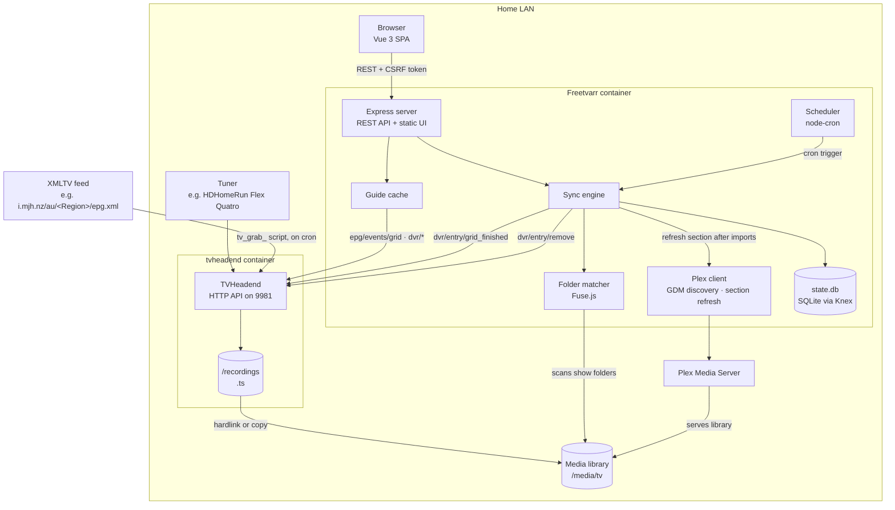
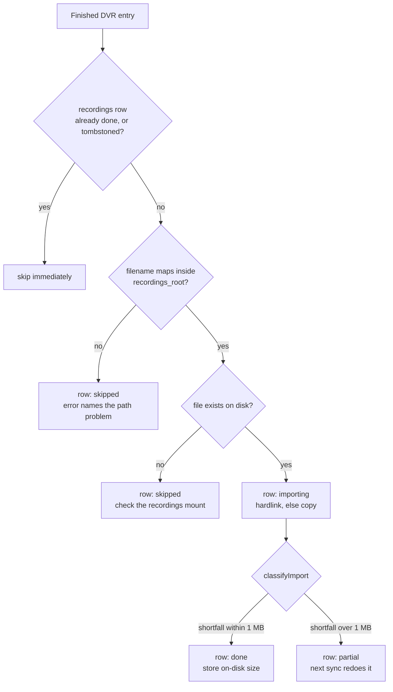

# Technical Deep Dive

The technical companion to [`README.md`](https://github.com/furey/freetvarr/blob/main/README.md): what Freetvarr does internally, and why it works the way it does.

## Contents

- [Architecture](#architecture)
- [The TVHeadend API surface](#the-tvheadend-api-surface)
- [Import state machine](#import-state-machine)
- [Why the import is a hardlink](#why-the-import-is-a-hardlink)
- [Series recordings as autorec rules](#series-recordings-as-autorec-rules)
- [Ad removal](#ad-removal)
- [Live progress indicators](#live-progress-indicators)
- [Mobile layout](#mobile-layout)
- [Full environment reference](#full-environment-reference)
- [Docker deployment](#docker-deployment)
- [Security model](#security-model)
- [Local development](#local-development)
- [Project layout](#project-layout)
- [Scripts](#scripts)
- [Testing](#testing)
- [Screenshots](#screenshots)
- [Documentation site](#documentation-site)

## Architecture



A single Node process runs everything. The Express server (`src/server.js`) serves the Vue 3 SPA and the REST API; the scheduler (`src/scheduler.js`) wires `node-cron` to the sync engine and reloads whenever the cron setting changes; the sync engine (`src/sync.js`) lists TVHeadend's finished recordings, matches them to followed shows, imports new episodes into the media library, and persists every outcome to SQLite. The guide layer (`src/epg.js`) caches TVHeadend's EPG and recording state for the TV Guide tab. After any sync that imported something, the Plex client (`src/plex.js`) refreshes the configured library section, and only then is a delete queued back to TVHeadend.

The load-bearing difference from [Fetcharr](https://github.com/furey/fetcharr), which this forked from, is that the recorder is now on the same filesystem. Fetcharr downloaded each episode from a set-top box over HTTP and could only delete the source through a vendor cloud service. Freetvarr reads a local file and deletes through one authenticated API call.

## The TVHeadend API surface

Everything goes through TVHeadend's JSON API at `<tvh_url>/api/<path>`, with HTTP basic auth, a `15 s` timeout, and `application/x-www-form-urlencoded` bodies on writes. `src/tvheadend.js` is the only module that speaks it.

| Endpoint | Used for |
| --- | --- |
| `serverinfo` | TEST CONNECTION; reports the version and API version. Also the unauthenticated probe behind AUTO-DISCOVER TVHEADEND, which tries port `9981` on the address the browser used to reach Freetvarr, then each host LAN address, `tvheadend`, `host.docker.internal`, and `127.0.0.1`, in parallel with a `1.5 s` timeout. A `200` with `sw_version` or a `401` with the `tvheadend` realm counts as a hit; loopback hits are dropped when a LAN address answers |
| `channel/grid` | The channel lineup, sorted by number, disabled channels dropped |
| `epg/events/grid` | The guide, paged `2000` events at a time until the window is covered |
| `epg/events/load` | One programme's detail |
| `dvr/entry/grid_upcoming` | Scheduled and in-progress recordings |
| `dvr/entry/grid_finished` | The import queue: everything TVHeadend has finished |
| `dvr/entry/create_by_event` | RECORD |
| `dvr/entry/cancel`, `dvr/entry/stop` | CANCEL RECORDING, depending on whether it's already running |
| `dvr/entry/remove` | Delete: drops the entry and the file |
| `dvr/autorec/grid`, `dvr/autorec/create` | Series recordings |
| `idnode/save`, `idnode/delete` | Applying padding to a new entry; removing an autorec rule |
| `dvr/config/grid` | Finding the default DVR profile, cached after the first call |
| `status/inputs`, `hardware/tree` | Tuner count and signal readings for the dashboard |

Two translations happen at this boundary:

- **Series identity.** TVHeadend has no single series ID, so Freetvarr synthesises one: `` `${channelUuid}|${title.toLowerCase()}` ``. That key is what the UI uses to tell whether a programme's show already has a rule.
- **Season and episode.** `dvr/entry/*` returns a human-readable `episode_disp` (`Season 3.Episode 7`) rather than numeric fields, so `parseEpisodeDisp` regexes the numbers back out. Guide events, by contrast, carry `seasonNumber` and `episodeNumber` directly.

Errors come back as a `TvheadendError` carrying a `stage` (the API path) and a `code`, so a failure logs where it happened. HTTP `401` and `403` are mapped to `code: 'auth'` and surfaced as a credentials problem rather than a generic HTTP error.

## Import state machine

The sync engine lists `dvr/entry/grid_finished`, matches each entry to a followed show by case-insensitive substring, and runs the match through this decision tree:



1. **Already-done short-circuit.** A `recordings` row with `status='done'`, or one carrying a `deleted_from_tvh_at` tombstone, is skipped without touching the disk.
2. **Path translation.** `localPathFor` rewrites the filename TVHeadend reported from `tvh_recordings_path` to `recordings_root`. A filename outside that prefix returns `null` and the row is written `skipped` with the reason, because there is nothing sensible to do with a path the container cannot see.
3. **Existence check.** A `fs.stat` failure means the recording is still running, or failed, or the mount is wrong. Row goes `skipped` with the path in the error.
4. **Import.** `buildDestPath` composes `<media_root>/<dest_folder>/<season dir>/<filename>` and throws if the result resolves outside the media root. The file is then hardlinked or copied ([below](#why-the-import-is-a-hardlink)).
5. **Classify.** `classifyImport({ expectedSize, actualSize })` is a pure function, exported for tests. A shortfall over `1 MB` against the size TVHeadend reported gives `partial` with the byte gap in the error, and the row counts as a failure in the sync summary rather than a skip, so a short import is visible at a glance. Anything else gives `done`.

A `statusText` from TVHeadend other than `Completed OK` is recorded on the row even when the import succeeded, so a recording with data errors from a weak signal says so.

The sync itself is single-flight: a module-level `inFlight` holds the running sync's ID, and a second request returns that ID rather than starting a second pass.

## Why the import is a hardlink

`importFile` tries `fs.link` first and falls back to `fs.copyFile` on any error. A hardlink is a second name for the same bytes: instant, no extra disk, and both names stay valid until the last one is removed. That is exactly the right shape here, because TVHeadend's copy is about to be deleted anyway once Plex confirms the file.

The fallback exists because a hardlink cannot cross filesystems. Mount `recordings/` and `media/tv` on one volume and every import is a link; put them on separate volumes and every import copies a multi-gigabyte transport stream. Nothing breaks either way, but the difference is between instant and minutes.

An import whose destination already exists at exactly the source size returns early, so a re-run is free.

## Series recordings as autorec rules

RECORD SERIES creates one TVHeadend autorec rule through `dvr/autorec/create`:

```json
{
  "enabled": true,
  "title": "<show title>",
  "fulltext": false,
  "channel": "<channel uuid>",
  "start": "Any",
  "start_window": "Any",
  "weekdays": [1, 2, 3, 4, 5, 6, 7],
  "pri": 2,
  "record": 1,
  "start_extra": 2,
  "stop_extra": 10,
  "maxcount": "<episodes to keep>",
  "comment": "freetvarr"
}
```

The design decisions in that payload:

- **Title plus channel, any time, any day.** A time window would silently miss episodes whenever a broadcaster moves the timeslot, as Australian broadcasters do constantly. `fulltext: false` keeps the match on the title field rather than the synopsis, which otherwise catches every programme that mentions the show.
- **`record: 1`** is TVHeadend's duplicate detection by episode number. Where the XMLTV feed supplies episode numbers this stops repeats cleanly. Where it doesn't, every airing records and Freetvarr's own already-done check is the second line.
- **`start_extra: 2` / `stop_extra: 10`** are minutes of padding. The asymmetry is deliberate: free-to-air overruns far more often than it starts early, Australian channels especially.
- **`comment: "freetvarr"`** tags every entry and rule Freetvarr created, so rules made by hand in TVHeadend's own UI are distinguishable.

Single recordings take a second call. `dvr/entry/create_by_event` does not accept padding, so Freetvarr creates the entry, then patches `start_extra` and `stop_extra` onto it with `idnode/save`.

## Ad removal

Free-to-air recordings carry their commercial breaks. Plex has no marker API for non-DVR library items and doesn't read EDL sidecar files, so skip markers are not viable; the only end state that actually helps playback is physically cutting the breaks out of the file. Freetvarr does this with two spawned binaries (`comskip` for detection, `ffmpeg`/`ffprobe` for cutting; both baked into the Docker image, never npm deps) and a safety design that assumes detection will sometimes be wrong.

The feature is double-gated: a global `ad_removal_enabled` setting (Settings → AD REMOVAL, default off) and a per-show mode (`off` / `detect` / `cut`, default `off`). Processing runs inline in the sync loop, immediately after an import classifies `done` (never on `partial`), and everything is wrapped so a failure can never kill the sync or damage the recording.

**Detect** runs comskip against the file with an EDL output forced on (the resolved ini is copied to a temp file with `output_edl=1` appended; last key wins in comskip, so a user-supplied ini can't silently disable it), parses the EDL, and stores the breaks as JSON on the `recordings` row (`ad_status='detected'`, `ad_breaks_json`). The file is untouched. This mode exists so users can audit comskip's accuracy on their channels before letting it cut anything.

**Cut** continues from detection:

1. `ffprobe` reads the container duration; `computeKeepSegments` inverts the merged, clamped break list into keep segments. An empty keep list (breaks covering the whole file) is treated as a failure; Freetvarr never produces an empty output.
2. Each keep segment is extracted with `ffmpeg -ss … -to … -c copy`, mapping only the video, audio and subtitle streams (`-map 0:v -map 0:a -map 0:s?`). AU DVB-T recordings carry a private data stream the mpegts muxer can't stream-copy, so a blanket `-map 0` aborts the cut; dropping that stream is harmless for playback. Keyframe stream-copy, no transcode; output stays `.ts`, then the segments are concatenated with ffmpeg's concat demuxer. All intermediate files live in a hidden `.freetvarr-adcut/` workdir next to the recording: same filesystem, so the final swap is an atomic rename, and hidden so Plex ignores it. The workdir is removed on every exit path.
3. **Verify then swap**: the output must be non-empty and its ffprobe duration must match the summed keep-segment duration within a tolerance that scales with boundary count (`max(5, 2 × boundaries)` seconds; keyframe snapping costs up to a couple of seconds per cut point). Only then does the swap happen: original → `<file>.ts.orig`, output → original name; if the second rename fails the `.orig` is rolled back. Plex ignores the unknown `.orig` extension.
4. Any caught failure at any step leaves the original file exactly where it was and marks the row `cut_failed`; the sync carries on. The one gap the rollback can't cover is a process death *between* the two renames of the swap; that would leave no file at the real path. `recoverInterruptedCuts` on startup closes it: for any recording row whose `file_path` is missing on disk but whose `<file>.ts.orig` exists, it renames the `.orig` back, so a crash mid-swap self-heals on the next boot.

> [!NOTE]<br>
> The cut rewrites the file in the Plex library, not the TVHeadend copy. TVHeadend's own entry still points at its original file, and deleting through `dvr/entry/remove` removes that one.

`.orig` backups are pruned after a configurable retention window (`ad_original_retention_days`, default 7) during sync housekeeping; this gives a recovery window for bad cuts (rename the `.orig` back).

**Delete gating**: for a `cut`-mode show, the TVHeadend copy is the last pristine source once the local file has been rewritten. Auto-delete is therefore only queued when the cut verified (or no breaks were found); a `cut_failed` or detect-only outcome keeps the TVHeadend copy. This composes with the Plex-refresh delete guard (`delete_after_plex_refresh_only`, default on), which skips the delete entirely when a Plex refresh was attempted and failed.

**comskip.ini resolution**: Freetvarr bundles `assets/comskip.ini`, tuned for Australian free-to-air DVB-T (detection method, break-length windows, brightness/silence thresholds, logo detection). Detect-mode runs against real Network 10 captures (July 2026) found the expected pattern (five 2.5–4-minute ad blocks per ~75-minute episode plus occasional pre-roll/tail slivers), so the bundled ini is a sane default for at least that channel; others remain untested. If `comskip.ini` exists in the config dir (the `/config` bind mount), it wins. `GET /api/settings` reports which one is active and the Settings panel displays it.

**Manual scans**: `POST /api/recordings/:recording_id/ad-scan` (re)processes an already-imported recording using the show's mode (detect-only when the show is `off`), so existing files can be trialled without re-importing. The endpoint responds `202` immediately and processes in the background; the UI polls the recordings list for the resulting `ad_status`. Both entry points (this endpoint and the sync loop's inline call) share one single-flight guard, a module-level `Set` keyed by recording ID inside `processRecordingAds`. A given recording is therefore only ever processed by one `comskip`/`ffmpeg` pipeline at a time; the endpoint returns `409` if that recording is already in flight. Different recordings may still process concurrently.

Comskip is CPU-bound; expect roughly half an hour for a 75-minute 1080i broadcast `.ts` (`~2.7 GB`) on NAS-class hardware. The scan timeout scales with the recording's duration (1.5× realtime, 60-minute floor, 6-hour cap) so a long recording isn't killed mid-scan and misreported as producing no EDL. It's spawned via `nice -n 10` so a scan doesn't starve the host of I/O for a concurrent import, and per-recording statuses (`scanning`, `detected`, `no_breaks`, `cut`, `detect_failed`, `cut_failed`) surface on the Recordings tab. A scan interrupted by a restart leaves no stuck `scanning` row: startup resets any in-flight status back to unscanned.

## Live progress indicators

An ad scan, a cut, and a cross-filesystem import are all slow and, without help, opaque: the Recordings tab polls every 60 seconds and would otherwise show a static label for the whole run. `src/progress.js` closes that gap with a small in-memory progress registry that the three operations feed and `GET /api/recordings` merges into each row. No new persistence, no WebSocket, no extra dependency; the tab just polls faster while something is active.

The registry is a module-level `Map` keyed by recording ID, shared by every request handler and the sync loop because it's all one Node process. Entries are ephemeral, present only while an operation runs:

```javascript
{
  phase: 'importing' | 'scanning' | 'cutting' | 'verifying',
  percent: number | null,   // 0..100, or null when the phase is indeterminate
  etaSeconds: number | null,
  etaLabel: string | null,  // preformatted with pretty-ms; the SPA has no build step
  detail: string | null,    // '12.4 MB/s', 'segment 2/5', '18s elapsed'
  startedAt: number,
  updatedAt: number,
}
```

`setProgress(recordingId, patch)` shallow-merges and stamps `updatedAt`; `clearProgress` deletes; `getProgress` returns the entry or `null` if it's missing or older than `PROGRESS_STALE_MS` (`30 s`), deleting it on staleness; `snapshotProgress(recordingIds)` collects the fresh entries for the API merge. The staleness guard is the backstop for a process that dies before its cleanup runs: a leaked entry stops being served within 30 seconds instead of showing a frozen bar forever. Labels that the SPA would otherwise need a bundler to format (rate strings, ETA durations) are preformatted server-side.

The three sources:

- **Import**: `makeImportProgress(recordingId)` is only wired into the copy path, because a hardlink completes before a bar could render. A `1 s` ticker stats the growing destination file, and the shim recomputes percentage, rate, and ETA from the bytes on disk against the source size.
- **Cut**: `cutBreaks` already loops over keep segments, so `segment i/N` is free; it writes a `cutting` entry per segment and flips to `verifying` before the duration check. Stream-copy is seconds per segment, so a counter is more honest than a bar and neither phase carries a percentage.
- **Scan**: `comskip` runs through a buffered `execFileP` and emits no live signal, so the bar is a duration-based estimate rather than parsed output. `detectBreaks` already probes duration (for the timeout); a 1-second ticker writes `percent = clamp(0, 99, elapsed / expectedScanMs × 100)` where `expectedScanMs = durationSeconds × SCAN_REALTIME_FACTOR × 1000`. `SCAN_REALTIME_FACTOR` is `0.5`, deliberately above the `~0.39` measured on the author's NAS so the bar under-promises; it clamps at 99 so it never claims done while comskip is still running, and holds there if the scan over-runs. If the duration probe failed the scan entry is indeterminate (`percent: null`) with an elapsed count-up caption. `computeScanPercent` and `expectedScanMs` are pure exports, unit-tested.

Lifecycle is owned in one place so no path leaks an entry. The scan ticker clears its own `setInterval` in a `finally` inside `detectBreaks`; `processRecordingAds` clears the registry entry in a single `finally` around the whole detect/cut sequence; the import shim clears on `stop()`. On the API side, `GET /api/recordings` calls `snapshotProgress` over the returned rows and attaches `progress` (the entry or `null`) to each one without mutating the query result.

The frontend renders a thin CSS bar plus a `percent · ETA` caption under the relevant label, and reuses the existing cell so nothing shifts when the bar appears or vanishes. The recordings poll is a self-scheduling `setTimeout` that recomputes its cadence every tick from the freshly fetched rows: `RECORDINGS_ACTIVE_POLL_MS` (`2 s`) when any row has a non-null `progress`, `RECORDINGS_POLL_MS` (`60 s`) otherwise, so it always falls back to idle once operations end. A restart mid-operation leaves no frozen bar: the registry is empty on boot and `resetInterruptedScans` has already cleared any persisted `scanning` row.

## Mobile layout

The UI is responsive at a single breakpoint: Tailwind's `md` (`768 px`). Below it, phone layout (baseline iPhone 16e, `390×844 pt`); at or above it, the desktop layout, unchanged.

The load-bearing decision is how the `deck-table` views behave on a phone. They use **dual markup**: the desktop `<table>` sits behind `hidden md:table` and a purpose-built `deck-card` list renders behind `md:hidden` in the same Vue template. Rows are entity-shaped (title + metadata + actions), so cards fit; a CSS-only `data-label` table transform was rejected because the control-heavy cells (per-row buttons, selects, headerless action columns) come out unordered and ugly. Cell logic stays shared through the existing helpers (`summary-line`, labels, `fmtTime`/`fmtBytes`) plus the `progress-block` component, which both the desktop table and the cards render so the bar markup exists once. Accepted losses on mobile: no column sorting (the server-side default applies), and `title`-attribute tooltips don't exist on touch, so the load-bearing one (ad break count and minutes) is inlined into the card and the rest are dropped.

Filter button groups become `chip-row`s below `md`: single-line, horizontally scrollable, hidden scrollbar, non-shrinking children. The tab nav is the same pattern (`tab-strip`), with a `watch(route)` and `scrollIntoView` nudge so the active tab is always visible.

The rest is a CSS pass in `styles.css`, all standard iOS Safari accommodations:

- `.field-input` bumps to `16 px` below `md`; iOS auto-zooms (and stays zoomed) on focusing any input smaller than that.
- `viewport-fit=cover` in the meta tag plus `env(safe-area-inset-bottom)` on the settings save bar and footer, so the home indicator doesn't cover the SAVE button; `min-h-dvh` instead of `min-h-screen` for the collapsing URL bar.
- Every `:hover` rule is scoped inside `@media (hover: hover)`; otherwise taps leave sticky hover states.
- Under `@media (pointer: coarse)`, buttons and checkboxes grow toward Apple's `44 pt` hit-target guideline; a later `max-width: 767px` block (which wins the cascade by source order) re-tightens button heights to `2.1 rem`/`1.9 rem` and shrinks card, label, and panel type after real-device feedback that the guideline sizes felt oversized at `390 px`.
- Selected chips use `.btn-on`: a pressed segment with a solid raised background and the nav tab's blue underline. Blue-tinted `btn-primary` always means an action (SYNC NOW, SAVE, RECORD); state and action don't share a style.
- List datetimes come from `fmtTime` as `26/08/26 10:30am`: 2-digit year, no seconds, `am`/`pm` attached, and a non-breaking space between date and time so the value never wraps mid-datetime.
- `-webkit-tap-highlight-color: transparent`, since controls have their own pressed states.

## Full environment reference

The TVHeadend URL and credentials, the Plex token, and the storage paths are runtime settings; configure them in the web UI (or the first-run wizard), not via env. The env vars below are deploy/runtime knobs only.

> [!NOTE]<br>
> `MEDIA_ROOT`, `RECORDINGS_ROOT`, `TVH_RECORDINGS_PATH`, and `PLEX_PREFS_PATH` also act as defaults for matching DB-backed settings that can be overridden from the UI at runtime. The fallback chain is *settings DB value → env var → hardcoded default*. The Storage panel in Settings (and the STORAGE step of the wizard) shows the effective values and provides a TEST PATH button.

| Variable              | Notes                                                                                                                                                                                                 |
| --------------------- | ------------------------------------------------------------------------------------------------------------------------------------------------------------------------------------------------------ |
| `MEDIA_ROOT`          | Default for the `media_root` setting: the directory Freetvarr writes imported episodes to. Defaults to `/media/tv`.                                                                                     |
| `RECORDINGS_ROOT`     | Default for the `recordings_root` setting: where Freetvarr sees TVHeadend's recordings inside its own container. Defaults to `/recordings`.                                                             |
| `TVH_RECORDINGS_PATH` | Default for the `tvh_recordings_path` setting: the path prefix TVHeadend reports in the filenames it hands out. Defaults to `/recordings`. Only differs from `RECORDINGS_ROOT` if the mounts disagree. |
| `DB_PATH`             | Absolute path to the SQLite state file. Defaults to `<repo>/config/state.db`; compose sets it to `/config/state.db` so state lives on the bind mount.                                                   |
| `PORT`                | HTTP port inside the container. Defaults to `8124`.                                                                                                                                                    |
| `NODE_ENV`            | `production` makes the server refuse to start if `CSRF_SECRET` is unset or the dev placeholder. Compose sets this.                                                                                      |
| `TZ`                  | Container timezone (IANA name). The Dockerfile installs `tzdata` so any IANA zone resolves. `/api/settings` exposes the value as `tz`; the web UI renders all timestamps in that zone.                  |
| `PUID`/`PGID`         | Runtime UID/GID (set via compose `user:`). Defaults to `1000:1000`. Must match TVHeadend's, because Freetvarr hardlinks and deletes files TVHeadend created.                                            |
| `CSRF_SECRET`         | 32+ random bytes used to sign the CSRF cookie. `openssl rand -hex 32`. Required in production.                                                                                                         |
| `TVH_URL`             | Optional. When set, AUTO-DISCOVER TVHEADEND offers this address instead of probing. The stored `tvh_url` setting still wins once saved. |

Compose-only env (set in `.env` alongside `docker-compose.yml`):

| Variable          | Notes                                                                                                                                                                                                            |
| ----------------- | ------------------------------------------------------------------------------------------------------------------------------------------------------------------------------------------------------------------ |
| `FREETVARR_PORT`  | Host port the container binds (under `network_mode: host`, also flows into `PORT` inside the container). Defaults to `8124`.                                                                                       |
| `CONFIG_PATH`     | Host root for the config bind mounts. Freetvarr's `/config` is `${CONFIG_PATH}/freetvarr`; TVHeadend's is `${CONFIG_PATH}/tvheadend`.                                                                             |
| `DATA_PATH`       | Host root for the data bind mounts. `/media/tv` is `${DATA_PATH}/media/tv`; `/recordings` is `${DATA_PATH}/recordings` in both containers.                                                                         |
| `PLEX_PREFS_PATH` | Optional. Host path to Plex's `Preferences.xml`, bind-mounted read-only so the "Auto-detect from local Plex" button can read `PlexOnlineToken`. Drop the mount if Plex isn't on this host; the button degrades.   |

## Docker deployment

- Freetvarr's image is built locally from the repo via compose; nothing is pushed to a registry. TVHeadend comes from `lscr.io/linuxserver/tvheadend`.
- The Dockerfile inlines `npm ci --ignore-scripts && npm run rebuild:natives` instead of calling `npm run setup`, deliberately skipping `npm audit signatures` at build time. That step re-queries the registry and enforces `.npmrc`'s `min-release-age=3`, which would block whenever a brand-new dep is in the lockfile. Run `npm run setup` on the host once the newest dep has aged past the threshold; the lockfile's integrity hashes still verify package contents during `npm ci`.
- Both services use `network_mode: host` (no `ports:` mapping). TVHeadend needs it to discover a network tuner such as an HDHomeRun, which announces itself by UDP broadcast that doesn't traverse Docker's bridge network. Side-effect: neither container is on a Docker bridge network, so they address each other by the host's LAN IP rather than by container name, and so does anything else that wants to reach them.
- Both run as `${PUID}:${PGID}` (default `1000:1000`). They must match: Freetvarr hardlinks files TVHeadend wrote and deletes them afterwards.
- `tini` is PID 1 inside the Freetvarr container so `SIGTERM` propagates cleanly.
- The Docker healthcheck hits `GET /healthz` every `30 s`.
- The container entrypoint (`docker-entrypoint.sh`) runs `knex migrate:latest` against `/config/state.db` before exec'ing the server, so pending migrations apply on next boot and first boot on a fresh host is a no-op for the operator.
- `docker compose up -d --build freetvarr` rebuilds the image from the local `Dockerfile` and recreates the container only if its image actually changed; the bind-mounted `/config/state.db` is untouched.

Volumes:

| Service | Container path | Host path | Purpose |
| --- | --- | --- | --- |
| `tvheadend` | `/config` | `${CONFIG_PATH}/tvheadend` | TVHeadend's own configuration, channels, and DVR entries |
| `tvheadend` | `/recordings` | `${DATA_PATH}/recordings` | Where TVHeadend writes `.ts` files |
| `freetvarr` | `/config` | `${CONFIG_PATH}/freetvarr` | SQLite state DB and an optional `comskip.ini` override |
| `freetvarr` | `/recordings` | `${DATA_PATH}/recordings` | The same folder, read side. This shared mount is what makes the import a hardlink |
| `freetvarr` | `/media/tv` | `${DATA_PATH}/media/tv` | Plex TV library, where imports land |
| `freetvarr` | `/plex-preferences.xml` (ro) | `${PLEX_PREFS_PATH}` | Optional. Read-only, only for the Auto-detect token button |

> [!IMPORTANT]<br>
> `/recordings` and `/media/tv` should be on one host filesystem. They are two directories under `${DATA_PATH}` for exactly that reason; split them across volumes and every import becomes a full copy.

## Security model

Vulnerability reporting and the accepted residual risks are documented in [SECURITY.md](https://github.com/furey/freetvarr/blob/main/SECURITY.md). The hardening measures:

- **`.npmrc`** sets `ignore-scripts=true` (never run lifecycle scripts during install; native rebuilds are explicit), `engine-strict=true`, `audit-level=high`, `save-exact=true`, `package-lock=true`, and `min-release-age=3` (refuse packages newer than three days, which mitigates rapid-fire supply-chain attacks).
- **`npm run setup`** uses `npm ci` (not `npm install`) so deps come straight from the lock file.
- **`npm run rebuild:natives`** is an explicit allow-list; only `better-sqlite3` rebuilds. Adding a new native dep means adding it here on purpose.
- **`npm audit signatures`** runs as the last step of `setup` to verify the npm registry signatures of every dep. The Docker build deliberately inlines `npm ci + rebuild:natives` instead, because `npm audit signatures` re-queries the registry and enforces `min-release-age`.
- **`package-lock.json`** is committed; integrity hashes verify package contents during `npm ci` even when the audit step is skipped.
- **HTTP**: Helmet with a strict CSP. `script-src 'self' 'unsafe-eval'` is required because Vue's in-browser template compiler uses `new Function()`; everything else is locked down. Dropping `'unsafe-eval'` would need a build step that pre-compiles templates.
- **Rate limiting**: `express-rate-limit` on the POST endpoints that reach TVHeadend or Plex (`/api/sync`, `/api/tvh-shows`, `/api/tvh-test`, `/api/tvh-detect`, `/api/discover-plex`, the per-recording delete and ad-scan endpoints), and a separate limiter on the guide's record/cancel endpoints.
- **CSRF**: `csrf-csrf` (double-submit cookie) protects state-changing POSTs. The UI fetches a token from `GET /api/csrf-token` and sends it as the `x-csrf-token` header. `generateToken` is called with `overwrite=true` so a stale browser cookie from a previous `CSRF_SECRET` doesn't trigger a 403 mint. `getSessionIdentifier` is a constant, because this is an authless LAN service. The front-end clears the cached token and retries once on any 403, so secret rotations and cookie clears recover silently.
- **Path containment**: `dest_folder` and `season_template` are validated on write to reject `..` segments and leading slashes, and `buildDestPath` resolves the final path and throws if it escapes the media root. A show can only ever write inside the configured library.
- **Credential storage**: the TVHeadend password sits in plaintext in the SQLite database, and `GET /api/settings` returns only a `tvh_password_set` boolean rather than the value. There is no login in front of any of this, which is the whole reason for the LAN-only posture below.
- **Fail-closed production defaults**: the Dockerfile sets `NODE_ENV=production`, so even a bare `docker run` refuses the dev CSRF secret. A terminal Express error handler returns the error message only, never a stack trace.
- **Daemon resilience**: a `process.on('unhandledRejection')` handler logs and keeps the process alive, so a DB-layer rejection in an async route handler can't take the whole daemon (and any in-flight sync or cut) down.
- **Indexing**: `X-Robots-Tag: noindex, nofollow` is set globally; this is a LAN-only service.
- **HSTS disabled**: Freetvarr serves over plain HTTP on the LAN. Helmet's default `Strict-Transport-Security` header would tell browsers to refuse HTTP for the host for a year, which is wrong for this deployment. Re-enable HSTS (with an appropriate `maxAge`) only when fronted by TLS.

## Local development

```sh
git clone https://github.com/furey/freetvarr
cd freetvarr
cp .env.example .env       # fill in CSRF_SECRET (openssl rand -hex 32)
npm run setup              # ci --ignore-scripts + rebuild natives + audit signatures
npm start                  # http://localhost:8124; first visit shows the setup wizard
                           # (prestart auto-creates ./config/ and runs migrations)
```

`npm start` / `npm run dev` load `./.env` via Node's `--env-file-if-exists`, so the `CSRF_SECRET` you set there applies to the from-source run. The Docker path doesn't use `.env.example` at all; it takes its environment from the compose file.

Running from source still needs a reachable TVHeadend. Point the `tvh_url` setting at an existing instance on the LAN; nothing else about the host matters, because Freetvarr talks to it over HTTP like any other client.

> [!NOTE]<br>
> `npm run setup` calls `npm audit signatures`, which honours `.npmrc`'s `min-release-age=3`. If a dep in the lockfile was published in the last three days, the audit step fails (`ETARGET notarget`). Either wait for it to age past the threshold or run `npm install --ignore-scripts --min-release-age=0` once for the freshly-published dep.

> [!TIP]<br>
> `package.json`'s `volta` block pins Node and npm to the versions the Dockerfile uses. Install [Volta](https://volta.sh) and it'll auto-switch when you `cd` into the repo, which avoids `EBADENGINE` from the host npm and ABI mismatches on `better-sqlite3`.

For dev:

```sh
npm run dev                # node --watch
npm run migrate:refresh    # drop the SQLite DB and re-migrate
```

## Project layout

```
freetvarr/
├── src/
│   ├── server.js           # Express app; helmet, CSP, rate limit, CSRF, X-Robots-Tag
│   ├── db.js               # Knex instance + simple settings get/set
│   ├── tvheadend.js        # The only module that speaks TVHeadend's JSON API
│   ├── epg.js              # Guide + recording-state caching, channel prefs, series projection
│   ├── folder-matcher.js   # Fuse.js wrapper that scans /media/tv
│   ├── sync.js             # Sync engine; list finished, match shows, hardlink or copy, persist; exports classifyImport / matchShow / buildDestPath / localPathFor for tests
│   ├── commercials.js      # Ad removal; comskip detect + ffmpeg cut orchestration, pure helpers exported for tests
│   ├── progress.js         # In-memory progress registry + import-bar shim; merged into GET /api/recordings
│   ├── scheduler.js        # node-cron wiring, reloads on settings change
│   ├── plex.js             # Plex section refresh + token detection from Preferences.xml
│   └── web/                # Static UI; Vue 3 SPA (browser ESM) + Tailwind v4 Play CDN (self-hosted), hash-routed, responsive at md/768px, no build step
├── test/                   # node --test; no extra test deps
├── assets/
│   └── comskip.ini         # Bundled AU free-to-air comskip tuning; /config/comskip.ini overrides
├── migrations/             # knex migrations
├── knexfile.js             # Honours DB_PATH env (defaults to ./config/state.db)
├── Dockerfile              # node:22-bookworm-slim + tini + comskip + ffmpeg + healthcheck
├── docker-entrypoint.sh    # `knex migrate:latest` then `exec node src/server.js`
├── docker-compose.example.yml  # Both services; copy to docker-compose.yml
├── .env.example            # Local-dev minimal envs (CSRF_SECRET, TZ, PUID/PGID)
├── .npmrc                  # Supply-chain hardening
└── package.json
```

> [!NOTE]<br>
> `src/web/styles.css` is a plain, unlayered stylesheet, while the Tailwind browser build emits its utilities inside `@layer utilities`. Unlayered rules beat layered ones no matter the specificity, so a bare element selector in `styles.css` (`a { color: #62cfff }`) overrides any Tailwind colour utility applied to an `<a>`. To restyle a link, add a class to `styles.css` or move the utility onto an inner `<span>`.

## Scripts

| Script                    | What it does                                                                                   |
| ------------------------- | ---------------------------------------------------------------------------------------------- |
| `npm run setup`           | `npm ci --ignore-scripts` → `npm run rebuild:natives` → `npm audit signatures`                 |
| `npm run rebuild:natives` | Explicitly rebuilds the native deps allow-listed in `package.json` (just `better-sqlite3`)     |
| `npm run migrate`         | `mkdir -p config && knex migrate:latest`; idempotent, auto-run by `start` / `dev`              |
| `npm run migrate:refresh` | `rm -f ./config/state.db && mkdir -p config && knex migrate:latest`; dev only                  |
| `npm start`               | `node --env-file-if-exists=.env src/server.js` (chains `npm run migrate` via `prestart`)       |
| `npm run dev`             | `node --env-file-if-exists=.env --watch src/server.js` (chains `npm run migrate` via `predev`) |
| `npm test`                | `node --test 'test/*.test.js'`; Node 24 built-in runner, no extra deps                         |

## Testing

```sh
npm test
```

Node 24's built-in test runner, with no additional test dependencies. What's covered by unit tests, all of it pure functions:

- **Sync**: `classifyImport` across the size-tolerance boundary, `matchShow` (case-insensitive substring matching), `buildDestPath` (`{season}` / `{season_padded}` / `{season_unpadded}` substitution, missing-season fallback, media-root escape rejection), `episodeFilename` (the `SxxEyy` and air-date forms, and title sanitisation), and `localPathFor` (prefix rewrite, the outside-the-prefix `null`, trailing-slash handling).
- **Ad removal**: EDL parsing (malformed rows, action filtering), keep-segment maths (clamping, merging, break-at-edge, whole-file-break), cut verification tolerance, comskip.ini resolution, the auto-delete gating matrix, and the scan-estimate maths.
- **Progress**: registry round-trip, staleness eviction past `PROGRESS_STALE_MS` (via mocked timers), `clearProgress`, and the import shim's percentage and monotonically decreasing ETA.
- **Folder matcher**: a real on-disk fixture under `os.tmpdir()` exercising `listShowFolders` and `matchShowFolder` against realistic disambiguated folder names.

The TVHeadend client and the comskip/ffmpeg orchestration are exercised against the real thing rather than mocked. Manual smoke test:

- `npm run dev`, hit `http://localhost:8124`.
- **First visit** (with empty settings): auto-redirects to the setup wizard. Walks TVHeadend (URL, user, TEST CONNECTION) → storage (three paths, each with TEST PATH) → Plex → ready.
- **Re-open the wizard later**: SETUP WIZARD panel at the top of Settings. All previously-saved values prefill; stored passwords and tokens render as `••••• (stored)`.
- **Settings**: save; the cron field reloads the scheduler on save; TEST CONNECTION reports the TVHeadend version, channel count, and tuner count; the Plex buttons each succeed when Plex is reachable.
- **TV Guide**: seven days of programmes with names; record, cancel, record-series, cancel-series each reflected in TVHeadend's own UI within a refresh; pin, hide, and reorder channels.
- **Shows**: add a show (folder-suggest auto-completes from the effective `media_root`), toggle enabled, per-show Sync now, delete.
- **Syncs**: run a sync, watch the row appear and finish; clear history; filter by activity type.
- **Recordings**: a hardlink import completes with no bar; a cross-filesystem copy shows one and the list polls every `2 s`. Tombstoned rows appear struck-through and dimmed, except for labels, buttons, and progress bars, so a tombstoned recording can still be re-scanned.
- **Danger Zone**: `NUKE ALL STATE` clears the DB and reloads into the wizard.

## Screenshots

The PNGs under `docs/img/` are captured from the running app by `scripts/capture-screenshots.sh`. The script pulls the official Playwright Docker image (no host install required), drives headless Chromium across the tabs at desktop width plus a `390×844` mobile viewport, and writes the screenshots back into `docs/img/` with the right ownership.

```sh
# the container must be up + reachable at the URL the script expects
./scripts/capture-screenshots.sh

# Re-shoot a single tab:
./scripts/capture-screenshots.sh settings
```

The captures themselves are configured in `scripts/capture-screenshots.mjs` (desktop viewport `1280×936`, mobile `390×844`, viewport-only clip so every shot has the same aspect ratio, 2× device-scale). Before the Settings shot, the script rewrites the `/api/settings` response in-page so no real TVHeadend URL, password, Plex token, or host path reaches a committed PNG.

> [!WARNING]<br>
> The committed PNGs are still the Fetcharr-era captures, and the capture scripts still carry Fetcharr's fixture data. Both need a pass before the shots in the README and on the docs site match what the app now shows.

> [!TIP]<br>
> To shoot UI changes that haven't shipped yet, run them locally against a copy of the live database; every panel renders from SQLite and the settings row, so the shots come out identical to production. Copy the state file off the deploy host (`ssh <host> 'cat /path/to/freetvarr/state.db' > /tmp/shots.db`; `scp` fails on Synology's restricted sftp subsystem), start the server with `DB_PATH=/tmp/shots.db CSRF_SECRET=$(openssl rand -hex 32) node src/server.js`, then point the capture script at your machine's LAN IP rather than `localhost` (the Playwright container can't reach the host loopback). Cautions: the scheduler starts with the copied `sync_cron`, so capture outside the cron window or a real sync fires against the live TVHeadend, and delete the copy afterwards; it holds the TVHeadend password and the Plex token.

## Documentation site

The published docs at [furey.github.io/freetvarr](https://furey.github.io/freetvarr/) are a VitePress site under `docs/`, deployed to GitHub Pages by `.github/workflows/docs.yml` on every push to `main` that touches `docs/**` (pull requests build but don't deploy). It's decoupled from the app: `docs/` has its own `package.json` and lockfile, so `cd docs && npm install && npm run dev` previews it and `npm run build` compiles to `docs/.vitepress/dist`. The `base` is `/freetvarr/`; this file is surfaced on the site at `/deep-dive` via a `rewrites` entry, and the `docs/guide/` pages are the user-facing companion to this reference.

One VitePress quirk: the `> [!NOTE]` alert convention in these files carries a trailing `<br>` (for the VS Code preview). VitePress would render that as a blank alert title, so `docs/.vitepress/config.mjs` strips it in a markdown hook.
