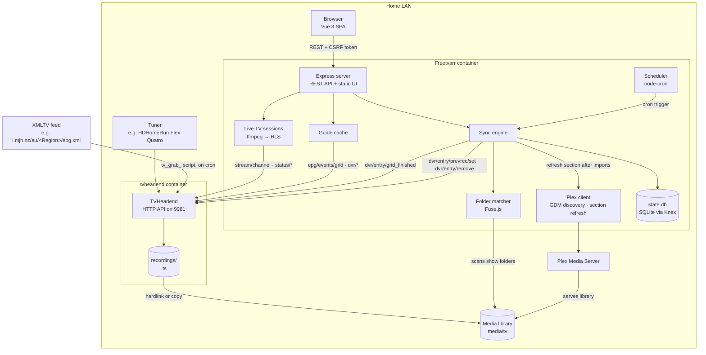
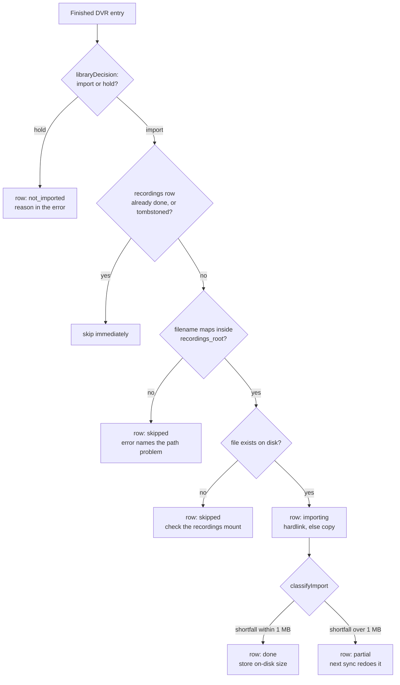
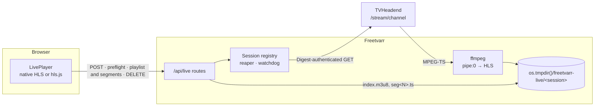

# Technical Deep Dive

The technical companion to [`README.md`](https://github.com/furey/freetvarr/blob/main/README.md): how Freetvarr works inside, and why.

## Contents

- [Architecture](#architecture)
- [The TVHeadend API surface](#the-tvheadend-api-surface)
- [Import state machine](#import-state-machine)
- [Why the import is a hardlink](#why-the-import-is-a-hardlink)
- [Series recordings as autorec rules](#series-recordings-as-autorec-rules)
- [Remove after import](#remove-after-import)
- [Ad removal](#ad-removal)
- [Live progress indicators](#live-progress-indicators)
- [Guide days and history](#guide-days-and-history)
- [Live TV](#live-tv)
- [Mobile layout](#mobile-layout)
- [Full environment reference](#full-environment-reference)
- [Docker deployment](#docker-deployment)
- [Security model](#security-model)
- [Local development](#local-development)
- [Project layout](#project-layout)
- [Scripts](#scripts)
- [Testing](#testing)
- [Screenshots](#screenshots)
- [Documentation site](#documentation-site)

## Architecture


```mermaid
flowchart TB
  subgraph lan["Home LAN"]
    hdhr["Tuner<br>e.g. HDHomeRun Flex Quatro"]

    subgraph tvh["tvheadend container"]
      tvhsrv["TVHeadend<br>HTTP API on 9981"]
      rec[("recordings/<br>.ts")]
    end

    plex["Plex Media Server"]
    browser["Browser<br>Vue 3 SPA"]

    subgraph app["Freetvarr container"]
      server["Express server<br>REST API + static UI"]
      sched["Scheduler<br>node-cron"]
      sync["Sync engine"]
      epg["Guide cache"]
      live["Live TV sessions<br>ffmpeg → HLS"]
      matcher["Folder matcher<br>Fuse.js"]
      plexclient["Plex client<br>GDM discovery · section refresh"]
      db[("state.db<br>SQLite via Knex")]
    end

    media[("Media library<br>media/tv")]
  end

  xmltv["XMLTV feed<br>e.g. i.mjh.nz/au/&lt;Region&gt;/epg.xml"]

  hdhr --> tvhsrv
  xmltv -->|"tv_grab_ script, on cron"| tvhsrv
  tvhsrv --> rec
  browser -->|"REST + CSRF token"| server
  server --> sync
  server --> epg
  server --> live
  live -->|"stream/channel · status/*"| tvhsrv
  sched -->|"cron trigger"| sync
  epg -->|"epg/events/grid · dvr/*"| tvhsrv
  sync -->|"dvr/entry/grid_finished"| tvhsrv
  sync --> db
  rec -->|"hardlink or copy"| media
  sync --> matcher
  matcher -->|"scans show folders"| media
  sync -->|"refresh section after imports"| plexclient
  plexclient --> plex
  plex -->|"serves library"| media
  sync -->|"dvr/entry/prevrec/set · dvr/entry/remove"| tvhsrv
```

A single Node process runs everything. The Express server (`src/server.js`) serves the Vue 3 SPA and the REST API; the scheduler (`src/scheduler.js`) wires `node-cron` to the sync engine and reloads whenever the cron setting changes; the sync engine (`src/sync.js`) lists TVHeadend's finished recordings, matches them to followed shows, imports new episodes into the media library, and persists every outcome to SQLite. The guide layer (`src/epg.js`) caches TVHeadend's EPG and recording state for the TV Guide tab. After any sync that imported something, the Plex client (`src/plex.js`) refreshes the configured library section, and only then is a remove queued back to TVHeadend. The live TV layer (`src/live-tv.js`) pulls a channel's transport stream from TVHeadend, pipes it through ffmpeg into rolling HLS files under the temp folder, and serves them to the browser player ([Live TV](#live-tv)).

The main difference from [Fetcharr](https://github.com/furey/fetcharr), which this forked from, is that the recorder is on the same filesystem. Fetcharr downloaded each episode from a set-top box over HTTP and could only delete the source through a vendor cloud service. Freetvarr reads a local file and removes it through authenticated calls to TVHeadend's API.

## The TVHeadend API surface

Everything goes through TVHeadend's JSON API at `<tvh_url>/api/<path>`, with HTTP Digest auth (or Basic, whichever challenge TVHeadend sends; `src/http-auth.js` builds the header), a `15 s` timeout, and `application/x-www-form-urlencoded` bodies on writes. `src/tvheadend.js` is the only module that speaks it.

| Endpoint                                 | Used for                                                                                                                                                                                                                                                                                                                                                                                                                                                     |
| ---------------------------------------- | ------------------------------------------------------------------------------------------------------------------------------------------------------------------------------------------------------------------------------------------------------------------------------------------------------------------------------------------------------------------------------------------------------------------------------------------------------------ |
| `serverinfo`                             | TEST CONNECTION; reports the version and API version. Also the unauthenticated probe behind AUTO-DISCOVER TVHEADEND, which tries port `9981` on the address the browser used to reach Freetvarr, then each host LAN address, `tvheadend`, `host.docker.internal`, and `127.0.0.1`, in parallel with a `1.5 s` timeout. A `200` with `sw_version` or a `401` with the `tvheadend` realm counts as a hit; loopback hits are dropped when a LAN address answers |
| `channel/grid`                           | The channel lineup, sorted by number, disabled channels dropped                                                                                                                                                                                                                                                                                                                                                                                              |
| `epg/events/grid`                        | The guide, paged `2000` events at a time until the window is covered                                                                                                                                                                                                                                                                                                                                                                                         |
| `epg/events/load`                        | One programme's detail                                                                                                                                                                                                                                                                                                                                                                                                                                       |
| `dvr/entry/grid_upcoming`                | Scheduled and in-progress recordings                                                                                                                                                                                                                                                                                                                                                                                                                         |
| `dvr/entry/grid_finished`                | The import queue: everything TVHeadend has finished                                                                                                                                                                                                                                                                                                                                                                                                          |
| `dvr/entry/create_by_event`              | RECORD                                                                                                                                                                                                                                                                                                                                                                                                                                                       |
| `dvr/entry/cancel`, `dvr/entry/stop`     | CANCEL RECORDING, depending on whether it's already running                                                                                                                                                                                                                                                                                                                                                                                                  |
| `dvr/entry/remove`                       | Remove after import: deletes the file and keeps the entry, which moves to TVHeadend's Removed Recordings tab ([Remove after import](#remove-after-import))                                                                                                                                                                                                                                                                                                   |
| `dvr/entry/prevrec/set`                  | Remove after import: marks the entry previously recorded, so it stays a completed recording across TVHeadend restarts and never re-records                                                                                                                                                                                                                                                                                                                   |
| `dvr/autorec/grid`, `dvr/autorec/create` | Series recordings                                                                                                                                                                                                                                                                                                                                                                                                                                            |
| `idnode/save`, `idnode/delete`           | Applying padding to a new entry; removing an autorec rule. Before remove after import: setting the entry's retention to `Forever`, and deleting a scheduled re-record of it                                                                                                                                                                                                                                                                                  |
| `dvr/config/grid`                        | Finding the default DVR profile, cached after the first call                                                                                                                                                                                                                                                                                                                                                                                                 |
| `epggrab/channel/grid`                   | Channel logo fallback: the guide feed's channel icons, used when TVHeadend reports no `icon_public_url` for a channel. Admin only in TVHeadend; a failure leaves the logos to TVHeadend's own icons                                                                                                                                                                                                                                                          |
| `status/inputs`, `hardware/tree`         | Tuner count and signal readings for the dashboard; the multiplex each tuner carries, for the live TV preflight                                                                                                                                                                                                                                                                                                                                               |
| `status/subscriptions`                   | What holds each tuner, and why a live stream stalled                                                                                                                                                                                                                                                                                                                                                                                                         |
| `mpegts/service/grid`                    | The multiplex of every service, cached for `10` minutes                                                                                                                                                                                                                                                                                                                                                                                                      |
| `service/streams`                        | A channel's elementary streams and their PIDs, which set the live TV codec choice                                                                                                                                                                                                                                                                                                                                                                            |
| `config/load`                            | TVHeadend's default language, for the live TV audio track                                                                                                                                                                                                                                                                                                                                                                                                    |
| `/stream/channel/<uuid>`                 | Live TV. Not under `/api`; requested with `profile=pass`, `weight=50`, a `Freetvarr-live/<session>` user agent, and no timeout                                                                                                                                                                                                                                                                                                                               |

Two translations happen at this boundary:

- **Series identity.** TVHeadend has no single series ID, so Freetvarr synthesises one: `` `${channelUuid}|${title.toLowerCase()}` ``. The UI uses that key to check whether a programme's show already has a rule.
- **Season and episode.** `dvr/entry/*` returns a human-readable `episode_disp` (`Season 3.Episode 7`) rather than numeric fields, so `parseEpisodeDisp` regexes the numbers back out. Guide events, by contrast, carry `seasonNumber` and `episodeNumber` directly.

Errors come back as a `TvheadendError` carrying a `stage` (the API path) and a `code`, so a failure logs where it happened. HTTP `401` and `403` are mapped to `code: 'auth'` and surfaced as a credentials problem rather than a generic HTTP error.

## Import state machine

The sync engine lists `dvr/entry/grid_finished` and saves each entry's details (channel, air time, synopsis) on its `recordings` row. It matches the entry to a followed show by case-insensitive substring, longest pattern first, and runs it through this decision tree:


```mermaid
flowchart TD
  entry["Finished DVR entry"] --> decide{"libraryDecision:<br>import or hold?"}
  decide -->|hold| held["row: not_imported<br>reason in the error"]
  decide -->|import| donecheck{"recordings row<br>already done, or tombstoned?"}
  donecheck -->|yes| skip["skip immediately"]
  donecheck -->|no| pathcheck{"filename maps inside<br>recordings_root?"}
  pathcheck -->|no| skiprow["row: skipped<br>error names the path problem"]
  pathcheck -->|yes| statcheck{"file exists on disk?"}
  statcheck -->|no| skipmissing["row: skipped<br>check the recordings mount"]
  statcheck -->|yes| imp["row: importing<br>hardlink, else copy"]
  imp --> classify{"classifyImport"}
  classify -->|"shortfall within 1 MB"| ok["row: done<br>store on-disk size"]
  classify -->|"shortfall over 1 MB"| partial["row: partial<br>next sync redoes it"]
```

1. **Library decision.** `libraryDecision` is a pure function, exported for tests. A choice saved on the row (`library_choice`, set by the IMPORT button) wins. Next comes the choice made on RECORD, which TVHeadend keeps in the entry's `comment` field. Otherwise a matched show imports, and an unmatched recording imports to the one-off folder unless `import_unmatched` is `false`.
2. **Already-done short-circuit.** A `recordings` row with `status='done'`, or one carrying a `deleted_from_tvh_at` tombstone, is skipped without touching the disk.
3. **Path translation.** `localPathFor` rewrites the filename TVHeadend reported from `tvh_recordings_path` to `recordings_root`. A filename outside that prefix returns `null` and the row is written `skipped` with the reason, because the container cannot see that path.
4. **Existence check.** A `fs.stat` failure means the recording is still running, or failed, or the mount is wrong. The row goes `skipped` with the path in the error.
5. **Import.** `buildDestPath` composes `<media_root>/<dest_folder>/<season dir>/<filename>`; for a recording with no show, `buildOneOffPath` composes `<oneoff_root>/<title>/<title> - <date> <time>.ts`. Both throw if the result resolves outside their root, and a missing one-off root gives `skipped`, so nothing lands inside the container's own filesystem. The file is then hardlinked or copied ([below](#why-the-import-is-a-hardlink)).
6. **Classify.** `classifyImport({ expectedSize, actualSize })` is a pure function, exported for tests. A shortfall over `1 MB` against the size TVHeadend reported gives `partial` with the byte gap in the error, and the row counts as a failure in the sync summary, not a skip. Anything else gives `done`.

A `statusText` from TVHeadend other than `Completed OK` is recorded on the row even when the import succeeded, so a recording with data errors from a weak signal says so.

Each sync also saves the programme image of every scheduled recording to `<config>/artwork/recordings/<uuid>`, because guide image links often expire once the programme airs. Channel logos are saved to `artwork/channels/` whenever one loads. Artwork leaves with its row; an orphan file older than 14 days is pruned.

The sync itself is single-flight: a module-level `inFlight` holds the running sync's ID, and a second request returns that ID rather than starting a second pass.

## Why the import is a hardlink

`importFile` tries `fs.link` first and falls back to `fs.copyFile` on any error. A hardlink is a second name for the same bytes: instant, no extra disk, and both names stay valid until the last one is removed. TVHeadend's copy is deleted once Plex confirms the file, so a second name is all the import needs.

The fallback exists because a hardlink cannot cross filesystems, and Linux also refuses one between two bind mounts (`EXDEV`), even when both mounts show one disk. Docker makes each `volumes:` entry a separate bind mount. A container that mounts `recordings/` and `media/tv` as two entries copies every import, a multi-gigabyte transport stream that takes minutes. The example compose file mounts `${DATA_PATH}` once, at `/data`, so both folders sit inside one mount and every import is a link.

The Doctor Hardlinks check makes a real test link from the recordings folder into the media folder and the one-off folder. It reports one disk with separate mounts as a different case from separate disks.

An import whose destination already exists at exactly the source size returns early, so a re-run does nothing.

## Series recordings as autorec rules

RECORD SERIES creates one TVHeadend autorec rule through `dvr/autorec/create`:

```json
{
  "enabled": true,
  "title": "<show title>",
  "fulltext": false,
  "channel": "<channel uuid>",
  "start": "Any",
  "start_window": "Any",
  "weekdays": [1, 2, 3, 4, 5, 6, 7],
  "pri": 2,
  "record": 1,
  "start_extra": 2,
  "stop_extra": 10,
  "maxcount": "<episodes to keep>",
  "comment": "freetvarr"
}
```

The design decisions in that payload:

- **Title plus channel, any time, any day.** A time window would silently miss episodes whenever a broadcaster moves the timeslot. `fulltext: false` keeps the match on the title field rather than the synopsis, which otherwise catches every programme that mentions the show.
- **`record: 1`** is TVHeadend's duplicate detection by episode number. Where the XMLTV feed supplies episode numbers this stops repeats cleanly. Where it doesn't, every airing records and Freetvarr's own already-done check catches the repeats.
- **`start_extra: 2` / `stop_extra: 10`** are minutes of padding. The end gets more because free-to-air programmes overrun far more often than they start early.
- **`comment: "freetvarr"`** tags every entry and rule Freetvarr created, so rules made by hand in TVHeadend's own UI are distinguishable.

Single recordings take a second call. `dvr/entry/create_by_event` does not accept padding, so Freetvarr creates the entry, then patches `start_extra` and `stop_extra` onto it with `idnode/save`.

## Remove after import

TVHeadend's duplicate check (`_dvr_duplicate_event` in `src/dvr/dvr_db.c`) compares a new autorec entry with the DVR entries TVHeadend still holds. It skips entries in the `MISSED_TIME` or `NOSTATE` state and failed recordings, but it counts a successful recording whose file is gone. The duplicate check therefore needs the entry, not the file. `removeRecordings` in `src/tvheadend.js` makes these calls for each finished recording, in this order:

1. `idnode/delete` on each upcoming entry whose `parent` is this recording. A DVR profile with a re-record error limit schedules such a child when a recording has too many data errors. For a child that has not started, this is the same as `dvr/entry/cancel`: TVHeadend destroys the child and sets the parent's `norerecord`. For a child already recording, it also aborts the recording and deletes the partial file. `dvr/entry/cancel` would leave that child linked to the parent, and TVHeadend's re-record logic can then delete the parent entry.
2. `idnode/save` with `retention: 2147483647` (`Forever`) on the entry. `dvr/entry/remove` destroys the entry together with the file when the retention is `On file removal` (`dvr_entry_delete_retention_expired`), and that is the default DVR profile setting.
3. `dvr/entry/prevrec/set`. This sets `noresched`, `norerecord`, and `fileremoved`, and completes the entry with the `previously recorded` code. Without `noresched`, the next TVHeadend start turns a completed entry with no files into `MISSED_TIME` (`dvr_entry_set_timer`), and the duplicate check then ignores it.
4. `dvr/entry/remove`. TVHeadend deletes the file and keeps the entry in `grid_removed`.

The order sets the failure mode. If a call fails part-way, the file stays on disk and TVHeadend still holds the entry, so the duplicate check still sees the episode. `idnode/delete` on a finished entry is never used: it deletes the entry together with the file, and the next autorec update schedules the next repeat of the episode.

## Ad removal

Free-to-air recordings carry their commercial breaks. Plex has no marker API for non-DVR library items and doesn't read EDL sidecar files, so skip markers are not possible; Freetvarr cuts the breaks out of the file instead. It spawns two binaries (`comskip` for detection, `ffmpeg`/`ffprobe` for cutting; both in the Docker image, not npm deps), and every step assumes detection is sometimes wrong.

The feature is double-gated: a global `ad_removal_enabled` setting (Settings → AD REMOVAL, default off) and a per-show mode (`off` / `detect` / `cut`, default `off`). Processing runs inline in the sync loop, immediately after an import classifies `done` (never on `partial`), and a failure never stops the sync or damages the recording.

**Detect** runs comskip against the file with an EDL output forced on (the resolved ini is copied to a temp file with `output_edl=1` appended; last key wins in comskip, so a user-supplied ini can't silently disable it), parses the EDL, and stores the breaks as JSON on the `recordings` row (`ad_status='detected'`, `ad_breaks_json`). The file is untouched. This mode exists so users can audit comskip's accuracy on their channels before letting it cut anything.

**Cut** continues from detection:

1. `ffprobe` reads the container duration; `computeKeepSegments` inverts the merged, clamped break list into keep segments. An empty keep list (breaks covering the whole file) is treated as a failure; Freetvarr never produces an empty output.
2. Each keep segment is extracted with `ffmpeg -ss … -to … -c copy`, mapping only the video, audio and subtitle streams (`-map 0:v -map 0:a -map 0:s?`). AU DVB-T recordings carry a private data stream the mpegts muxer can't stream-copy, so a blanket `-map 0` aborts the cut; dropping that stream is harmless for playback. Keyframe stream-copy, no transcode; output stays `.ts`, then the segments are concatenated with ffmpeg's concat demuxer. All intermediate files live in a hidden `.freetvarr-adcut/` workdir next to the recording: same filesystem, so the final swap is an atomic rename, and hidden so Plex ignores it. The workdir is removed on every exit path.
3. **Verify then swap**: the output must be non-empty and its ffprobe duration must match the summed keep-segment duration within a tolerance that scales with boundary count (`max(5, 2 × boundaries)` seconds; keyframe snapping costs up to a couple of seconds per cut point). Only then does the swap happen: original → `<file>.ts.orig`, output → original name; if the second rename fails the `.orig` is rolled back. Plex ignores the unknown `.orig` extension.
4. Any caught failure at any step leaves the original file in place and marks the row `cut_failed`; the sync carries on. The one gap the rollback can't cover is a process death *between* the two renames of the swap; that would leave no file at the real path. `recoverInterruptedCuts` on startup closes it: for any recording row whose `file_path` is missing on disk but whose `<file>.ts.orig` exists, it renames the `.orig` back, so the next start repairs a crash mid-swap.

> [!NOTE]<br>
> The cut rewrites the file in the Plex library, not the TVHeadend copy. TVHeadend's own entry still points at its original file, and deleting through `dvr/entry/remove` removes that one.

Sync housekeeping deletes `.orig` backups after `ad_original_retention_days` (default 7). Until then, renaming the `.orig` back undoes a bad cut.

**Remove gating**: for a `cut`-mode show, the TVHeadend copy is the last pristine source once the local file has been rewritten. Remove after import is therefore only queued when the cut verified (or no breaks were found); a `cut_failed` or detect-only outcome keeps the TVHeadend copy. This composes with the Plex-refresh guard (`delete_after_plex_refresh_only`, default on), which skips the remove entirely when a Plex refresh was attempted and failed.

**comskip.ini resolution**: Freetvarr bundles `assets/comskip.ini`, tuned for Australian free-to-air DVB-T (detection method, break-length windows, brightness/silence thresholds, logo detection). Detect-mode runs on Network 10 captures (July 2026) found the expected pattern (five 2.5–4-minute ad blocks per ~75-minute episode, plus short pre-roll and tail slivers); other channels are untested. If `comskip.ini` exists in the config dir (the `/config` bind mount), it wins. `GET /api/settings` reports which one is active, and Settings shows it.

**Manual scans**: `POST /api/recordings/:recording_id/ad-scan` (re)processes an already-imported recording using the show's mode (detect-only when the show is `off`), so existing files can be trialled without re-importing. The endpoint responds `202` immediately and processes in the background; the UI polls the recordings list for the resulting `ad_status`. Both entry points (this endpoint and the sync loop's inline call) share one single-flight guard, a module-level `Set` keyed by recording ID inside `processRecordingAds`. A given recording is therefore only ever processed by one `comskip`/`ffmpeg` pipeline at a time; the endpoint returns `409` if that recording is already in flight. Different recordings may still process concurrently.

Comskip is CPU-bound; expect roughly half an hour for a 75-minute 1080i broadcast `.ts` (`~2.7 GB`) on NAS-class hardware. The scan timeout scales with the recording's duration (1.5× realtime, 60-minute floor, 6-hour cap) so a long recording isn't killed mid-scan and misreported as producing no EDL. It runs under `nice -n 10` so a scan does not slow a concurrent import. Per-recording statuses (`scanning`, `detected`, `no_breaks`, `cut`, `detect_failed`, `cut_failed`) surface on the Recordings tab. A scan interrupted by a restart leaves no stuck `scanning` row: startup resets any in-flight status back to unscanned.

## Live progress indicators

An ad scan, a cut, and a cross-filesystem import can each take minutes. `src/progress.js` keeps an in-memory progress registry that these operations write to and `GET /api/recordings` merges into each row. Nothing is persisted and there is no WebSocket; the Recordings tab polls faster while an operation runs.

The registry is a module-level `Map` keyed by recording ID, shared by every request handler and the sync loop because it's all one Node process. Entries are ephemeral, present only while an operation runs:

```javascript
{
  phase: 'importing' | 'scanning' | 'cutting' | 'verifying',
  percent: number | null,   // 0..100, or null when the phase is indeterminate
  etaSeconds: number | null,
  etaLabel: string | null,  // preformatted with pretty-ms; the SPA has no build step
  detail: string | null,    // '12.4 MB/s', 'segment 2/5', '18s elapsed'
  startedAt: number,
  updatedAt: number,
}
```

`setProgress(recordingId, patch)` shallow-merges and stamps `updatedAt`; `clearProgress` deletes; `getProgress` returns the entry or `null` if it's missing or older than `PROGRESS_STALE_MS` (`30 s`), deleting it on staleness; `snapshotProgress(recordingIds)` collects the fresh entries for the API merge. The staleness check covers a process that dies before its cleanup runs: the API stops serving a leaked entry after 30 seconds. The server preformats rate strings and ETA durations, because the SPA has no bundler to format them.

The three sources:

- **Import**: `makeImportProgress(recordingId)` runs on the copy path only, because a hardlink is instant. A `1 s` ticker stats the growing destination file and computes percentage, rate, and ETA against the source size.
- **Cut**: `cutBreaks` already loops over keep segments, so it writes a `cutting` entry with `segment i/N` per segment and switches to `verifying` before the duration check. Stream-copy takes seconds per segment, so neither phase carries a percentage.
- **Scan**: `comskip` runs through a buffered `execFileP` and gives no live output, so the percentage is an estimate from the recording's duration. `detectBreaks` already probes duration (for the timeout); a 1-second ticker writes `percent = clamp(0, 99, elapsed / expectedScanMs × 100)` where `expectedScanMs = durationSeconds × SCAN_REALTIME_FACTOR × 1000`. `SCAN_REALTIME_FACTOR` is `0.5`, above the `~0.39` measured on the author's NAS, so the estimate runs slow rather than fast. It clamps at 99 while comskip runs, including when the scan over-runs. If the duration probe failed, the entry has `percent: null` and shows elapsed time. `computeScanPercent` and `expectedScanMs` are pure exports, unit-tested.

Cleanup is in one place per source. The scan ticker clears its own `setInterval` in a `finally` inside `detectBreaks`; `processRecordingAds` clears the registry entry in a single `finally` around the whole detect/cut sequence; the import shim clears on `stop()`. On the API side, `GET /api/recordings` calls `snapshotProgress` over the returned rows and attaches `progress` (the entry or `null`) to each one without mutating the query result.

The Recordings tab shows each entry as a progress bar with percent and ETA. Its poll is a self-scheduling `setTimeout` that picks the next interval from the rows it just fetched: `RECORDINGS_ACTIVE_POLL_MS` (`2 s`) when any row has a non-null `progress`, otherwise `RECORDINGS_POLL_MS` (`60 s`). After a restart no stale progress remains: the registry starts empty and `resetInterruptedScans` clears any persisted `scanning` row.

## Guide days and history

TVHeadend deletes a guide event once it ends, so on its own the guide has nothing before now. Freetvarr saves every event it fetches into the `guide_history` table (`src/guide-history.js`, migration `0002`), and the scheduler fetches the guide at most once an hour so history builds even when nobody has the app open. Rows that ended before the start of yesterday are pruned on each save. `GET /api/epg/guide` merges saved past events with TVHeadend's live ones (live data wins on overlap) and marks each event `past`; `recorded` means the event had a DVR entry when it was last seen, not that the recording succeeded.

Each guide day is built from calendar dates in Freetvarr's time zone (`guideDayWindow` in `src/epg.js`, client helpers in `src/web/guide-time.js`), so a daylight-saving day is 23 or 25 hours long and its ruler labels stay right. The window runs from local midnight to 3 am the next day (`spillEnd`); a programme that crosses midnight comes back once, at full width. At midnight the client reloads TODAY. `test/guide-day.test.js` covers the Sydney changes on `2026-10-04` and `2027-04-04`.

## Live TV

The browser plays live TV as HLS that Freetvarr makes itself. TVHeadend streams MPEG-TS, which no browser plays, and TVHeadend's own transcoding profiles vary by build, so Freetvarr uses the ffmpeg already in its image.


```mermaid
flowchart LR
  subgraph browser["Browser"]
    player["LivePlayer<br>native HLS or hls.js"]
  end
  subgraph app["Freetvarr"]
    routes["/api/live routes"]
    reg["Session registry<br>reaper · watchdog"]
    ff["ffmpeg<br>pipe:0 → HLS"]
    dir[("os.tmpdir()/freetvarr-live/&lt;session&gt;")]
  end
  tvh["TVHeadend<br>/stream/channel"]
  player -->|"POST · preflight · playlist and segments · DELETE"| routes
  routes --> reg
  reg -->|"Digest-authenticated GET"| tvh
  tvh -->|"MPEG-TS"| ff
  ff --> dir
  routes -->|"index.m3u8, seg&lt;N&gt;.ts"| dir
```

Start (`POST /api/live`):

1. Check the channel id against the guide's channel list.
2. Run the preflight (below). A `409` with `code: 'no-tuner'` lists what holds each tuner.
3. Read the channel's first service from `service/streams` and pick the streams with `pickStreams`. `h264Plan` handles H.264 video: Chrome cannot decode interlaced H.264, so it is deinterlaced and re-encoded to progressive H.264 (`LIVE_TV_TRANSCODE=copy` keeps the old copy). `detectLiveEncoder` in `src/live-encoder.js` runs once at startup (`liveEncoderReady` in `src/server.js`). For `auto` and `hardware` it checks `LIVE_TV_VAAPI_DEVICE` (default `/dev/dri/renderD128`) is readable and writable, then runs a test encode through `deinterlace_vaapi` and `h264_vaapi` (low-power first, then full). A pass selects VAAPI: deinterlace only interlaced frames, `720`-line cap, `-qp 24`. Otherwise it selects software (`yadif`, `libx264`, `540`-line cap) and logs the reason on a `[live] video` line. NVENC is not supported. MPEG-2, HEVC, and other video goes to `libx264` (`veryfast`, `zerolatency`, CRF `23`, GOP `50`), with `yadif` and a `576`-line cap for SD and a `540`-line cap for HD. Audio is the first track with `audio_type` `0` (so never audio description), preferring TVHeadend's default language, always re-encoded to stereo AAC at `128k`. Streams are mapped by PID.
4. Spawn ffmpeg reading `-f mpegts -i pipe:0` and writing `-hls_time 2` with `-hls_list_size` set by `liveSegmentCount` (the buffer minutes in `2`-second segments, never fewer than `6`), plus `delete_segments`, `independent_segments`, `omit_endlist`, and `temp_file`, so a reader never sees a half-written playlist.
5. Open the TVHeadend stream through the same `sendAuthenticated` path as the API, with an `AbortSignal`, and pipe the body into ffmpeg's stdin. The credentials never appear in ffmpeg's arguments or in any URL.

Sessions are one per channel and shared by every viewer of it, up to `LIVE_TV_MAX_SESSIONS` (default `2`). Every playlist or segment request refreshes the session's last-seen time, and so does the player's preflight poll. A reaper runs every `5 s`:

- **Idle**: no request for `20 s` ends the session, unless the session is held (below).
- **Stalled**: no bytes from TVHeadend for `10 s` marks it stalled, then `status/subscriptions` decides why. A DVR subscription that started after the stream means a recording preempted it. The stream's own subscription still present means no input. Neither means TVHeadend dropped it.
- **ffmpeg exit**: the first line ffmpeg printed to stderr becomes the stop reason.

Teardown runs in a fixed order: abort the upstream request, `SIGTERM` ffmpeg (`SIGKILL` after `3 s`), then delete the session folder. Server shutdown tears down every session, and startup deletes any folder a crash left behind. An ended session's reason stays readable for `60 s`, so the player can say why it stopped.

The preflight (`GET /api/live/preflight?channel=<uuid>`) reads `status/inputs` live and compares multiplex names. A tuner already on the channel's multiplex is shared; otherwise an idle tuner is needed. For recordings whose padded start falls in the next `60` minutes, it counts the distinct multiplexes needed at that start: recordings running then, that recording, and this stream. More than the tuner count is a conflict, returned with the recording's title and start. Recordings come from the `45 s` recording-state cache, so the player's poll every `10 s` costs TVHeadend only a few small status reads.

The player is one Vue component mounted once in the app shell and teleported to `<body>`, so playback continues across tab changes. It uses hls.js wherever Media Source Extensions exist and recovers a capped number of media errors. It uses native HLS only where they do not exist (iPhone Safari). It imports hls.js only when a stream starts: `/vendor/hls.mjs` is served from `node_modules` at a pinned version, with its worker at `/vendor/hls.worker.js`. iOS allows playback only from a tap, so the tap handler calls `video.play()` on the empty element at once and sets the source when the stream is ready. When the page becomes hidden (a locked phone, another app, another tab) it sends a `keepalive` `POST /api/live/:session/hold` with the CSRF header. A hold sets `heldUntil` to now plus the buffer length, and the reaper skips the idle check until then; with no buffer, a hold acts as a leave. On `pagehide` the page sends `DELETE` unless the page is going into the back-forward cache (`event.persisted`), in which case it sends a hold. When the page becomes visible again it polls at once, and that poll refreshes the last-seen time.

Pause and rewind work inside the playlist window. The session view carries `bufferSeconds`, and the player turns its controls off when it is `0`. The player measures how far behind live it is once a second (`timeupdate` stops while paused), against hls.js's `liveSyncPosition`, or `6 s` before the seekable end on native HLS. A `seeking` handler moves any seek before the oldest kept segment to `4 s` after it, because ffmpeg has deleted the older files. hls.js runs without `liveMaxLatencyDurationCount`, so it never jumps a paused viewer back to live. On touch screens, `touchend` on the player frame detects taps (under `10 px` of movement and `300 ms`); a double-tap in the left or right `40%` of the picture, above the native control bar, skips `10 s`, and further taps on that side within `0.7 s` add `10 s` each. Safari on an iPhone plays native HLS and shows no timeline for a live stream, so double-tap is its only way to rewind. hls.js through ManagedMediaSource would give a timeline, but hls.js then sets `disableRemotePlayback`, which turns AirPlay off.

## Mobile layout

The UI has one breakpoint: Tailwind's `md` (`768 px`). Below it is the phone layout (tested against a `390×844 pt` iPhone); at or above it is the desktop layout.

The `deck-table` views use **dual markup** on a phone: the desktop `<table>` sits behind `hidden md:table`, and a `deck-card` list sits behind `md:hidden` in the same Vue template. Each row is one item (title, metadata, actions), so it fits a card. A CSS-only `data-label` table transform was rejected because cells full of buttons, selects, and headerless action columns lose their order. The table and the cards share the same helpers (`summary-line`, labels, `fmtTime`/`fmtBytes`) and the `progress-block` component. On a phone there is no column sorting (the server-side order applies) and no `title` tooltips; the ad break count and minutes move into the card, and the other tooltips are dropped.

Below `md`, filter button groups become `chip-row`s: one line that scrolls sideways. The tab nav uses the same pattern (`tab-strip`), and a `watch(route)` calls `scrollIntoView` to keep the active tab visible.

Below `md`, top-level `.panel`s and the TV Guide's `.epg-scroll` take a `-1rem` side margin and drop their side borders, so they span the screen. The header, tab nav, footer, and nested panels keep their padding and borders.

The rest is iOS Safari fixes in `styles.css`:

- `.field-input` bumps to `16 px` below `md`; iOS auto-zooms (and stays zoomed) on focusing any input smaller than that.
- `viewport-fit=cover` in the meta tag plus `env(safe-area-inset-bottom)` on the settings save bar and footer, so the home indicator doesn't cover the SAVE button; `min-h-dvh` instead of `min-h-screen` for the collapsing URL bar.
- Every `:hover` rule is scoped inside `@media (hover: hover)`; otherwise taps leave sticky hover states.
- Under `@media (pointer: coarse)`, buttons and checkboxes grow toward Apple's `44 pt` hit target. A later `max-width: 767px` block shrinks them again, because those sizes were too large on a real `390 px` phone.
- Selected chips use `.btn-on`, and `btn-primary` marks actions only, so state and action never share a style.
- `fmtTime` puts a non-breaking space between date and time, so a list datetime never wraps.
- `-webkit-tap-highlight-color: transparent`, since controls have their own pressed states.

## Full environment reference

The TVHeadend URL and credentials, the Plex token, and the storage paths are runtime settings; configure them in the web UI (or the first-run wizard), not via env. The env vars below are deploy/runtime knobs only.

> [!NOTE]<br>
> `MEDIA_ROOT`, `ONEOFF_ROOT`, `RECORDINGS_ROOT`, `TVH_RECORDINGS_PATH`, and `PLEX_PREFS_PATH` also act as defaults for matching DB-backed settings that can be overridden from the UI at runtime. The fallback chain is *settings DB value → env var → hardcoded default*. The Storage panel in Settings and the wizard's STORAGE step show the effective values and can test each path.

| Variable                 | Notes                                                                                                                                                                                                                                                                                                                                                                                                                                                                                                                                                                                                                                                                          |
| ------------------------ | ------------------------------------------------------------------------------------------------------------------------------------------------------------------------------------------------------------------------------------------------------------------------------------------------------------------------------------------------------------------------------------------------------------------------------------------------------------------------------------------------------------------------------------------------------------------------------------------------------------------------------------------------------------------------------ |
| `MEDIA_ROOT`             | Default for the `media_root` setting: the directory Freetvarr writes imported episodes to. Defaults to `/media/tv`; the example compose file sets `/data/media/tv`.                                                                                                                                                                                                                                                                                                                                                                                                                                                                                                            |
| `ONEOFF_ROOT`            | Default for the `oneoff_root` setting: the directory for recordings with no show rule. Defaults to `/media/one-offs`; the example compose file sets `/data/media/one-offs`.                                                                                                                                                                                                                                                                                                                                                                                                                                                                                                    |
| `MOVIES_ROOT`            | Default for the `movies_root` setting: the directory for films with no show rule, named `Title (Year)`. Empty by default, which sends films to the one-off folder.                                                                                                                                                                                                                                                                                                                                                                                                                                                                                                             |
| `RECORDINGS_ROOT`        | Default for the `recordings_root` setting: where Freetvarr sees TVHeadend's recordings inside its own container. Defaults to `/recordings`; the example compose file sets `/data/recordings`.                                                                                                                                                                                                                                                                                                                                                                                                                                                                                  |
| `TVH_RECORDINGS_PATH`    | Default for the `tvh_recordings_path` setting: the path prefix TVHeadend reports in the filenames it hands out. Defaults to `/recordings`, which is the path in the TVHeadend container. Freetvarr rewrites this prefix to `RECORDINGS_ROOT`.                                                                                                                                                                                                                                                                                                                                                                                                                                  |
| `DB_PATH`                | Absolute path to the SQLite state file. Defaults to `<repo>/config/state.db`; compose sets it to `/config/state.db` so state lives on the bind mount.                                                                                                                                                                                                                                                                                                                                                                                                                                                                                                                          |
| `PORT`                   | HTTP port inside the container. Defaults to `3733`.                                                                                                                                                                                                                                                                                                                                                                                                                                                                                                                                                                                                                            |
| `NODE_ENV`               | `production` selects production behaviour in Express and the dependencies. Compose sets this.                                                                                                                                                                                                                                                                                                                                                                                                                                                                                                                                                                                  |
| `TZ`                     | Optional IANA timezone. Overrides the zone stored in Freetvarr's settings (the wizard and Settings show it as set by `.env`), and applies to TVHeadend when set. Without it, Freetvarr uses the zone chosen in the wizard (stored as a setting, changeable in the SCHEDULE panel), which drives guide days, recording file dates, and the sync schedule. TVHeadend mounts the host's `/etc/localtime` read-only and follows the host zone; Freetvarr does not use that mount, because Node needs a zone name. The Dockerfile installs `tzdata` so any IANA zone resolves. `/api/settings` exposes the effective value as `tz`; the web UI renders all timestamps in that zone. |
| `PUID`/`PGID`            | Runtime UID/GID (set via compose `user:`). Defaults to `1000:1000`. Must match TVHeadend's, because Freetvarr hardlinks and deletes files TVHeadend created.                                                                                                                                                                                                                                                                                                                                                                                                                                                                                                                   |
| `CSRF_SECRET`            | Optional override for the secret that signs the CSRF cookie. When unset, Freetvarr generates a random secret on first start and saves it to `csrf-secret` in its config folder (`/config/csrf-secret` in the container, readable only by the Freetvarr user); later starts reuse it.                                                                                                                                                                                                                                                                                                                                                                                           |
| `TVH_URL`                | Optional. When set, AUTO-DISCOVER TVHEADEND offers this address instead of probing. The stored `tvh_url` setting still wins once saved.                                                                                                                                                                                                                                                                                                                                                                                                                                                                                                                                        |
| `LIVE_TV_MAX_SESSIONS`   | How many channels live TV streams at once. Defaults to `2`. Each channel holds a tuner unless it shares a multiplex with a recording or another stream.                                                                                                                                                                                                                                                                                                                                                                                                                                                                                                                        |
| `LIVE_TV_BUFFER_MINUTES` | Minutes of live TV kept for pause and rewind. Defaults to `30`; `0` keeps only the last `12` seconds; capped at `120`. ffmpeg keeps that many minutes of `2`-second HLS segments in the session folder. See [Live TV](/guide/live-tv#pause-and-rewind).                                                                                                                                                                                                                                                                                                                                                                                                                        |
| `LIVE_TV_TRANSCODE`      | How live TV handles H.264: `auto` (default), `hardware`, `software`, or `copy`. See [Live TV](/guide/live-tv#video-handling).                                                                                                                                                                                                                                                                                                                                                                                                                                                                                                                                                  |
| `LIVE_TV_VAAPI_DEVICE`   | Render device for hardware encoding. Defaults to `/dev/dri/renderD128`.                                                                                                                                                                                                                                                                                                                                                                                                                                                                                                                                                                                                        |

Compose-only env (set in `.env` alongside `docker-compose.yml`):

| Variable          | Notes                                                                                                                                                                                         |
| ----------------- | --------------------------------------------------------------------------------------------------------------------------------------------------------------------------------------------- |
| `FREETVARR_PORT`  | Host port the container binds (under `network_mode: host`, also flows into `PORT` inside the container). Defaults to `3733`.                                                                  |
| `CONFIG_PATH`     | Optional, default `./config`. Host root for the config bind mounts. Freetvarr's `/config` is `${CONFIG_PATH}/freetvarr`; TVHeadend's is `${CONFIG_PATH}/tvheadend`.                           |
| `DATA_PATH`       | Optional, default `./data`. Host root for the data. Holds only `recordings/` and `media/`. Freetvarr mounts it whole at `/data`; TVHeadend mounts `${DATA_PATH}/recordings` at `/recordings`. |
| `PLEX_PREFS_PATH` | Optional. Host path to Plex's `Preferences.xml`, bind-mounted read-only so the "Auto-detect from local Plex" button can read `PlexOnlineToken`. Drop the mount if Plex isn't on this host.    |

## Docker deployment

- Compose pulls the Freetvarr image from `ghcr.io/furey/freetvarr`; no clone is needed to run it. TVHeadend comes from `lscr.io/linuxserver/tvheadend`. Contributors build from a clone with `docker-compose.dev.yml`.
- The Dockerfile inlines `npm ci --ignore-scripts && npm run rebuild:natives` instead of calling `npm run setup`, so the build skips `npm audit signatures`. That step re-queries the registry and enforces `.npmrc`'s `min-release-age=3`, which would block whenever a brand-new dep is in the lockfile. Run `npm run setup` on the host once the newest dep has aged past the threshold; the lockfile's integrity hashes still verify package contents during `npm ci`.
- Both services use `network_mode: host` (no `ports:` mapping). TVHeadend needs it to discover a network tuner such as an HDHomeRun, which announces itself by UDP broadcast that doesn't traverse Docker's bridge network. Side-effect: neither container is on a Docker bridge network, so they address each other by the host's LAN IP rather than by container name, and so does anything else that wants to reach them.
- Both run as `${PUID}:${PGID}` (default `1000:1000`). They must match: Freetvarr hardlinks files TVHeadend wrote and deletes them afterwards.
- A one-shot `init` service (`busybox`) runs first. It makes the subfolders of `CONFIG_PATH` and `DATA_PATH` and gives them to `PUID:PGID`; both other services wait for it with `service_completed_successfully`. Some Docker builds (Synology's among them) refuse to mount a host folder that does not exist, so `CONFIG_PATH` and `DATA_PATH` themselves must exist first; `install.sh` makes them, and standard Docker creates them itself.
- `tini` is PID 1 inside the Freetvarr container so `SIGTERM` propagates cleanly.
- The Docker healthcheck hits `GET /healthz` every `30 s`.
- The container entrypoint (`docker-entrypoint.sh`) runs `knex migrate:latest` against `/config/state.db` before exec'ing the server, so pending migrations apply on the next start and a fresh host needs no manual migration.
- Compose pulls `ghcr.io/furey/freetvarr:latest`. Each release tag builds the image natively for `amd64` and `arm64`, boots it, and publishes it as `X.Y.Z` and `latest` (`.github/workflows/image.yml`). `docker compose pull && docker compose up -d` updates; the bind-mounted `/config/state.db` is untouched.
- To build from a checkout instead, add `docker-compose.dev.yml`: `docker compose -f docker-compose.yml -f docker-compose.dev.yml up -d --build freetvarr`.

Volumes:

| Service     | Container path               | Host path                  | Purpose                                                                                                                                                            |
| ----------- | ---------------------------- | -------------------------- | ------------------------------------------------------------------------------------------------------------------------------------------------------------------ |
| `tvheadend` | `/config`                    | `${CONFIG_PATH}/tvheadend` | TVHeadend's own configuration, channels, and DVR entries                                                                                                           |
| `tvheadend` | `/recordings`                | `${DATA_PATH}/recordings`  | Where TVHeadend writes `.ts` files                                                                                                                                 |
| `freetvarr` | `/config`                    | `${CONFIG_PATH}/freetvarr` | SQLite state DB and an optional `comskip.ini` override                                                                                                             |
| `freetvarr` | `/data`                      | `${DATA_PATH}`             | Recordings at `/data/recordings`, the Plex TV library at `/data/media/tv`, and the one-off folder at `/data/media/one-offs`. One mount makes the import a hardlink |
| `freetvarr` | `/plex-preferences.xml` (ro) | `${PLEX_PREFS_PATH}`       | Optional. Read-only, only for the Auto-detect token button                                                                                                         |

> [!IMPORTANT]<br>
> Freetvarr must see the recordings and the media folders through one mount. Linux refuses a hardlink between two bind mounts, so separate mounts make every import a full copy. Keep only `recordings/` and `media/` in `${DATA_PATH}`, because Freetvarr can write to all of it.

## Security model

Vulnerability reporting and the accepted residual risks are documented in [SECURITY.md](https://github.com/furey/freetvarr/blob/main/SECURITY.md). The hardening measures:

- **`.npmrc`** sets `ignore-scripts=true` (never run lifecycle scripts during install; native rebuilds are explicit), `engine-strict=true`, `audit-level=high`, `save-exact=true`, `package-lock=true`, and `min-release-age=3` (refuse packages newer than three days, which limits exposure to newly published malicious versions).
- **`npm run setup`** uses `npm ci` (not `npm install`) so deps come straight from the lock file.
- **`npm run rebuild:natives`** is an explicit allow-list; only `better-sqlite3` rebuilds. Adding a new native dep means adding it here on purpose.
- **`npm audit signatures`** runs as the last step of `setup` to verify the npm registry signatures of every dep. The Docker build inlines `npm ci + rebuild:natives` instead, because `npm audit signatures` re-queries the registry and enforces `min-release-age`.
- **`package-lock.json`** is committed; integrity hashes verify package contents during `npm ci` even when the audit step is skipped.
- **HTTP**: Helmet with a strict CSP. `script-src 'self' 'unsafe-eval'` is required because Vue's in-browser template compiler uses `new Function()`; everything else is locked down. Dropping `'unsafe-eval'` would need a build step that pre-compiles templates. `media-src 'self' blob:` and `worker-src 'self' blob:` let the live TV player attach hls.js's MediaSource to the video element and run its worker.
- **Live TV files**: `GET /api/live/:session/:file` accepts a 16-hex-digit session id and a file name matching `index.m3u8` or `seg<N>.ts` only, so no request can reach outside the session folder. Starting a stream is rate limited like the guide's record endpoints; starting and stopping need the CSRF token.
- **Rate limiting**: `express-rate-limit` on the POST endpoints that reach TVHeadend or Plex (`/api/sync`, `/api/tvh-shows`, `/api/tvh-test`, `/api/tvh-detect`, `/api/tvh-recordings-path-check`, `/api/discover-plex`, the per-recording delete and ad-scan endpoints), and a separate limiter on the guide's record/cancel endpoints.
- **CSRF**: `csrf-csrf` (double-submit cookie) protects state-changing POSTs. The UI fetches a token from `GET /api/csrf-token` and sends it as the `x-csrf-token` header. `generateToken` is called with `overwrite=true` so a stale browser cookie from a previous `CSRF_SECRET` doesn't trigger a 403 mint. The secret is `CSRF_SECRET` when set, otherwise the contents of the `csrf-secret` file in the config folder, created at first start; if the folder is not writable, the server exits with a message to check that `CONFIG_PATH` is owned by `PUID:PGID`. Deleting the file generates a new secret at the next start. `getSessionIdentifier` is a constant, because this is an authless LAN service. The front-end clears the cached token and retries once on any 403, so a rotated secret or a cleared cookie needs no user action.
- **Path containment**: `dest_folder` and `season_template` are validated on write to reject `..` segments and leading slashes, and `buildDestPath` resolves the final path and throws if it escapes the media root. A show can only ever write inside the configured library.
- **Credential storage**: the TVHeadend password sits in plaintext in the SQLite database, and `GET /api/settings` returns only a `tvh_password_set` boolean rather than the value. There is no login, which is why Freetvarr is LAN-only.
- **Generated secret**: with no `CSRF_SECRET`, each install generates its own random secret into the `csrf-secret` file, so no two installs share one. A terminal Express error handler returns the error message only, never a stack trace.
- **Daemon resilience**: a `process.on('unhandledRejection')` handler logs and keeps the process alive, so a DB-layer rejection in an async route handler can't take the whole daemon (and any in-flight sync or cut) down.
- **Indexing**: `X-Robots-Tag: noindex, nofollow` is set globally; this is a LAN-only service.
- **HSTS disabled**: Freetvarr serves over plain HTTP on the LAN. Helmet's default `Strict-Transport-Security` header would tell browsers to refuse HTTP for the host for a year, which is wrong for this deployment. Re-enable HSTS (with an appropriate `maxAge`) only when fronted by TLS.

## Local development

```sh
git clone https://github.com/furey/freetvarr
cd freetvarr
cp .env.example .env       # optional; all values are overrides
npm run setup              # ci --ignore-scripts + rebuild natives + audit signatures
npm start                  # http://localhost:3733; first visit shows the setup wizard
                           # (prestart auto-creates ./config/ and runs migrations)
```

`npm start` / `npm run dev` load `./.env` via Node's `--env-file-if-exists`, so any `CSRF_SECRET` or `TZ` you set there applies to the from-source run; without them, Freetvarr generates its own secret and uses the zone chosen in the wizard. The Docker path doesn't use `.env.example` at all; it takes its environment from the compose file.

`better-sqlite3` is pinned to a release with prebuilt binaries for Node 24, so `npm run setup` downloads one rather than compiling. On a Node version with no prebuilt binary it compiles from source, which needs Python 3, `make`, and a C++ compiler.

Running from source still needs a reachable TVHeadend. Point the `tvh_url` setting at an existing instance on the LAN; nothing else about the host matters, because Freetvarr talks to it over HTTP like any other client.

> [!NOTE]<br>
> `npm run setup` calls `npm audit signatures`, which honours `.npmrc`'s `min-release-age=3`. If a dep in the lockfile was published in the last three days, the audit step fails (`ETARGET notarget`). Either wait for it to age past the threshold or run `npm install --ignore-scripts --min-release-age=0` once for the freshly-published dep.

> [!TIP]<br>
> `package.json`'s `volta` block pins Node and npm to the versions the Dockerfile uses. Install [Volta](https://volta.sh) and it'll auto-switch when you `cd` into the repo, which avoids `EBADENGINE` from the host npm and ABI mismatches on `better-sqlite3`.

For dev:

```sh
npm run dev                # node --watch
npm run migrate:refresh    # drop the SQLite DB and re-migrate
```

## Project layout

```text
freetvarr/
├── src/
│   ├── server.js           # Express app; helmet, CSP, rate limit, CSRF, X-Robots-Tag
│   ├── db.js               # Knex instance + simple settings get/set
│   ├── tvheadend.js        # The only module that speaks TVHeadend's JSON API
│   ├── epg.js              # Guide + recording-state caching, channel prefs, series projection
│   ├── guide-history.js    # Saves guide events TVHeadend will drop; prunes before yesterday
│   ├── folder-matcher.js   # Fuse.js wrapper that scans the media root
│   ├── sync.js             # Sync engine; list finished, match shows, hardlink or copy, persist; exports classifyImport / matchShow / buildDestPath / localPathFor for tests
│   ├── commercials.js      # Ad removal; comskip detect + ffmpeg cut orchestration, pure helpers exported for tests
│   ├── live-tv.js          # Live TV; stream picking, ffmpeg arguments, tuner preflight, session registry
│   ├── progress.js         # In-memory progress registry + import-bar shim; merged into GET /api/recordings
│   ├── scheduler.js        # node-cron wiring, reloads on settings change
│   ├── plex.js             # Plex section refresh + token detection from Preferences.xml
│   └── web/                # Static UI (app.js, guide-time.js calendar-day helpers); Vue 3 SPA (browser ESM) + Tailwind v4 Play CDN (self-hosted), hash-routed, responsive at md/768px, no build step
├── test/                   # node --test; no extra test deps
├── assets/
│   └── comskip.ini         # Bundled AU free-to-air comskip tuning; /config/comskip.ini overrides
├── migrations/             # knex migrations
├── knexfile.js             # Honours DB_PATH env (defaults to ./config/state.db)
├── Dockerfile              # node:22-bookworm-slim + tini + comskip + ffmpeg + healthcheck
├── docker-entrypoint.sh    # `knex migrate:latest` then `exec node src/server.js`
├── docker-compose.example.yml  # Init, TVHeadend, and Freetvarr; download as docker-compose.yml
├── docker-compose.hwaccel.example.yml  # Optional VAAPI override
├── install.sh                  # Downloads the compose file, writes .env, starts it
├── docker-compose.dev.yml      # Override that builds Freetvarr from the checkout
├── .env.example            # Local-dev minimal envs (optional CSRF_SECRET and TZ overrides, PUID/PGID)
├── .npmrc                  # Supply-chain hardening
└── package.json
```

> [!NOTE]<br>
> `src/web/styles.css` is a plain, unlayered stylesheet, while the Tailwind browser build emits its utilities inside `@layer utilities`. Unlayered rules beat layered ones no matter the specificity, so a bare element selector in `styles.css` (`a { color: #62cfff }`) overrides any Tailwind colour utility applied to an `<a>`. To restyle a link, add a class to `styles.css` or move the utility onto an inner `<span>`.

## Scripts

| Script                     | What it does                                                                                                                                  |
| -------------------------- | --------------------------------------------------------------------------------------------------------------------------------------------- |
| `npm run setup`            | `npm ci --ignore-scripts` → `npm run rebuild:natives` → `npm audit signatures`                                                                |
| `npm run rebuild:natives`  | Explicitly rebuilds the native deps allow-listed in `package.json` (just `better-sqlite3`)                                                    |
| `npm run migrate`          | `mkdir -p config && knex migrate:latest`; idempotent, auto-run by `start` / `dev`                                                             |
| `npm run migrate:refresh`  | `rm -f ./config/state.db && mkdir -p config && knex migrate:latest`; dev only                                                                 |
| `npm start`                | `npm run migrate && node --env-file-if-exists=.env src/server.js` (`.npmrc` sets `ignore-scripts`, so a `prestart` hook would never run)      |
| `npm run dev`              | `npm run migrate && node --env-file-if-exists=.env --watch src/server.js`                                                                     |
| `npm test`                 | `node --test 'test/*.test.js'`; Node 24 built-in runner, no extra deps                                                                        |
| `npm run test:integration` | Starts a disposable `linuxserver/tvheadend` container with Docker and runs the TVHeadend bootstrap against it; never touches a real TVHeadend |

## Testing

```sh
npm test
```

Node 24's built-in test runner, with no additional test dependencies. Unit tests cover:

- **Sync**: `classifyImport` across the size-tolerance boundary, `matchShow` (case-insensitive substring matching), `buildDestPath` (`{season}` / `{season_padded}` / `{season_unpadded}` substitution, missing-season fallback, media-root escape rejection), `episodeFilename` (the `SxxEyy` and air-date forms, and title sanitisation), and `localPathFor` (prefix rewrite, the outside-the-prefix `null`, trailing-slash handling).
- **Ad removal**: EDL parsing (malformed rows, action filtering), keep-segment maths (clamping, merging, break-at-edge, whole-file-break), cut verification tolerance, comskip.ini resolution, the auto-delete gating matrix, and the scan-estimate maths.
- **Progress**: registry round-trip, staleness eviction past `PROGRESS_STALE_MS` (via mocked timers), `clearProgress`, and the import shim's percentage and monotonically decreasing ETA.
- **Live TV**: `pickStreams` (audio description skipped, AC-3-only audio, H.264 deinterlaced and re-encoded (or copied under `LIVE_TV_TRANSCODE=copy`), MPEG-2 and HEVC transcoded with the right height cap), exact ffmpeg arguments with no URL or credentials, `tunerVerdict` (multiplex sharing, idle tuner, none free, recording conflict inside and outside the window, same-multiplex recording), `stallReason`, the file-name pattern against path traversal, and the session registry with a fake clock, fake ffmpeg, and fake upstream: teardown order, the `SIGKILL` fallback, sharing, the session limit, the idle reaper, the stall watchdog, and the ffmpeg error line.
- **Library routing**: `libraryDecision` (show rule, the RECORD choice, the row choice), longest-pattern `matchShow`, one-off and film paths, film detection, and the stored-path move when a root changes.
- **Artwork and playback**: the artwork store (safe ids, orphan pruning, image shrinking) and the recording player (path guard, resume rule, seek-or-restart decision, the shared stream limit).
- **TVHeadend bootstrap**: fresh-instance detection, the ordered plan, abort and rollback before the open entry is removed, and undo. `npm run test:integration` runs the same flow against a real, disposable TVHeadend container.
- **Folder matcher**: a real on-disk fixture under `os.tmpdir()` exercising `listShowFolders` and `matchShowFolder` against realistic disambiguated folder names.

The TVHeadend client and the comskip/ffmpeg orchestration are tested by hand against real instances, not mocks. Manual smoke test:

- `npm run dev`, hit `http://localhost:3733`.
- **First visit** (with empty settings): auto-redirects to the setup wizard. Walks the time zone (WELCOME; pre-filled from the browser, shown as set by `.env` when `TZ` is set) → TVHeadend (URL, user, TEST CONNECTION; SAVE & NEXT runs the same test and stays on the step until it passes) → storage (three paths, with TEST PATH and CHECK TVHEADEND) → Plex → ready.
- **Re-open the wizard later**: SETUP WIZARD panel at the top of Settings. Saved values prefill; stored passwords and tokens show as stored, not as their values.
- **Settings**: save; the cron field reloads the scheduler on save; TEST CONNECTION reports the TVHeadend version, channel count, and tuner count; the Plex buttons each succeed when Plex is reachable.
- **TV Guide**: seven days of programmes with names; record, cancel, record-series, cancel-series each reflected in TVHeadend's own UI within a refresh; favourite, hide, and reorder channels; the Live TV page lists every channel's now and next.
- **Shows**: add a show (folder-suggest auto-completes from the effective `media_root`), toggle enabled, per-show Sync now, delete.
- **Syncs**: run a sync, watch the row appear and finish; clear history; filter by activity type.
- **Recordings**: a cross-filesystem copy shows progress and the list polls every `2 s`; a hardlink import shows none. A tombstoned recording is marked as removed and can still be re-scanned.
- **Danger Zone**: `NUKE ALL STATE` clears the DB and reloads into the wizard.

## Screenshots

The PNGs under `docs/img/` are captured from the running app by `scripts/capture-screenshots.sh`. The script pulls the official Playwright Docker image (no host install required), drives headless Chromium across the tabs at desktop width plus a `390×844` mobile viewport, and writes the screenshots back into `docs/img/` with the right ownership.

```sh
# the container must be up + reachable at the URL the script expects
./scripts/capture-screenshots.sh

# Re-shoot a single tab:
./scripts/capture-screenshots.sh settings
```

The captures themselves are configured in `scripts/capture-screenshots.mjs` (desktop viewport `1280×936`, mobile `390×844`, viewport-only clip so every shot has the same aspect ratio, 2× device-scale). Before the Settings shot, the script rewrites the `/api/settings` response in-page so no real TVHeadend URL, password, Plex token, or host path reaches a committed PNG.

> [!TIP]<br>
> To shoot UI changes that haven't shipped yet, run them locally against a copy of the live database; every panel renders from SQLite and the settings row, so the shots match production. Copy the state file off the deploy host (`ssh <host> 'cat /path/to/freetvarr/state.db' > /tmp/shots.db`; `scp` fails on hosts with a restricted sftp subsystem, Synology among them), start the server with `DB_PATH=/tmp/shots.db node src/server.js`, then point the capture script at your machine's LAN IP rather than `localhost` (the Playwright container can't reach the host loopback). Cautions: the scheduler starts with the copied `sync_cron`, so capture outside the cron window or a real sync fires against the live TVHeadend, and delete the copy afterwards; it holds the TVHeadend password and the Plex token.

## Documentation site

The published docs at [furey.github.io/freetvarr](https://furey.github.io/freetvarr/) are a VitePress site under `docs/`, deployed to GitHub Pages by `.github/workflows/docs.yml` on every push to `main` that touches `docs/**` (pull requests build but don't deploy). It's decoupled from the app: `docs/` has its own `package.json` and lockfile, so `cd docs && npm install && npm run dev` previews it and `npm run build` compiles to `docs/.vitepress/dist`. The `base` is `/freetvarr/`; this file is surfaced on the site at `/deep-dive` via a `rewrites` entry, and the `docs/guide/` pages are the user-facing companion to this reference.

One VitePress quirk: the `> [!NOTE]` alert convention in these files carries a trailing `<br>` (for the VS Code preview). VitePress would render that as a blank alert title, so `docs/.vitepress/config.mjs` strips it in a markdown hook.
