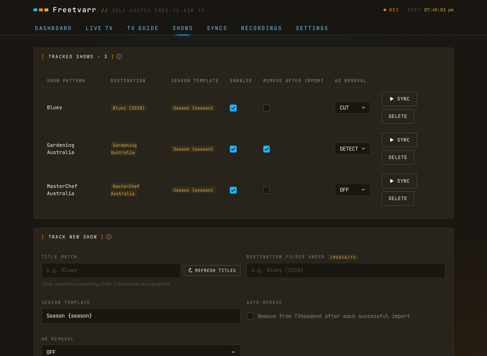

# Following shows

TVHeadend records shows; Freetvarr imports the ones you follow. The Shows tab is where you pick them.

## Add a show

Pick a title TVHeadend has recorded, or type one (on a new install the list is empty). Freetvarr suggests a matching folder under your media root, or a new folder named after the show. You can change the folder before you save.



Matching is by name: a recording is claimed by the first followed show whose pattern appears in the recording's title. Keep patterns specific enough not to collide.

## Season template

Each show has a season-folder template that decides where episodes are saved: `{season}`, `{season_padded}` (zero-padded, `01`), or `{season_unpadded}` (`1`). Freetvarr writes to `<media_root>/<dest_folder>/<season>/…`, and it rejects any template that would point outside your media root.

## Filenames

Freetvarr renames every file as it imports it, into the shape Plex reads:

```text
Show Name - S01E02 - Episode Title.ts
```

When the guide gave no episode number, the air date stands in:

```text
Show Name - 2026-09-21 - Episode Title.ts
```

The episode title is dropped when the guide didn't supply one. TVHeadend's own naming is left alone, because nothing downstream reads it.

## Import, not download

TVHeadend already wrote the file to a folder Freetvarr can see, so there is nothing to download. The import is a hardlink when both folders are on one filesystem, and a copy when they aren't. A hardlink is instant and uses no extra disk; a copy shows its progress in [Recordings](/guide/recordings).

## Enable, sync, remove

- Disable a show to leave it out of scheduled syncs.
- Sync one show to import its new episodes now.
- Delete a follow to stop tracking it; imported files stay on disk.

## Per-show switches

These options are set per show:

- **Remove after import**: remove the TVHeadend copy once Plex confirms the file. See [Remove from TVHeadend](/guide/remove-from-tvheadend).
- **Ad removal mode**: `off`, `DETECT`, or `CUT`. See [Ad removal](/guide/ad-removal).
