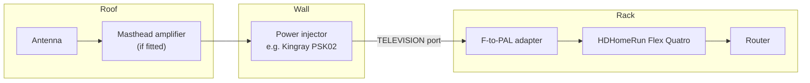

# Hardware

freetvarr needs a tuner that TVHeadend can drive. In Australia that means a DVB-T tuner, and on a NAS it means a network tuner rather than a USB stick.

## The tuner

Buy an **HDHomeRun Flex Quatro**, model `HDFX-4DT`, direct from [SiliconDust](https://shop.silicondust.com/shop/product/hdfx-4dt/). It is `US$199.99`, receives DVB-T and DVB-T2, and carries four tuners, so four things can record at once (or three record while you watch a fourth live).

It is a network tuner: it plugs into your router by ethernet and serves its tuners over the LAN. Nothing plugs into the NAS.

> [!IMPORTANT] 
> Put "AU/NZ adapter" in the order notes. SiliconDust ship the unit with a US, UK, EU, or AU/NZ mains adapter, and they pick from what you tell them.

No Australian retailer stocks a DVB-T HDHomeRun. Buying direct from SiliconDust is the normal route, and shipping to Australia is free.

### Models that work

| Model | Standard | Tuners | Note |
| --- | --- | --- | --- |
| `HDFX-4DT` Flex Quatro | DVB-T/T2 | 4 | The current model. `2 year` warranty |
| `HDFX-4DT-R` Flex Quatro refurbished | DVB-T/T2 | 4 | Cheaper, `90 day` warranty, stock comes and goes |
| `HDHR5-4DT` Connect Quatro | DVB-T/T2/C | 4 | The older model. Works, but usually dearer through AU resellers than a new Flex direct |

### Models that do not work

Anything with `-US` in the model number, and anything branded 4K, is an ATSC tuner for the American standard. It will not tune a single Australian channel. Most Amazon AU and eBay AU HDHomeRun listings are these; check the model number before you buy.

### Outside Australia

The HDHomeRun family covers most of the world, and TVHeadend drives all of them the same way. Match the model to the local broadcast standard:

| Region | Standard | HDHomeRun model |
| --- | --- | --- |
| Australia, New Zealand, UK, Europe | DVB-T/T2 | `HDFX-4DT` Flex Quatro (this page) |
| Europe, cable | DVB-C | `HDHR5-4DT` Connect Quatro (T/T2/C) |
| United States, Canada | ATSC 1.0 / 3.0 | `HDFX-4US` Flex Quatro, `HDHR5-4US` Connect Quatro, or the Flex 4K |

Everything else on this page (network tuner, wiring, signal checks) applies unchanged. Only the guide source changes; see [Outside Australia](/guide/tvheadend#outside-australia) on the TVHeadend page.

### Why not a USB tuner

A `A$20` Xbox One or Hauppauge USB tuner is tempting and does work on a normal Linux box. It does not work on a Synology or QNAP NAS: their kernels ship no DVB drivers, so there is no `/dev/dvb` to pass into the container and nothing for TVHeadend to find. A network tuner sidesteps the kernel entirely. If you want the cheap tuner anyway, run TVHeadend on a Raspberry Pi and write its recordings to a NAS share instead.

## Wiring it up

The HDHomeRun takes the place of whatever box was on the end of your aerial lead. Nothing else in the chain changes.

If a masthead amplifier sits at the antenna, a small box at the wall powers it by sending mains-derived voltage back up the coax. A Kingray `PSK02` is the common one: the wall lead goes into its `ANTENNA` port and the tuner hangs off its `TELEVISION` port. **Keep that box in the chain.** Run a lead from the wall straight to the tuner and the masthead amplifier loses its power, so almost no signal arrives and the tuner finds nothing.

### The connector

The HDHomeRun's antenna input is an F-type threaded socket. Australian wall plates and leads use a PAL (Belling-Lee) push-on plug, so the two do not meet. Australian buyers on the Whirlpool HDHomeRun thread report that the AU order ships with an F-to-PAL converter in the box, so check the box first. If it is missing, one adapter fixes it: an F plug that screws onto the tuner with a PAL socket that takes your existing lead. Jaycar `PA3672` is about `$6`, or use a fly lead with a PAL plug on one end and an F plug on the other.

> [!NOTE] 
> SiliconDust's product page does not itemise what is in the box beyond the power adapter; the converter report comes from owners, not the vendor.

## Checking the signal

Once the tuner has power and ethernet, find its IP in your router's client list and open `http://<hdhr-ip>/tuners.html`. That page reports signal strength, signal quality, and symbol quality per tuner. Read it before you blame the tuner for anything.

Two faults account for most complaints:

- **Dropouts and reboots.** The usual cause is a tired `5 V` power supply, not reception. Swap in a `2–3 A` `5 V` supply and re-test.
- **Strong signal, poor quality.** A masthead amplifier plus a short cable run can overload the front end. A `12 dB` inline attenuator between the adapter and the tuner is the first thing to try.

If the injector's `TELEVISION` port is not fully isolated it can pass a few volts AC through to the tuner. Tuners tolerate this, but if the readings look strange, a `$5` inline DC block (Jaycar `LT3068`, or any F-type DC block) between the adapter and the tuner removes it.

## Where next

- **[TVHeadend](/guide/tvheadend)**: point the recorder at the tuner and scan for channels.
- **[Live TV](/guide/live-tv)**: watch the tuner directly, with no recording involved.
