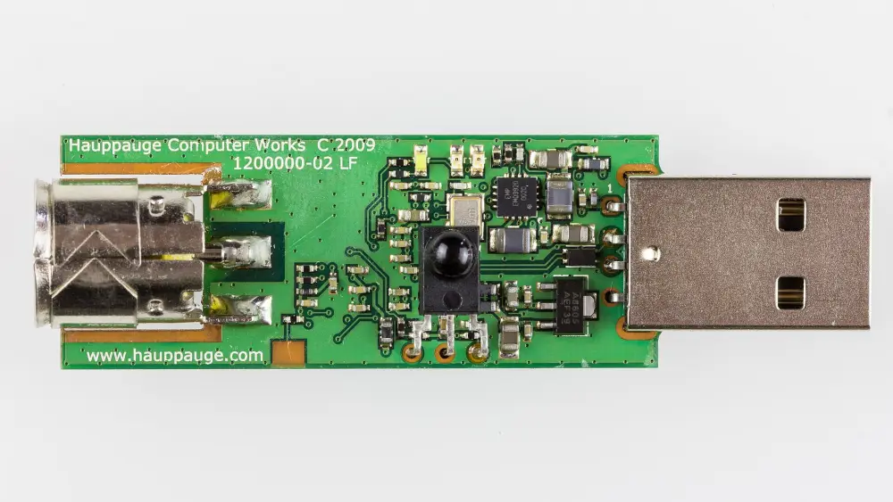
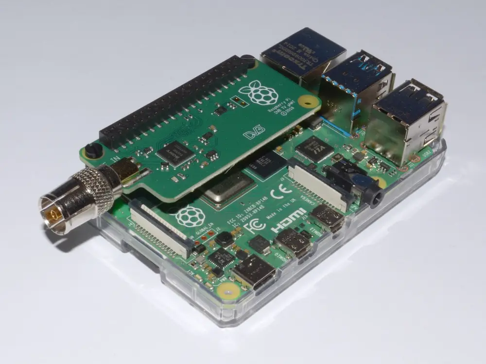
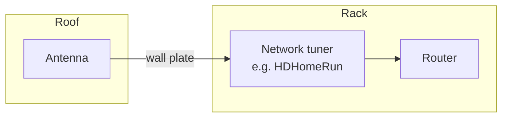
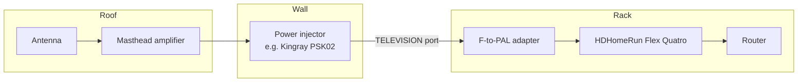
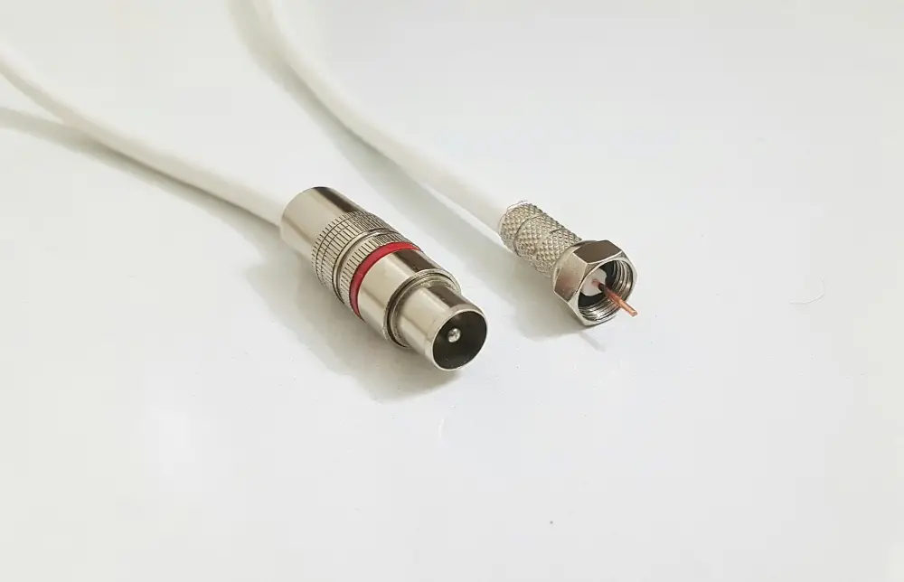

# Hardware

Any TVHeadend-compatible tuner works. Freetvarr talks only to TVHeadend and the recordings folder, so a network tuner, a USB DVB-T/T2/C/S2 stick, a PCIe card, SAT>IP, and IPTV all work. On a NAS a network tuner is the easiest choice, because there is no USB passthrough to arrange; Synology and QNAP kernels ship no DVB drivers, so a USB stick gives you no `/dev/dvb` to pass in. The author recommends the HDHomeRun Flex Quatro, and it is the only tuner Freetvarr has been tested with.

The broadcast standard where you live decides the model: DVB-T/T2 in Australia, New Zealand, the UK, and Europe; ATSC in North America; DVB-C on cable. An HDHomeRun model exists for each, and TVHeadend drives them all the same way.

| Region                             | Standard       | HDHomeRun model                                                    |
| ---------------------------------- | -------------- | ------------------------------------------------------------------ |
| Australia, New Zealand, UK, Europe | DVB-T/T2       | `HDFX-4DT` Flex Quatro                                             |
| Europe, cable                      | DVB-C          | `HDHR5-4DT` Connect Quatro (T/T2/C)                                |
| United States, Canada              | ATSC 1.0 / 3.0 | `HDFX-4US` Flex Quatro, `HDHR5-4US` Connect Quatro, or the Flex 4K |

The wiring, the connector, and the signal checks below are the same for every model. Only the model number and the guide source change; see [Outside Australia](/guide/tvheadend#outside-australia) on the TVHeadend page for the guide.

## The tuner

The rest of this page is the author's own setup, in Australia. Read it as a worked example and substitute your own region's model and retailer.

Buy an **HDHomeRun Flex Quatro**, model `HDFX-4DT`, direct from [SiliconDust](https://shop.silicondust.com/shop/product/hdfx-4dt/). It is `US$199.99`, receives DVB-T and DVB-T2, and carries four tuners, so four things can record at once (or three record while you watch a fourth live).

It is a network tuner: it plugs into your router, or a switch on your LAN, by ethernet and serves its tuners over the LAN. Nothing plugs into the NAS. The author's router has a single LAN port, so a `TP-Link TL-SG105` five-port switch connects the router, the NAS, and the tuner.

> [!IMPORTANT] 
> In the order notes, ask for the AU/NZ power adapter and an F-to-PAL aerial adapter. SiliconDust has power adapters for the US, UK, EU, and AU/NZ. The author asked for both in his order notes, and both came in the box.

No Australian retailer stocks a DVB-T HDHomeRun. Buying direct from SiliconDust is the normal route, and shipping to Australia is free.

### Direct to a spare NAS port

A NAS with a second ethernet port can take the tuner directly, with no router in between. It works, with two catches. Nothing on that link hands out addresses, so the tuner and the NAS port fall back to link-local addresses (`169.254.x.x`). TVHeadend under host networking still finds the tuner by broadcast on that port. But the tuner no longer appears in your router's client list, and its status page answers only from the NAS itself. Plug the tuner into the router or a switch on your LAN if you can.

### Models that work in Australia

| Model                                | Standard   | Tuners | Note                                                                                   |
| ------------------------------------ | ---------- | ------ | -------------------------------------------------------------------------------------- |
| `HDFX-4DT` Flex Quatro               | DVB-T/T2   | 4      | The current model. `2 year` warranty                                                   |
| `HDFX-4DT-R` Flex Quatro refurbished | DVB-T/T2   | 4      | Cheaper, `90 day` warranty, stock comes and goes                                       |
| `HDHR5-4DT` Connect Quatro           | DVB-T/T2/C | 4      | The older model. Works, but usually dearer through AU resellers than a new Flex direct |

### Models that do not work in Australia

Anything with `-US` in the model number, and anything branded 4K, is an ATSC tuner for the American standard. It will not tune a single Australian channel. Most Amazon AU and eBay AU HDHomeRun listings are these; check the model number before you buy.

### Why not a USB tuner

A `A$20` Xbox One or Hauppauge USB tuner works on a normal Linux computer. It does not work on a Synology or QNAP NAS: their kernels ship no DVB drivers, so there is no `/dev/dvb` to pass into the container and nothing for TVHeadend to find. A network tuner needs no driver on the NAS. To use a USB tuner anyway, run TVHeadend on a Raspberry Pi and write its recordings to a NAS share instead.

  
  
A USB tuner (Hauppauge WinTV MiniStick). It needs a computer with DVB drivers, such as a Raspberry Pi or a mini PC running Linux. <em>Photo: <a href="https://commons.wikimedia.org/wiki/File:Hauppauge_WinTV_MiniStick-1202.jpg">Raimond Spekking</a>, <a href="https://creativecommons.org/licenses/by-sa/4.0/">CC BY-SA 4.0</a>, via Wikimedia Commons; resized.</em>

  
  
A Raspberry Pi 4 with the Raspberry Pi TV µHAT, a DVB-T/T2 tuner board. TVHeadend drives it the same way as a USB tuner. <em>Photo: <a href="https://commons.wikimedia.org/wiki/File:Raspberry_Pi_4B_DVB_TV_%CE%BCHat_(angle).jpg">Multicherry</a>, <a href="https://creativecommons.org/licenses/by-sa/4.0/">CC BY-SA 4.0</a>, via Wikimedia Commons; resized.</em>

## Wiring it up

The tuner takes the place of whatever box was on the end of your aerial lead. Nothing else in the chain changes. For most homes the chain is the aerial lead into the tuner and an ethernet lead into the router:

```mermaid
flowchart LR
  subgraph roof["Roof"]
    ant["Antenna"]
  end
  subgraph rack["Rack"]
    hdhr["Network tuner<br>e.g. HDHomeRun"]
    router["Router"]
  end
  ant -->|"wall plate"| hdhr --> router
```

> [!NOTE] 
> The masthead amplifier, the power injector, and the F-to-PAL adapter below are the author's own installation. None of them is required by Freetvarr or TVHeadend. Skip this section unless your aerial already has an amplifier or your wall plate does not fit the tuner's socket.

### With a masthead amplifier (author's setup)

If a masthead amplifier sits at the antenna, a small box at the wall powers it by sending mains-derived voltage back up the coax. A Kingray `PSK02` is the common one in Australia: the wall lead goes into its `ANTENNA` port and the tuner hangs off its `TELEVISION` port.

```mermaid
flowchart LR
  subgraph roof["Roof"]
    ant["Antenna"]
    amp["Masthead amplifier"]
  end
  subgraph wall["Wall"]
    inj["Power injector<br>e.g. Kingray PSK02"]
  end
  subgraph rack["Rack"]
    adapt["F-to-PAL adapter"]
    hdhr["HDHomeRun Flex Quatro"]
    router["Router"]
  end
  ant --> amp --> inj
  inj -->|"TELEVISION port"| adapt --> hdhr --> router
```

> [!WARNING] 
> If you have an injector, keep it in the chain. Run a lead from the wall straight to the tuner and the masthead amplifier loses its power, so almost no signal arrives and the tuner finds nothing.

### The connector

The HDHomeRun's antenna input is an F-type threaded socket, so your wall plate may need an adapter. This depends on your country's plug standard. In Australia it does: Australian wall plates and leads use a PAL (Belling-Lee) push-on plug, so the two do not meet. Ask for an F-to-PAL adapter in the order notes, as above; buyers on the Whirlpool HDHomeRun thread report that it comes in the box. If it is missing, buy one: an F plug that screws onto the tuner with a PAL socket that takes your existing lead. Jaycar `PA3672` is about `$6`, or use a fly lead with a PAL plug on one end and an F plug on the other.

  
  
Left: a PAL (Belling-Lee) plug, which pushes on. Right: an F plug, which screws on. The tuner has an F socket. <em>Photo: <a href="https://commons.wikimedia.org/wiki/File:TV_antenna_connectors.jpg">Sajad-HasanAhmadi</a>, <a href="https://creativecommons.org/licenses/by-sa/4.0/">CC BY-SA 4.0</a>, via Wikimedia Commons; resized.</em>

> [!NOTE] 
> SiliconDust's product page lists only the power adapter as in the box. The F-to-PAL adapter is not a listed item, so a future order could arrive without it.

## Checking the signal

Once the tuner has power and ethernet, find its IP in your router's client list and open `http://<hdhr-ip>/tuners.html`. That page reports signal strength, signal quality, and symbol quality per tuner. Read it before you blame the tuner for anything.

The common faults:

- **Dropouts and reboots.** The usual cause is a tired `5 V` power supply, not reception. Swap in a `2–3 A` `5 V` supply and re-test.
- **Strong signal, poor quality.** Only with a masthead amplifier: the amplifier plus a short cable run can overload the front end. A `12 dB` inline attenuator between the adapter and the tuner is the first thing to try.

Only with a power injector: if its `TELEVISION` port is not fully isolated it can pass a few volts AC through to the tuner. Tuners tolerate this, but if the readings look strange, a `$5` inline DC block (Jaycar `LT3068`, or any F-type DC block) between the adapter and the tuner removes it.

## Hardware transcoding

Live TV in the browser re-encodes H.264 so that Chrome can play interlaced channels; see [Video handling](/guide/live-tv#video-handling). A graphics chip does this work with almost no CPU. Freetvarr supports Intel Quick Sync and AMD through VAAPI. NVIDIA (NVENC) is not supported. A host without a supported chip needs no setup: Freetvarr uses software and caps the video at `540` lines.

1. Find the render group on the host: `stat -c %g /dev/dri/renderD128`.
2. Add that number to `.env`: `RENDER_GID=<number>`.
3. Download `docker-compose.hwaccel.example.yml` from the repository (`https://raw.githubusercontent.com/furey/freetvarr/main/docker-compose.hwaccel.example.yml`) and save it as `docker-compose.override.yml` beside `docker-compose.yml`. Compose loads the override file by itself.
4. Recreate the container: `docker compose up -d`.
5. Check the log: `docker compose logs freetvarr | grep "\[live\] video"`. The line says `hardware (VAAPI` when it works.

The override file passes `/dev/dri` into the container and adds `RENDER_GID` as a group. Never put `/dev/dri` in the main compose file on a host that lacks it; the container then fails to start. Set `LIVE_TV_VAAPI_DEVICE` if the render node is not `/dev/dri/renderD128`.

> [!NOTE] 
> The author's NAS is a Synology DS220+ (Intel Celeron J4025, UHD 600 graphics) with render group `937`. Hardware `1080i` to `720p` ran at about `6.5x` real time, using about `5%` of one core. Software `720p` ran at only `1.36x` real time on both cores.

## Where next

- **[TVHeadend](/guide/tvheadend)**: point the recorder at the tuner and scan for channels.
- **[Live TV](/guide/live-tv)**: watch the tuner directly, with no recording involved.
