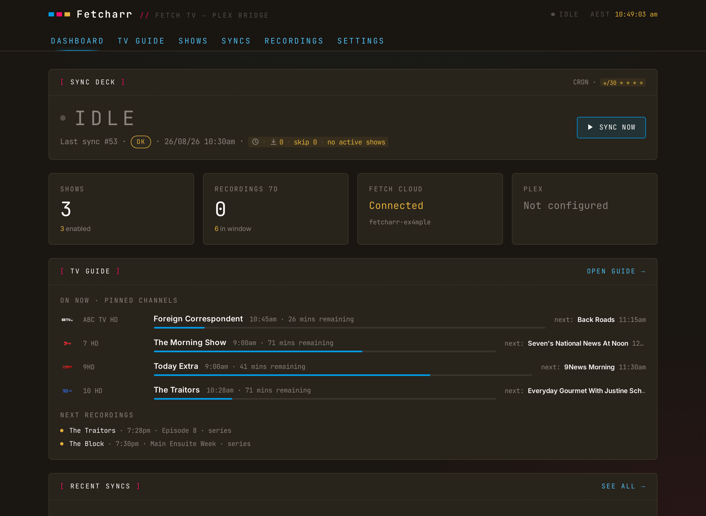
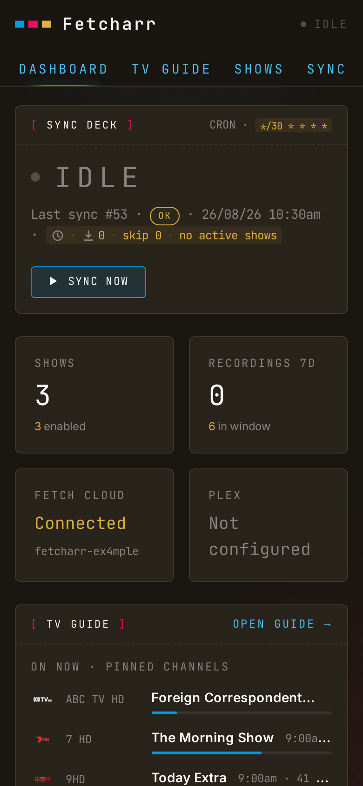
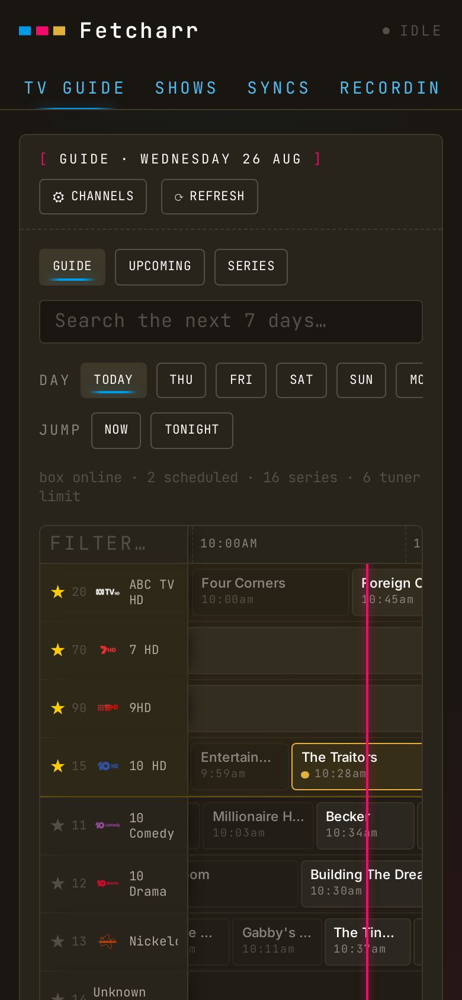
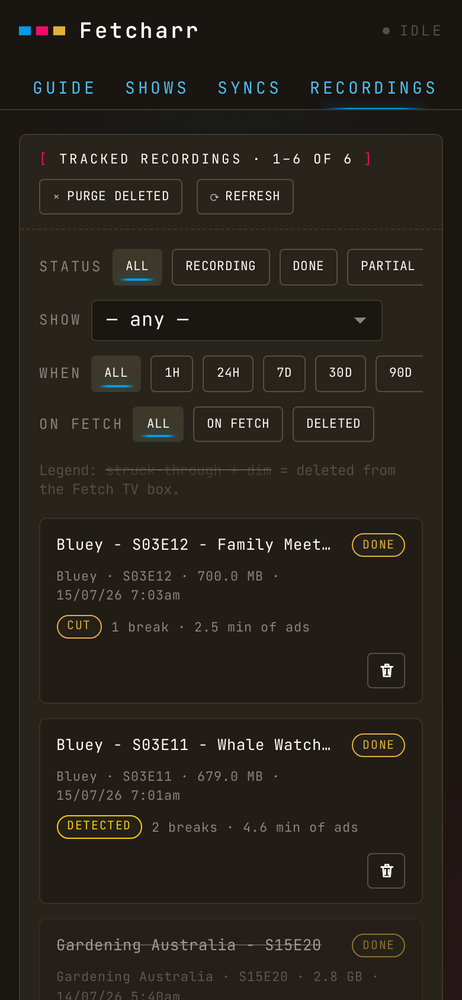

# What freetvarr is

TVHeadend records free-to-air TV, then the files sit in its recordings folder with names Plex cannot read. freetvarr watches TVHeadend on your LAN, picks up new episodes of the shows you follow, files them into your Plex TV library under names Plex understands, and pokes Plex to scan. Once Plex confirms the file, it can delete the recording from TVHeadend.

If your media stack is HDHomeRun → TVHeadend → Plex, freetvarr is the automation in between: schedule a series from its built-in TV Guide, and the episodes turn up in Plex named and foldered.

> [!NOTE] 
> Screenshots are pending. The images below still show the previous Fetch TV build of the app.

## Where it works

Everywhere TVHeadend works. freetvarr talks only to TVHeadend's HTTP API and the recordings folder, so the broadcast standard is TVHeadend's problem: DVB-T/T2 (Australia, New Zealand, UK, Europe), DVB-C and DVB-S, ATSC (United States and Canada), ISDB-T. Three things differ by country, and TVHeadend holds all three: the tuner model, the guide source, and the mux scan list.

> [!NOTE] 
> These pages use Australian values in their examples (`TZ=Australia/Sydney`, the `au-Sydney` mux list, a Sydney XMLTV feed, a `comskip.ini` tuned for Australian channels) because that is where the author lives. Each one is an example. Substitute your own region's values as you go; [Hardware](/guide/hardware) and [TVHeadend](/guide/tvheadend) say what to pick instead.

## What freetvarr isn't

- **Not an indexer integration** (Sonarr / Radarr / Prowlarr). freetvarr works with the recordings TVHeadend has made, and its [TV Guide](/guide/tv-guide) schedules what TVHeadend records next. It doesn't search the internet for content.
- **Not a tuner.** TVHeadend drives the tuner, scans the muxes, and writes the files. freetvarr talks to TVHeadend's HTTP API; it never touches the hardware. See [TVHeadend](/guide/tvheadend).
- **Not authenticated.** There's no login, so it's built for a home network you trust. The usual web hardening is in place (CSRF protection, rate limiting, a strict content-security policy), but anyone who can reach the page can change its settings, so don't expose it to the internet. See the [security model](/deep-dive#security-model).
- **Not a converter.** Files arrive from TVHeadend as `.ts` (the raw broadcast format) and stay `.ts`; freetvarr never re-encodes them. The optional ad-cutting copies the video across untouched and just drops the ad sections, so there's no quality loss and no change of format. If you want `.mkv`, run the files through Tdarr or similar afterwards.
- **Not a notifier.** No Discord / ntfy / push integration.

> [!IMPORTANT] 
> Tested against TVHeadend `4.3` fed by an HDHomeRun Flex Quatro, with Plex Media Server. Other tuners and TVHeadend versions are unverified.

## Where next

- **[Hardware](/guide/hardware)**: what to buy, and how it wires into the aerial you already have.
- **[TVHeadend](/guide/tvheadend)**: the recorder itself, from Docker container to scanned channels and a working guide.
- **[Getting started](/guide/getting-started)**: run freetvarr with Docker and walk the first-run wizard.
- **[TV Guide](/guide/tv-guide)**: browse 7 days of programmes and schedule recordings from the browser.
- **[Following shows](/guide/following-shows)**: mark shows to follow and point them at library folders.
- **[Recordings](/guide/recordings)** and **[Syncs](/guide/syncs)**: watch imports happen and read the status of each one.
- **[Ad removal](/guide/ad-removal)**: the optional comskip detect/cut pass.
- **[Plex](/guide/plex)**, **[Delete from TVHeadend](/guide/delete-from-tvheadend)**, and **[Live TV](/guide/live-tv)**: the optional extras.
- **[Migrating from Fetch](/guide/migrating-from-fetch)**: the moving-day checklist if you're coming off a Fetch box.
- **[Configuration](/guide/configuration)** and **[Troubleshooting](/guide/troubleshooting)**: the deploy knobs and the fixes for common snags.

It works on a phone, too: on a narrow screen every view rearranges into cards and swipeable rows of buttons.

