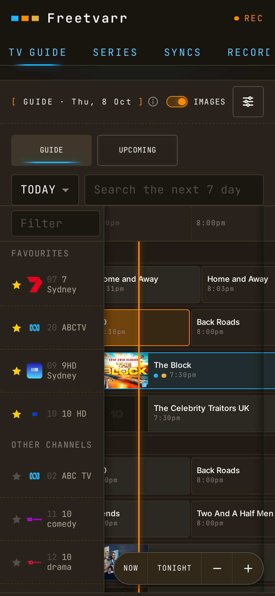

# What Freetvarr is

Freetvarr records free-to-air TV and files each episode into your TV library. Watch it on your TV in Plex, Jellyfin, Kodi, or another media player, with pause, rewind, and skip.

<!-- markdownlint-disable-next-line MD033 -->
<BrowserFrame />

With it, you can:

- **[Record from a 7-day guide](/guide/tv-guide)** on your phone or computer: one episode, or every episode of a series.
- **[Watch recordings in your own player](/guide/series).** Each episode goes into a series and season folder with its episode number, so your player shows the right title and artwork. If you use [Plex](/guide/plex), Freetvarr also tells it to scan.
- **[Cut the ad breaks](/guide/ad-removal)**, if you want them gone. Freetvarr keeps the original in case a cut goes wrong.
- **[Watch live TV in a browser](/guide/live-tv)** on any phone, tablet, or computer, with no app to install, and pause or rewind up to `30` minutes. To watch live TV on the TV itself, use one of the TV apps that [Live TV](/guide/live-tv#the-options) lists.
- **[Clear out TVHeadend](/guide/remove-from-tvheadend).** If you use Plex, Freetvarr can delete each recording once Plex has the episode.

Freetvarr runs in Docker next to TVHeadend and a TVHeadend-compatible tuner, on a computer that stays on, such as a NAS or a mini PC. [Hardware](/guide/hardware) covers the tuner, and [Getting started](/guide/getting-started) covers the install.

## Plex DVR

If you have a Plex Pass, you may not need Freetvarr. Plex's own DVR records free-to-air TV from a network tuner straight into your Plex library, and that is a fine choice. [Plex DVR instead](/guide/plex-dvr) compares the two and says what Plex DVR costs without a Plex Pass.

## How it files recordings

TVHeadend names each recording after the programme title only, for example `The Block.ts`. Plex, Jellyfin, and Kodi match a file to an episode only when the name has a season and episode number (`S01E02`) or an air date. Freetvarr finds new recordings. It files each episode of a series into your TV library as `Show/Season 01/Show - S01E02.ts`, or by air date when the guide has no episode number. A one-off, such as a sports final, goes to a separate folder named after its title. When Freetvarr sees the recordings folder and the library through one mount, the import is a hardlink: it is instant and uses no extra disk space.

## Where it works

Everywhere TVHeadend works. Freetvarr talks only to TVHeadend's HTTP API and the recordings folder, so the broadcast standard is TVHeadend's problem: DVB-T/T2 (Australia, New Zealand, UK, Europe), DVB-C and DVB-S, ATSC (United States and Canada), ISDB-T. The tuner model, the guide source, and the mux scan list differ by country, and all of them are TVHeadend settings.

Any tuner that TVHeadend can drive works: a network tuner, a USB DVB stick, a PCIe card, SAT>IP, or IPTV. [Hardware](/guide/hardware) covers the choice.

> [!NOTE] 
> These pages use Australian values in their examples (the `Australia/Sydney` time zone, the `au-Sydney` mux list, a Sydney XMLTV feed, a `comskip.ini` tuned for Australian channels) because that is where the author lives. Each one is an example. Substitute your own region's values as you go; [Hardware](/guide/hardware) and [TVHeadend](/guide/tvheadend) say what to pick instead.

## What Freetvarr isn't

- **Not an indexer integration** (Sonarr / Radarr / Prowlarr). Freetvarr works with the recordings TVHeadend has made, and its [TV Guide](/guide/tv-guide) schedules what TVHeadend records next. It doesn't search the internet for content.
- **Not a tuner.** TVHeadend drives the tuner, scans the muxes, and writes the files. Freetvarr talks to TVHeadend's HTTP API; it never touches the hardware. See [TVHeadend](/guide/tvheadend).
- **Not authenticated.** There's no login, so it's built for a home network you trust. The usual web hardening is in place (CSRF protection, rate limiting, a strict content-security policy), but anyone who can reach the page can change its settings, so don't expose it to the internet. See the [security model](/deep-dive#security-model).
- **Not a converter.** Files arrive from TVHeadend as `.ts` (the raw broadcast format) and stay `.ts`; Freetvarr never re-encodes them. The optional ad removal drops the ad sections without re-encoding, so there's no quality loss. If you want `.mkv`, run the files through Tdarr or similar afterwards.
- **Not a notifier.** No Discord / ntfy / push integration.

> [!IMPORTANT] 
> Tested against TVHeadend `4.3` fed by an HDHomeRun Flex Quatro, with Plex Media Server. Other tuners and TVHeadend versions are unverified.

## Background

The author first wrote [Fetcharr](https://github.com/furey/fetcharr), which copied recordings off a Fetch TV box into Plex. When Fetch announced its Gen 3 levy, he bought an HDHomeRun tuner, set up TVHeadend, and swapped Fetcharr's pieces one at a time until the new setup worked. That became Freetvarr. Only after all that did he notice that his own Plex Pass already covered Plex DVR, which records from the same tuner with no extra software; [Plex DVR instead](/guide/plex-dvr) compares the two. For people without a Plex Pass, Freetvarr is one option, but the hardware still costs a few hundred dollars. [Leaving Fetch TV](/guide/leaving-fetch) compares that cost with a new Fetch box.

## Where next

- **[Hardware](/guide/hardware)**: what to buy, and how it wires into the aerial you already have.
- **[TVHeadend](/guide/tvheadend)**: the recorder itself, from Docker container to scanned channels and a working guide.
- **[Getting started](/guide/getting-started)**: run Freetvarr with Docker and walk the first-run wizard.
- **[TV Guide](/guide/tv-guide)**: browse 7 days of programmes and schedule recordings from the browser.
- **[Series](/guide/series)**: record a series and set its library folder.
- **[Recordings](/guide/recordings)** and **[Syncs](/guide/syncs)**: watch imports happen and read the status of each one.
- **[Ad removal](/guide/ad-removal)**: the optional comskip detect/cut pass.
- **[Plex](/guide/plex)**, **[Remove from TVHeadend](/guide/remove-from-tvheadend)**, and **[Live TV](/guide/live-tv)**: the optional extras.
- **[Leaving Fetch TV](/guide/leaving-fetch)**: save your recordings, buy a tuner, and cancel before the levy. Former Fetcharr users also read **[From Fetcharr](/guide/from-fetcharr)**.
- **[Configuration](/guide/configuration)** and **[Troubleshooting](/guide/troubleshooting)**: the deploy knobs and the fixes for common snags.

It works on a phone, too.

