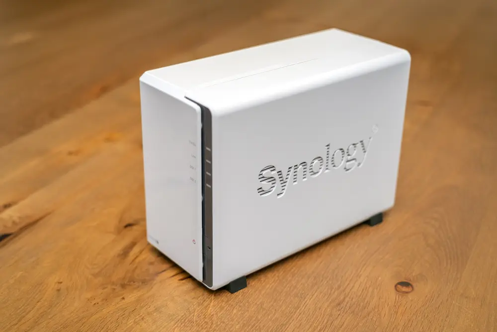
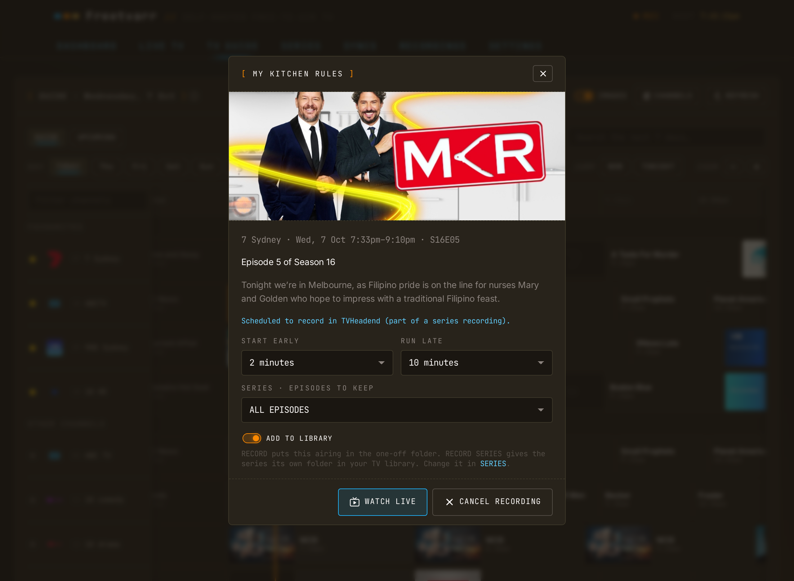
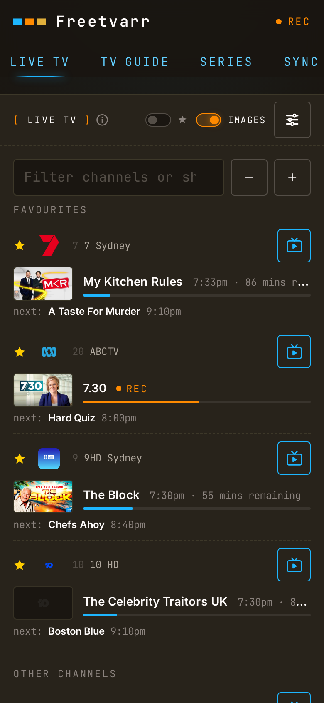
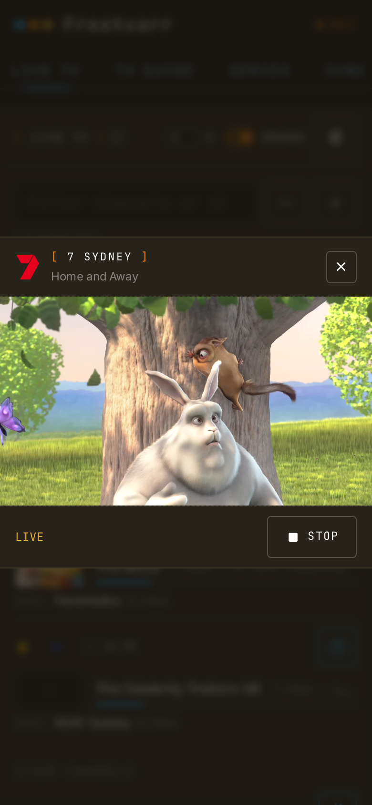
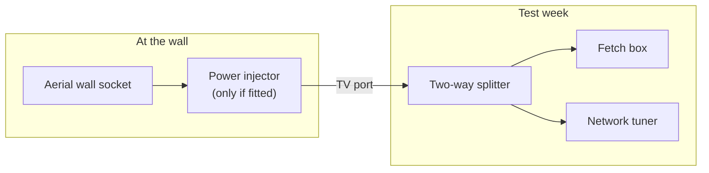

# Leaving Fetch TV

Fetch TV is an Australian set-top box service. If you have a Fetch Mini Gen 3 or Mighty Gen 3, Fetch now charges a one-off levy to keep it working until October 2027. Fetch also removes some apps from these boxes, whether you pay or not. The steps below replace the box with hardware you own. Free-to-air TV is free to receive, so after the one-off purchase there is nothing more to pay.

## What you'll need

1. **A tuner**: a small box that takes your aerial lead and sends live TV over your home network. An HDHomeRun is a good one. The Flex Quatro has four tuners inside, so it receives four channels at once.
2. **Somewhere to store recordings**: a hard drive. A NAS (a small storage box with hard drives that stays on) suits this well, because it can also run the recording software.

   

     
     
A two-bay NAS (Synology DS223j). It holds two hard drives and stays on all the time. <em>Photo: <a href="https://commons.wikimedia.org/wiki/File:Synology_Disk_Station_DS223J_-_NAS-Server.jpg">DYVER</a>, <a href="https://creativecommons.org/licenses/by-sa/4.0/">CC BY-SA 4.0</a>, via Wikimedia Commons; resized.</em>

   

3. **Recording software** on a computer that stays on, such as the NAS. It follows the TV guide and records what you ask for. Free options include TVHeadend and Jellyfin. Paid options include Plex's own recording feature (it needs a Plex Pass subscription), Channels DVR, and SiliconDust's own recording service.

To watch live TV only, you need just the tuner and its free app. The drive and the software are for recording.

[Freetvarr](/guide/) is one more optional piece. The author built it for his own setup and shares it in case it makes things easier. Its install includes TVHeadend, and its setup wizard sets it up for you: logins, channels, and the guide. It can install Plex too. If you already run TVHeadend or Plex, it uses yours. You can use any of the other software instead.

> [!TIP] 
> If you already pay for a Plex Pass, Plex's own recorder may be all you need: buy the tuner, set up Plex DVR, and skip TVHeadend and Freetvarr. [Plex DVR instead](/guide/plex-dvr) compares the two, including the Plex Pass price if you don't have one.

## What the Fetch box did

| Job                 | Fetch box                          | Replacement                                                                     |
| ------------------- | ---------------------------------- | ------------------------------------------------------------------------------- |
| Live free-to-air TV | Fetch's guide and remote           | A network tuner and its free app (Path 1), or Freetvarr in any browser (Path 2) |
| Recording           | Mighty only, to its own hard drive | TVHeadend, free recording software, on an always-on computer (Path 2)           |
| 7-day guide         | Fetch's cloud                      | A free online guide for your city, loaded into TVHeadend (Path 2)               |
| Streaming apps      | Netflix, Stan, Disney+, and others | The apps on your smart TV, or a streaming stick ([FAQ](#streaming-apps))        |

Fetch's paid channel packs and streamed international channels have no free replacement. See [Channel packs](#channel-packs).

## The deadline

The facts below come from Fetch's [Extended Service Levy](https://news.fetchtv.com.au/extended-service-levy-1) page and [levy FAQ](https://main.fetchtv.com.au/gen-3-extended-service-levy), as of October 2026:

- **Who pays**: households with a Mini Gen 3 (`H626T`) or Mighty Gen 3 (`M616T`) and no active Fetch subscription (Fetch Access, Multiroom, Movie Box, or a channel pack). Apps billed through Fetch, such as Netflix, do not count.
- **How much**: `$29.99` once per household, however many Gen 3 boxes you have.
- **When**: Fetch charges the card on file on `1 November 2026` unless you cancel by `31 October 2026`.
- **What it buys**: service to `31 October 2027`. Fetch says it will "endeavour" to support Gen 3 boxes after that, but it makes no promise.
- **If you do not pay**: Fetch suspends the account. A suspended Mighty loses "making or viewing recordings".
- **If you cancel**: Fetch says a cancelled box "cannot be reactivated in the future by you or anyone else". The box stops working completely, free-to-air TV included.
- **Apps**: Fetch removes some apps from Gen 3 boxes whether you pay or not. [CyberShack reports](https://cybershack.com.au/consumer-advice/fetch-tv-gen-3/) that the Mini loses Netflix, Paramount+, SBS On Demand, and Hayu, and the Mighty loses Paramount+.

Fetch's own offer is a new Fetch box, which needs a Fetch Access subscription at `$4.99` a month.

> [!WARNING] 
> Save your recordings first. Once the box is cancelled or suspended, you cannot play or copy them. [Saving your Fetch recordings](#saving-your-fetch-recordings) takes an afternoon; do it before you cancel and before `1 November 2026`.

## Two paths

Both paths start with the same network tuner: a small box that takes your aerial lead and sends live TV over your home network. Pick the path that fits you. You can start with Path 1 and add Path 2 later with the same tuner.

The first path needs no technical skill. The second path means installing and setting up software on a computer; if you have never done that, ask a friend who has.

|                  | Path 1: Watch only                  | Path 2: Watch and record                                                                          |
| ---------------- | ----------------------------------- | ------------------------------------------------------------------------------------------------- |
| Cost             | about `A$280–400` once              | about `A$600–1,400` once, or the tuner alone if you already own an always-on computer             |
| What you get     | Live TV on TVs, tablets, and phones | Everything in Path 1, plus a 7-day guide, recordings to watch on your TV, and optional ad removal |
| Your time        | about `30 minutes`                  | `1–2` evenings                                                                                    |
| Needs a computer | No                                  | Yes, one that stays on: a NAS (a home storage box) or a mini PC                                   |

On cost alone, a new Fetch box can come out cheaper. [Staying with Fetch](#staying-with-fetch) has the numbers.

### Path 1: Watch only

Buy a network tuner, plug in the aerial lead and a network cable from your router, and install an app that plays it on your TV, tablet, or phone (e.g. the HDHomeRun app, Kodi, or VLC). The HDHomeRun app is the simplest: it finds the tuner on its own and shows every free-to-air channel with a short guide. SiliconDust, the company that makes HDHomeRun tuners, [lists the app](https://www.silicondust.com/hdhomerun/) for iPhone and iPad, Android, Apple TV, Google TV and Android TV, Fire TV, Roku, Xbox, Windows, macOS, and Linux. The app is free, and it can pause and rewind live TV with no subscription.

Add Path 2 later and the TV apps get TVHeadend's 7-day guide too: Freetvarr shows the addresses to copy into Jellyfin or Kodi ([TV apps](/guide/tv-apps)).

SiliconDust also sells a recording service, its [DVR service](https://info.hdhomerun.com/info/dvr), that works in Australia. Series recording and the longer guide cost `US$35` a year, and the service needs a storage device to record to. Path 2 records for free instead.

### Path 2: Watch and record

This is the author's setup. The tuner sends TV to TVHeadend, free recording software that runs on an always-on computer at home. Freetvarr runs alongside it and gives you:

- A 7-day [TV Guide](/guide/tv-guide), where you record one programme or a whole series.
- [Recordings](/guide/recordings) filed into your TV library, so you watch them on your TV in Plex, Jellyfin, or Kodi, with pause, rewind, and skip.
- Optional [ad removal](/guide/ad-removal) from recordings.
- [Live TV](/guide/live-tv) in the browser on any phone, tablet, or computer in the house, with no app to install. On the TV itself, watch live TV with the 7-day guide in Jellyfin or Kodi: Freetvarr shows the addresses to copy into the app ([TV apps](/guide/tv-apps)).

The clip below shows Freetvarr in use.

<!-- markdownlint-disable-next-line MD033 -->
<BrowserFrame />

Recording works like the record button on the Fetch remote. Open a programme in the TV Guide, then press **RECORD** for one episode or **RECORD SERIES** for every episode.

<!-- markdownlint-disable MD033 -->
<BrowserFrame label="http://freetvarr.lan/#/guide">
  
</BrowserFrame>
<!-- markdownlint-enable MD033 -->

On a phone, open the Live TV tab and tap a channel. The browser plays it, with no app to install.

  

    
    
  

  
Live TV on a phone: the channel list, then the player.

The always-on computer is a NAS (a small storage box with hard drives) or a mini PC. Setup uses Docker (free software that runs apps such as TVHeadend) and a few typed commands. The guides linked in [Setting up](#setting-up) show each step.

To use other recording software from [What you'll need](#what-you-ll-need), buy the same tuner, drive, and computer, and follow that software's own setup guide. With a Plex Pass, the simplest choice is Plex's own recorder; see [Plex DVR instead](/guide/plex-dvr).

[Channels DVR](https://getchannels.com/dvr-server/) is paid recording software with its own apps for Apple TV, Fire TV, Google TV, and phones. It costs `US$8` a month or `US$80` a year after a free month, and its apps stop working if you stop paying; your recordings stay on your drive. It has no Australian guide of its own, so you load a free one (e.g. the guide Freetvarr uses). It has no app for Roku or most smart TVs.

## Shopping list

Some links below are affiliate links: as an Amazon Associate I earn from qualifying purchases, at no extra cost to you.

Prices are in Australian dollars, as of October 2026, and change often. Check the model number before you buy.

### Path 1 shopping

| Item                                              | Why                                                                                                                                  | Price                                                                                | Where to buy                                                                                                                                                                                                |
| ------------------------------------------------- | ------------------------------------------------------------------------------------------------------------------------------------ | ------------------------------------------------------------------------------------ | ----------------------------------------------------------------------------------------------------------------------------------------------------------------------------------------------------------- |
| HDHomeRun Flex Quatro (`HDFX-4DT`)                | The tuner. It has four tuners inside, so it receives four channels at once                                                           | `US$199.99` direct (about `A$280–330` with GST), `A$370–400` from Australian sellers | [SiliconDust](https://shop.silicondust.com/shop/product/hdfx-4dt/), [Standard Computers](https://www.standard.com.au/silicondust-hd-homerun-quatro-flex-tv-tuner-hdfx-4dt-au-aussie-version/product-detail) |
| HDHomeRun Flex Quatro, refurbished (`HDFX-4DT-R`) | The same tuner, cheaper, with a `90 day` warranty; not always in stock                                                               | `US$174.99` direct                                                                   | [SiliconDust](https://shop.silicondust.com/shop/product/dvb-t-t2-c-hdhomerun-flex-quatro-hdfx-4dt-r/)                                                                                                       |
| F-to-PAL adapter                                  | Australian aerial leads have a PAL plug; the tuner has an F socket. Ask for one in the order notes; buy one only if it does not come | `A$4–6`                                                                              | [Jaycar `PA3672`](https://www.jaycar.com.au/f-59-plug-to-pal-tv-socket/p/PA3672)                                                                                                                            |
| 5-port network switch                             | Only if your router has no free network (ethernet) port                                                                              | `A$23–29`                                                                            | [Amazon AU `TL-SG105`](https://www.amazon.com.au/dp/B00A128S24?tag=freetvarr-22), [Umart](https://www.umart.com.au/product/tp-link-5-port-steel-gigabit-switch-tl-sg105-25339)                              |

  
  
Left: the PAL plug on an Australian aerial lead. Right: an F plug, the type the tuner takes. The F-to-PAL adapter joins the two. <em>Photo: <a href="https://commons.wikimedia.org/wiki/File:TV_antenna_connectors.jpg">Sajad-HasanAhmadi</a>, <a href="https://creativecommons.org/licenses/by-sa/4.0/">CC BY-SA 4.0</a>, via Wikimedia Commons; resized.</em>

Buy only a `DT` model. Anything with `US` in the model number, any Flex Duo, and anything branded 4K is built for American TV and cannot receive Australian channels. Most HDHomeRun listings on Amazon AU and eBay AU are these American models. When you order from SiliconDust, write in the order notes that you need the AU/NZ power adapter and an F-to-PAL aerial adapter. SiliconDust has power adapters for the US, UK, EU, and AU/NZ. The author asked for both in his order notes, and both came in the box. Shipping from the US takes about a week, so order early.

### Path 2 shopping

Everything in Path 1, plus an always-on computer and somewhere to store recordings:

| Item                                     | Why                                                                                                                                                          | Price                  | Where to buy                                                                                                                                                               |
| ---------------------------------------- | ------------------------------------------------------------------------------------------------------------------------------------------------------------ | ---------------------- | -------------------------------------------------------------------------------------------------------------------------------------------------------------------------- |
| Synology DS225+ NAS                      | Runs TVHeadend, Freetvarr, and Plex, and holds the recordings. Its Intel graphics chip converts live TV for the browser and leaves the processor almost idle | `A$549–620`, no drives | [Amazon AU](https://www.amazon.com.au/dp/B0FC2888KF?tag=freetvarr-22), [Umart](https://www.umart.com.au/brand/synology-271)                                                |
| NAS hard drive, 4TB                      | Room for about `650–1,300` hours of HD                                                                                                                       | `A$330–360`            | [Scorptec, Seagate IronWolf](https://www.scorptec.com.au/brand/seagate)                                                                                                    |
| NAS hard drive, 8TB                      | Twice that                                                                                                                                                   | `A$590–640`            | [Scorptec, Seagate IronWolf](https://www.scorptec.com.au/brand/seagate)                                                                                                    |
| Or: a mini PC with an Intel N150 or N100 | Cheaper than a NAS. Runs Linux and Docker; its Intel graphics chip converts live TV for the browser                                                          | about `A$290–370`      | [Amazon AU, Beelink EQ14](https://www.amazon.com.au/dp/B0G1M7C1V9?tag=freetvarr-22), [Amazon AU, GMKtec G3 Plus](https://www.amazon.com.au/dp/B0FKYPD8JR?tag=freetvarr-22) |
| Or, with a mini PC: a USB tuner          | Cheaper than a network tuner, but it works only plugged into the Linux computer that runs TVHeadend, not a NAS                                               | `A$100–190`            | [PB Tech, Hauppauge WinTV-dualHD](https://www.pbtech.com/au/product/TVNHGR1590/Hauppauge-WinTV-dualHD-Dual-Tuner-DVB-TT2C-Digital)                                         |

An hour of HD free-to-air takes about `3–6GB` on disk, and SD about half that. Plex is free for watching your own library at home; see [Plex's plans](https://www.plex.tv/en-au/plans/) for what its paid tier adds.

> [!NOTE] 
> The author's own hardware: an HDHomeRun Flex Quatro bought direct from SiliconDust (`A$281.56` with GST, September 2026), a Synology DS220+ NAS that was already at home, and a TP-Link `TL-SG105` switch. The DS220+ is no longer sold; the DS225+ above is the current model with a similar Intel chip. Any always-on computer that runs Docker works; the [Hardware](/guide/hardware) guide has the details.

## Saving your Fetch recordings

The [`fetchtv`](https://github.com/furey/fetchtv) tool copies recordings off a Fetch box over your home network. It does not need your Fetch account. It runs on a Windows PC or a Mac on the same network as the box. Allow `15 minutes` to set it up, then a few hours of copying, depending on how many recordings you have.

1. Install Node.js, the free software that runs the tool. Download the LTS installer from [nodejs.org](https://nodejs.org/en/download) and run it.
2. Open a terminal (a window where you type commands): **Terminal** on a Mac, or **PowerShell** on Windows.
3. Find the box. Type `npx fetchtv` and press Enter. If it asks to install, answer yes. It searches your network and lists each Fetch box it finds, with its IP address (four numbers such as `192.168.1.50`).
4. If it finds nothing, look up the box's IP address in your router's list of connected devices, or in the network details of the Fetch box's settings menu.
5. List your recordings: `npx fetchtv shows --ip=192.168.1.50`, with your box's address in place of the example.
6. Check that the computer has enough free space. Each hour of HD takes about `3–6GB`.
7. Copy everything: `npx fetchtv recordings --ip=192.168.1.50 --save=./fetch-recordings`.

The recordings go into a `fetch-recordings` folder inside the folder the terminal opened in (usually your home folder), with a folder for each show. If the copy stops, run the same command again: it skips the files it already copied.

To copy one show only, add `--show=` and part of its name: `npx fetchtv recordings --ip=192.168.1.50 --show=MasterChef --save=./fetch-recordings`. The [`fetchtv` README](https://github.com/furey/fetchtv#usage) lists every option.

The files play in VLC (a free video player).

### Adding them to your library

On Path 2, Plex and Jellyfin can show your Fetch recordings next to your new ones. The names `fetchtv` gives already suit them: a folder for each show, and file names that start with the season and episode (e.g. `Gogglebox Australia/S20 E8 - Episode 8 of Season 20 - Thu 03 Oct.ts`). You do not rename anything.

Once the NAS and Freetvarr are set up, open the NAS's shared folder from your computer (File Explorer on Windows, Finder on a Mac) and drag each folder out of `fetch-recordings` into one of the folders inside Freetvarr's `media` folder:

| Fetch folder                                                                   | Goes into                                                                         |
| ------------------------------------------------------------------------------ | --------------------------------------------------------------------------------- |
| A series, with file names that start with a season and episode (e.g. `S20 E8`) | `tv`                                                                              |
| A film                                                                         | `movies`, if you set a [movies folder](/guide/series#films); otherwise `one-offs` |
| Anything else, such as a news bulletin or a sports final                       | `one-offs`                                                                        |

Plex and Jellyfin find the new files on their next library scan. To start one now in Plex, choose **Scan Library Files** from the library's menu.

If the NAS is already running when you save, you can copy straight into it and skip the drag. Use the shared folder's network path in `--save` (e.g. `--save=\\NAS\data\media\tv` on Windows, or `--save=/Volumes/data/media/tv` on a Mac), and add `--exclude=` with the name of each film or news show to leave it out. Then save those with `--show=` into `movies` or `one-offs`.

## Setting up

Do these in order. The times are for someone doing it the first time.

1. **[Save your Fetch recordings](#saving-your-fetch-recordings)**. `15 minutes`, plus a few hours of copying.
2. **Order the tuner** ([Shopping list](#shopping-list)). `10 minutes`, then about a week for delivery.
3. **Wire the tuner** ([Hardware](/guide/hardware)). Move the aerial lead from the Fetch box to the tuner, through the adapter, and plug the tuner into your router. `15 minutes`.
4. **Path 1 stops here**: install a player app (e.g. the HDHomeRun app) and watch. `10 minutes`.
5. **Set up the NAS or mini PC**, and install Docker (on most NAS units, Docker is an app in the vendor's app store). `1–2 hours`.
6. **Set up [TVHeadend](/guide/tvheadend)**: channels, guide, and recording folder. One evening, `2–3 hours`.
7. **Set up Freetvarr** ([Getting started](/guide/getting-started)). `30–60 minutes`.
8. **Connect [Plex](/guide/plex)** if you use it. `30 minutes`.
9. **[Add your Fetch recordings](#adding-them-to-your-library)** to the library. `15 minutes`, plus copying time.
10. **Watch [Live TV](/guide/live-tv)** in the browser to check it all works. `5 minutes`.

## Switching over

1. Move the aerial lead from the Fetch box to the tuner. Some homes have a small power box for an aerial amplifier (a masthead amplifier power injector) between the wall socket and the Fetch box. If yours does, leave it in place and plug the tuner into its TV port.
2. Watch and record for a week. Check that every channel you watch works.
3. Sign in to [Fetch account management](https://www.fetchtv.com.au/manage/account). Your username is your email address, in lower case.
4. Choose **Cancel Service** under **Packages** in the left menu.
5. Choose **Yes, cancel my service**, on or before `31 October 2026`. This cancels every box on the account, so you do not need to remove the boxes one at a time first.
6. Unplug the Fetch box.

After you cancel, signing in to the Fetch account shows "User is disabled". The box itself restarts at Fetch's setup screen ("System is ready. Please continue to setup your Fetch Box.") and lists no recordings on the network, so `fetchtv` finds none. **Continue** leads to "Enter your Activation Code", which a cancelled account cannot supply.

Fetch pays any refund to the card on file. If Fetch owes you money, check your card under **Update Billing Details** before you cancel.

If you got Fetch through your internet provider, cancel through that provider instead. Ask it whether you must return the box.

To keep the Fetch box running during the test week, use a two-way TV splitter: it connects both boxes to one aerial lead. Each side gets less signal, so skip it if your reception is already weak. If your home has an amplifier power injector, put the splitter after it, on its TV port, so the amplifier keeps its power:

If the new setup is not working by the deadline, paying the `$29.99` keeps the Fetch box going for another year while you finish.

## FAQ

### Streaming apps

Netflix, Stan, Disney+, ABC iview, SBS On Demand, and the rest run on most smart TVs. On an older TV, a streaming stick plugged into a spare HDMI port adds them: a Google TV Streamer, a Fire TV Stick, or an Apple TV. These apps do not depend on Fetch, so you keep them when you leave.

### Channel packs

Fetch's paid channel packs and its streamed international channels belong to Fetch. A tuner receives only free-to-air broadcasts, so those channels are gone when you leave. Some of the same programmes are on streaming services.

### A NAS

You need one only for Path 2. Path 1 needs no computer at all. For Path 2, any always-on computer that runs Docker works: a NAS, a mini PC, or an old PC with Linux. A NAS is the simplest choice because it also stores the recordings.

### Watching away from home

Freetvarr works only on your home network and has no sign-in, so never make it reachable from the internet. To watch away from home, connect your phone to your home network with a VPN (a private, encrypted link) such as [Tailscale](https://tailscale.com) or WireGuard; Freetvarr then works as if you were at home.

### Captions

Freetvarr's browser player has no captions yet. Australian channels send captions in an older format called Teletext. The HDHomeRun app may not show them, because SiliconDust does not say it supports Teletext. Kodi and VLC (free video players) show them. If you need captions, watch through one of those; see [Captions](/guide/live-tv#captions).

### Your aerial

If the Fetch box gets a clear picture now, the tuner will too: it uses the same aerial lead. After setup, the tuner's status page shows signal strength for each channel; [Checking the signal](/guide/hardware#checking-the-signal) explains how to read it.

### Staying with Fetch

On cost alone, a new Fetch box can come out cheaper than either path. Fetch's prices, from its [store](https://store.fetchtv.com.au/) and its [Gen 3 upgrade offer](https://store.fetchtv.com.au/pages/fetch-gen-3-upgrade), in October 2026:

| Box              | Price                                  | Records         | Three years with Fetch Access |
| ---------------- | -------------------------------------- | --------------- | ----------------------------- |
| Mini Gen 5       | `A$149` for Gen 3 owners (RRP `A$199`) | No              | about `A$300`                 |
| Mighty Gen 4     | `A$659`                                | Yes, `1TB` disk | about `A$840`                 |
| Mighty Gen 4 Pro | `A$799` pre-order (RRP `A$999`)        | Yes, `2TB` disk | about `A$980`                 |

Every new box needs Fetch Access at `A$4.99` a month (`A$59.88` a year). Fetch Access includes Movie Box, 30+ streamed channels, and games; apps such as Netflix cost extra. Gen 3 owners who buy the Mini also get `A$29.94` of credit, which is six months of Fetch Access. The offer ends on `31 October 2026`.

Path 1 costs about `A$280–400` once, about the same as a Mini over three years. Path 2 costs about `A$600–1,400` once, so a Mighty can cost less than a new NAS and drive. After three years, a Fetch box still costs `A$59.88` a year, and the tuner route costs nothing more.

What the tuner route buys is control: you own the hardware and the recordings, and no company can add a levy, remove an app, or switch the box off. The way Fetch brought in the levy has annoyed enough people that some will pay a bit more for that.

### Former Fetcharr users

See [From Fetcharr](/guide/from-fetcharr) for what carries over.
