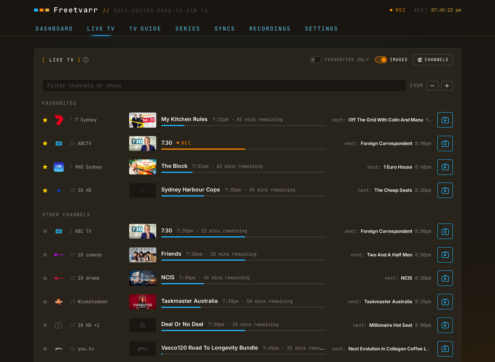
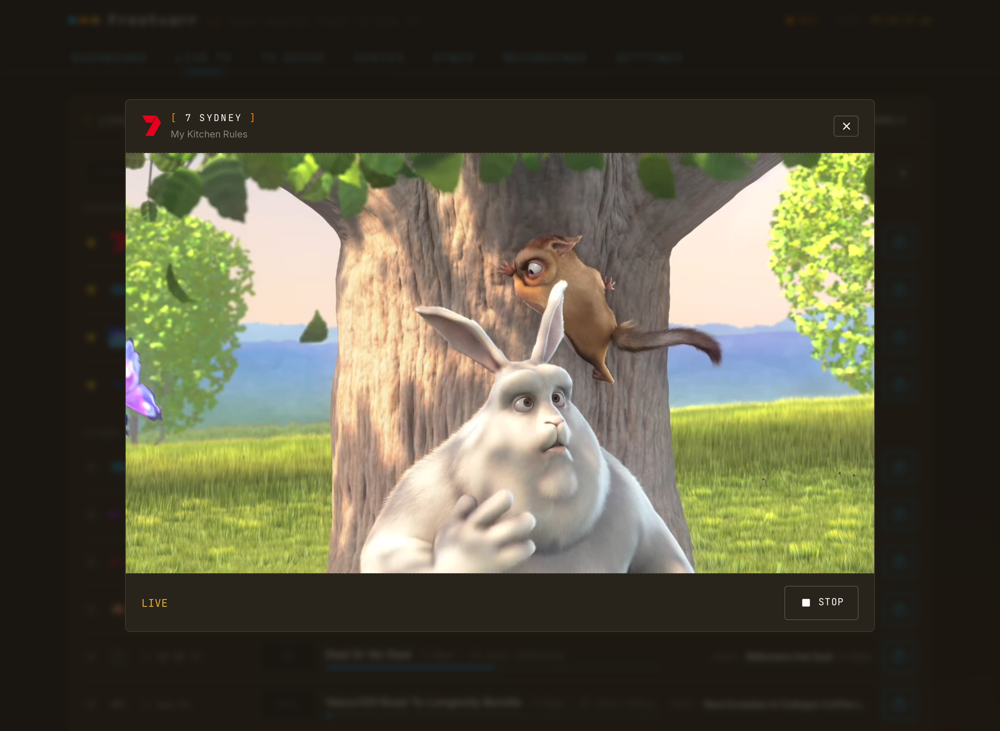

# Live TV

A network tuner streams live channels to anything on your LAN, and TVHeadend streams from any tuner it drives. None of it costs anything. Freetvarr has its own player for a quick look in the browser; the apps below suit an evening on the couch and need no Freetvarr at all.

## The options

| App                                 | Platforms                                | Points at              | Note                                                                        |
| ----------------------------------- | ---------------------------------------- | ---------------------- | --------------------------------------------------------------------------- |
| Freetvarr                           | Any modern browser, phones included      | TVHeadend              | No install. Pause and rewind `30` minutes. No captions yet                  |
| The tuner's own app, e.g. HDHomeRun | Apple TV, iOS, Android, Fire TV, Windows | The tuner              | No server in the path. Simplest thing that works                            |
| Plex live TV                        | Every Plex client                        | The tuner              | Free. Plex Pass is only needed to record, which you already do in TVHeadend |
| Jellyfin live TV                    | Apple TV, iOS, Android, web              | TVHeadend or the tuner | Free, and carries the guide                                                 |
| Kodi + TVHeadend PVR add-on         | Apple TV, Android, Shield                | TVHeadend              | Full guide, and it renders captions                                         |

## In Freetvarr

Open a programme that is on air in the TV Guide and press **WATCH LIVE**, or press the TV button beside a channel under **On now** on the dashboard. The player keeps playing while you switch tabs. Stop or close the player to free the tuner.

Video in the screenshots and demo: Big Buck Bunny, © Blender Foundation, CC BY 3.0.

## Pause and rewind

Pause the player, or drag back along its timeline, to rewind up to `30` minutes. While you are behind live, the player shows how far behind you are, and **GO LIVE** jumps back to now. Set `LIVE_TV_BUFFER_MINUTES` to keep more or fewer minutes, or `0` to turn it off.

On a phone or tablet, double-tap the left side of the picture to go back `10` seconds, or the right side to go forward `10` seconds. Keep tapping to skip further. Safari on an iPhone shows no timeline for live TV, so double-tap is the way to rewind there.

If you lock the phone or switch to another app, Freetvarr keeps the channel and its buffer for as long as the buffer lasts (`30` minutes by default), so you can come back to it. The tuner stays in use for that time; **STOP** frees it at once.

The buffer starts when you open the channel, so you can rewind only as far back as that. A paused channel keeps its tuner. Changing channel or closing the player deletes the buffer.

Freetvarr keeps the buffer on disk, in the container's temporary folder. At typical broadcast quality, `30` minutes takes about `1–2 GB` for each channel that is playing.

## Stream handling

If a channel takes longer than about `15` seconds to start, the player says it is still waiting for a signal. If a stream stops, the player says why (for example, a recording took the tuner), and **RETRY** tunes the channel again.

Freetvarr gets the channel from TVHeadend and converts it with ffmpeg into a stream that any browser can play:

- **H.264 video** is deinterlaced and re-encoded to progressive H.264. See [Video handling](#video-handling).
- **MPEG-2 or HEVC video** is re-encoded to H.264 in software, because browsers cannot play MPEG-2. Standard-definition channels stay at `576` lines; HD channels in those formats drop to `540` lines to keep the CPU load down.
- **Audio** becomes stereo, in TVHeadend's default language, without the audio-description track.

Each channel needs a tuner, unless a tuner already carries its multiplex, in which case the two share it. If every tuner is busy, the player says what is using each one. If a recording in the next hour needs the tuner, the player warns you; when the recording starts, it takes the tuner.

Stream limits:

- **Two channels at once** by default. Set `LIVE_TV_MAX_SESSIONS` to change it. Viewers of the same channel share one stream.
- **The stream stops 20 seconds** after the last viewer closes the player or the tab. A locked phone or a hidden tab keeps it for the buffer length instead ([Pause and rewind](#pause-and-rewind)).
- **CPU**: a software re-encode costs far more CPU than a hardware one. See [Video handling](#video-handling).

> [!NOTE] 
> The Freetvarr user in TVHeadend needs the streaming right, which the [TVHeadend guide](/guide/tvheadend#_8-make-a-user-for-freetvarr) already grants. TVHeadend gives Freetvarr's stream a low priority (`weight` `50`), so a recording always takes the tuner first.

## Video handling

Many broadcasters send HD as interlaced H.264 (Australian 1080i, for example). Chrome cannot play interlaced H.264; Safari can. So Freetvarr deinterlaces H.264 and re-encodes it to progressive H.264.

At startup Freetvarr reads `LIVE_TV_TRANSCODE` and picks one method:

| Value            | Behaviour                                                                                                  |
| ---------------- | ---------------------------------------------------------------------------------------------------------- |
| `auto` (default) | Hardware if a test encode passes on the VAAPI device, software otherwise                                   |
| `hardware`       | The same test and the same fallback as `auto`                                                              |
| `software`       | Always software: `yadif` and `libx264`, capped at `540` lines. Costs much more CPU                         |
| `copy`           | The old behaviour: H.264 passes through untouched. Safari plays it; Chrome cannot play interlaced channels |

Hardware means VAAPI on Intel Quick Sync or AMD, set up as in [Hardware transcoding](/guide/hardware#hardware-transcoding). The result is capped at `720` lines. The device defaults to `/dev/dri/renderD128`; set `LIVE_TV_VAAPI_DEVICE` to use another. NVIDIA (NVENC) is not supported, so an NVIDIA host uses software.

Freetvarr logs the choice and the reason on a line that starts with `[live] video`. Read it with `docker compose logs freetvarr | grep "\[live\] video"`.

> [!NOTE] 
> The author's NAS (Synology DS220+, Intel Celeron J4025 with two cores) re-encodes `1080i` to `720p` in hardware at about `6.5x` real time, using about `5%` of one core. Software at `720p` ran at only `1.36x` real time on both cores, which is why the software path caps at `540` lines.

## Browser notes

If an HD channel fails in Chrome, see [Playback failed on HD channels](/guide/troubleshooting#playback-failed-on-hd-channels).

## The tuner's own app

The author uses the HDHomeRun app, which finds the tuner by itself. The app talks to the tuner directly and skips TVHeadend, so it competes with recordings for tuners. A USB or PCIe tuner has no app of its own, so watch it through TVHeadend with Jellyfin or Kodi instead.

## Plex

Plex discovers an HDHomeRun the same way its own DVR feature does, and plays live channels on any client without a Plex Pass ([Plex: Live TV & DVR](https://support.plex.tv/articles/225877347-live-tv-dvr/)). You need a Plex Pass only to *record* through Plex, and TVHeadend and Freetvarr already do that for free. With a USB or PCIe tuner, watch through Jellyfin or Kodi against TVHeadend instead.

## Captions

Captions arrive either as Teletext or as DVB subtitles, and your broadcaster decides which. Australian broadcasters send Teletext, and not every app shows it:

- **The native HDHomeRun app is unproven.** SiliconDust documents DVB subtitle support but says nothing about Teletext, and the author has not tested it on an Australian channel.
- **Kodi, VLC, and Channels do render them.** If captions are a requirement, watch through one of those.

> [!NOTE] 
> The same applies to recordings. A `.ts` from TVHeadend carries the Teletext stream, so a player that decodes Teletext shows captions and one that doesn't shows nothing.

## Tuner budget

Recording and watching share your tuners. The author's Flex Quatro has four tuners, so recording three overlapping programmes leaves one tuner for live TV. TVHeadend reports what's in use under **Status → Stream**.
