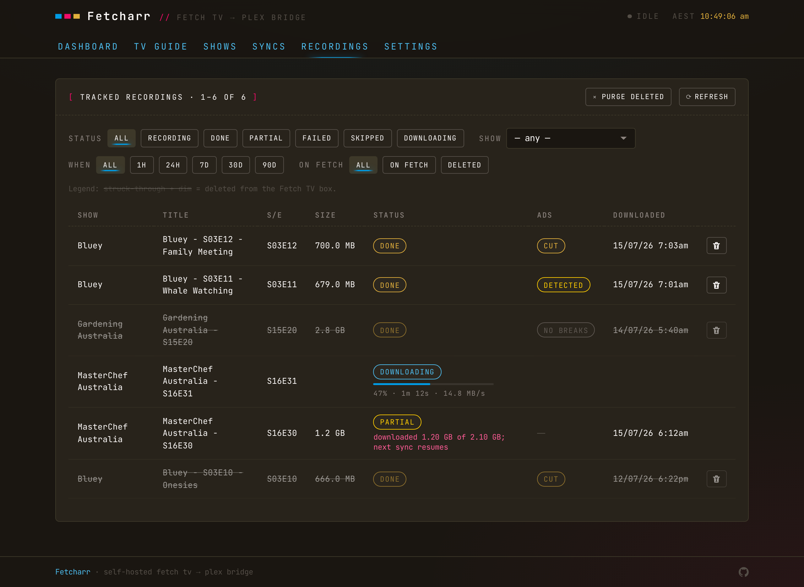

# Recordings

The Recordings tab is the per-episode record: every import Freetvarr has attempted, and how each one turned out.

## Statuses

- **done**: imported, and the file on disk matches the size TVHeadend reported.
- **partial**: the imported file came up more than `1 MB` short. The next sync redoes it.
- **skipped**: there was nothing to import. Either TVHeadend has no file for the entry yet (it's still recording, or the recording failed), or the path it reported sits outside the recordings folder Freetvarr can see. The error text says which.
- **failed**: the import hit an error.

With ad removal on, an ad status also appears: `scanning`, `detected`, `no_breaks`, `cut`, `detect_failed`, or `cut_failed`. See [Ad removal](/guide/ad-removal).

> [!NOTE] 
> A recording still in progress has no finished file, so it lands as `skipped` and is picked up on the next sync after TVHeadend closes it. Post-recording padding means that's up to ten minutes after the programme ends.

## Live progress

A hardlink import is instant and shows no bar. A cross-filesystem copy, an ad scan, and a cut are all slow, so the row shows a thin progress bar with a percentage and a time-remaining caption, and the list refreshes every 2 seconds instead of the idle 60. A copy bar shows the speed and time left; a scan bar counts down from an estimate; a cut shows how many segments it's joined. Once nothing's active, the list goes back to refreshing slowly.

## Re-scan and re-cut

The row can re-run an ad scan or cut on the file you've already imported, without touching TVHeadend, so you can try detection on recordings you already have.

## Tombstones

A recording deleted from TVHeadend shows struck-through and dimmed (a tombstone), but its labels, buttons, and progress bar stay readable: a tombstoned recording is still on disk in your Plex library, so you can re-scan or re-cut it. Tombstoned rows drop off the list 30 days after the delete.

## Failed rows

A `failed` row that is no longer in TVHeadend has nothing left to clean up, so the row carries a delete button that removes it from Freetvarr's history. If the recording is still in TVHeadend, the next sync imports it again and the row comes back.

## Filters and time

Filter by `ON TVHEADEND` / `DELETED`; the `WHEN` filter adds `1H` / `24H` shortcuts for recent activity. Timestamps show in the container's timezone (`TZ`), whatever device you're browsing from.
