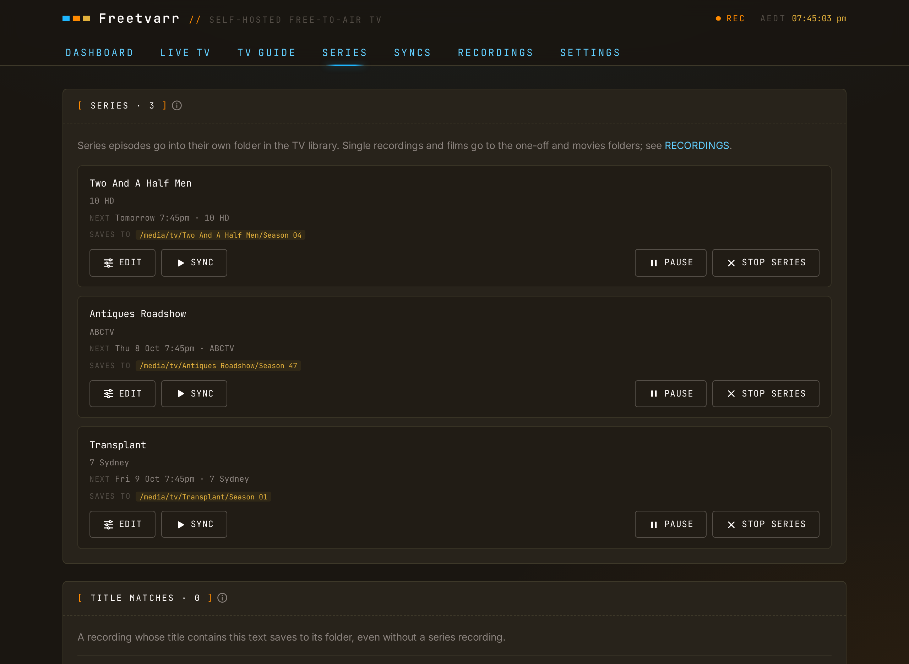

# Series

A series has two parts: a series recording in TVHeadend and a folder in your TV library. TVHeadend records each episode. Freetvarr imports every recording TVHeadend finishes, and files the episodes of a series into its own folder at the next sync. The SERIES tab lists both parts together.



## Add a series

1. Open the [TV Guide](/guide/tv-guide#recording-a-programme).
2. Click a programme of the series.
3. Press **RECORD SERIES**.

Freetvarr makes the library folder at the same time, unless you turn **ADD TO LIBRARY** off first. It uses an existing folder with the same name under your media root, or makes a new folder named after the series.

Matching is by title: a recording goes to the folder whose title appears in the recording's title. When more than one folder matches, the longest title wins, so `NRL Grand Final` beats `NRL`.

## How a series recording works

A series recording is one TVHeadend autorec entry. It matches on **title plus channel**, across all days and all start times. It skips an episode whose episode number it has already recorded. The **episodes to keep** option maps to the maximum-count field of TVHeadend, so TVHeadend removes the oldest episodes itself.

- **One channel**: an SD channel and its HD simulcast are separate channels, so a series recording on the HD channel does not cover SD airings. The SERIES tab shows both as one series.
- **Episode numbers**: duplicate detection needs them. XMLTV feeds carry them inconsistently, so your guide source decides what you get. Where they are missing, TVHeadend records every airing.

## Series rows

Each row shows one series:

- The title, with the channels and the number of episodes to keep.
- **Next**: the next airing, or the next expected airing, with its channel.
- **Saves to**: the full path where the next sync saves new episodes, such as `/media/tv/Bluey (2018)/Season 01`. The season comes from the next airing; when the guide has no season number, the path shows `Season …`. A series with no library folder shows its folder in the one-off folder, such as `/media/one-offs/Bluey`. When **IMPORT EVERY RECORDING** is off in Settings, such a series shows that its episodes wait in [Recordings](/guide/recordings).

A row shows a `PAUSED` badge when the series recording in TVHeadend is paused. A row with no badge records new episodes as normal.

The buttons on a row:

- **EDIT** opens the [edit form](#edit-a-series-folder).
- **SYNC** imports the new episodes of this series now.
- **ASSIGN FOLDER** (on a row that saves to the one-off folder) gives the series a folder in your TV library. See [Assign a folder](#assign-a-folder).
- **PAUSE** stops TVHeadend recording new episodes of this series. Episodes already recorded still import. **RESUME** starts it again. On an SD and HD pair, both series recordings pause and resume together.
- **STOP SERIES** removes the series recording from TVHeadend. Episodes already recorded stay, and so do their files.

## Assign a folder

**ASSIGN FOLDER** opens a dialog before it changes anything:

1. Check the folder name. Freetvarr fills in an existing folder with the same name under your media root, or a new folder named after the series.
2. To use another folder, type its name, or choose it under **Or pick an existing folder**.
3. Press **ASSIGN**.

The dialog shows the full path for future episodes. Episodes already imported stay where they are; Freetvarr does not move them.

## Edit a series folder

**EDIT** opens these fields:

- **SAVES TO**: the folder under your media root (shown before the field) where the series goes. As you type, Freetvarr suggests matching folders that are already there.
- **Season folders**: the [season template](#season-template).
- **Recording titles that contain**: the title that Freetvarr matches. It ignores case.
- **Ad removal**: `OFF`, `DETECT`, or `CUT`. See [Ad removal](/guide/ad-removal). The field is off until you turn on ad removal in Settings.
- **REMOVE FROM TVHEADEND AFTER IMPORT**: remove the TVHeadend copy once Plex confirms the file. See [Remove from TVHeadend](/guide/remove-from-tvheadend).

**SAVE** keeps the changes. A change to **SAVES TO** applies to future episodes only; episodes already imported stay where they are.

**UNASSIGN FOLDER** removes the folder from the series, after you confirm. Future episodes then save to the one-off folder again. When **IMPORT EVERY RECORDING** is off in Settings, they wait in [Recordings](/guide/recordings) instead. Episodes already imported stay where they are.

## Season template

Each folder has a season template that decides where episodes are saved: `{season}`, `{season_padded}` (zero-padded, `01`), or `{season_unpadded}` (`1`). Freetvarr writes to `<media_root>/<dest_folder>/<season>/…`, and it rejects any template that would point outside your media root.

## Filenames

Freetvarr renames every file as it imports it, into the shape Plex reads:

```text
Show Name - S01E02 - Episode Title.ts
```

When the guide gave no episode number, the air date stands in:

```text
Show Name - 2026-09-21 - Episode Title.ts
```

The episode title is dropped when the guide did not supply one. TVHeadend's own naming is left alone, because nothing downstream reads it.

## Title matches

A recording whose title contains this text saves to its folder, even without a series recording. The **TITLE MATCHES** panel lists each title with no series recording: a title you added by hand, such as `NRL`, or a series you stopped. Each title has a **Saves to** line, **EDIT**, and **SYNC**, like a series row. In the edit form, **REMOVE TITLE MATCH** removes the title after you confirm; recordings already imported stay where they are.

To add a title:

1. Under **ADD TITLE**, enter the **Recording titles that contain** text. **REFRESH TITLES** lists the titles TVHeadend has recorded.
2. Under **SAVES TO**, enter the folder under your media root. Freetvarr suggests an existing folder, or a new folder named after the title.
3. Set the season folders, ad removal, and **REMOVE FROM TVHEADEND AFTER IMPORT**.
4. Press **ADD TITLE**.

## Recordings with no series

A recording that matches no series folder, such as a sports final or a special, goes to the one-off folder (`/data/media/one-offs` in the example compose file). Each title gets its own folder, and the file name carries the air date and start time:

```text
NRL Grand Final/NRL Grand Final - 2026-10-04 1930.ts
```

The one-off folder stays out of the TV library on purpose. Plex, Jellyfin, and Infuse match a TV library against online listings, and a one-off title rarely matches. Point a separate library at the folder instead; in Plex, use the **Other Videos** type. See [Configuration](/guide/configuration#the-one-off-folder) for the mount and the Settings switch that turns this off.

## Films

Set a **movies folder** in Settings, and a film with no series folder goes there instead, named the way movie libraries expect:

```text
Isle Of Dogs (2018)/Isle Of Dogs (2018).ts
```

Freetvarr treats a recording as a film when the guide gives it a film or drama genre, no season or episode number, and a length of at least 75 minutes. The year appears only when the guide supplies one. Without a movies folder, films go to the one-off folder.

## Import, not download

TVHeadend already wrote the file to a folder Freetvarr can see, so there is nothing to download. The import is a hardlink when Freetvarr sees both folders through one mount, and a copy when it does not ([One shared mount](/guide/configuration#one-shared-mount)). A hardlink is instant and uses no extra disk; a copy shows its progress in [Recordings](/guide/recordings).

## Per-series switches

These options are set per series folder in the [edit form](#edit-a-series-folder):

- **Remove after import**: remove the TVHeadend copy once Plex confirms the file. See [Remove from TVHeadend](/guide/remove-from-tvheadend).
- **Ad removal mode**: `off`, `DETECT`, or `CUT`. See [Ad removal](/guide/ad-removal).
