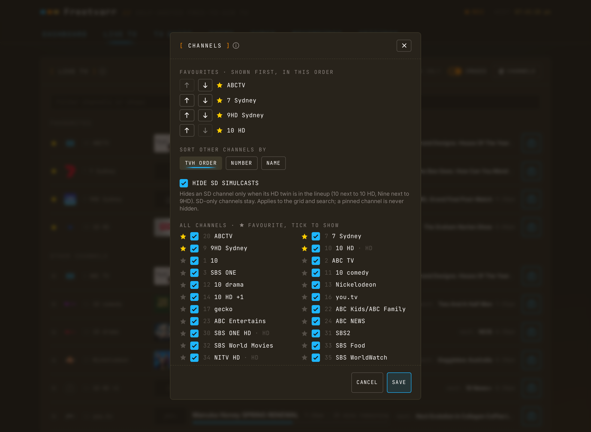

# TV Guide

The TV Guide tab is a 7-day programme guide. Click a programme to record it, cancel it, or record a whole [series](/guide/series) in TVHeadend. Freetvarr imports each recording into your library after TVHeadend records it.

The TV Guide shows only the listings you loaded into TVHeadend. With the XMLTV guide feed set up ([step 6](/guide/tvheadend#_6-load-the-xmltv-guide)) you get seven days with episode numbers. Without it you get what the broadcast carries: about a day, with little detail.

<!-- markdownlint-disable MD033 -->
<BrowserFrame label="http://freetvarr.lan/#/guide">
  
</BrowserFrame>
<!-- markdownlint-enable MD033 -->

## The grid

Channels run down the page and time runs across. The TV Guide opens at the current half hour.

- The **day chips** switch between today and the next six days; `NOW` and `TONIGHT` jump within the day.
- The **zoom buttons** change the time scale. Each browser remembers its zoom.
- **Search** covers all 7 days on the grid, and filters the list on `UPCOMING`.
- The **filter box** above the channels narrows them by name or number.
- Cell borders show recording state: blue for scheduled, gold for a series recording, orange for recording now.
- Programmes that ended earlier today stay in the grid. TVHeadend drops a programme once it ends, but Freetvarr keeps its own copy.
- Hover over a programme, or tab to it, to see its full title, times, and synopsis.
- Drag the right edge of the channel list to make it wider or narrower.
- A dimmed channel with **OFF AIR** beside its name is not broadcasting right now: TVHeadend has switched off every service for it. The note clears by itself once TVHeadend sees the channel again, after a channel scan.
- Each channel in the CHANNELS dialog shows `HD` or `SD` after its name, read from the TV service type that TVHeadend reports. **Hide SD simulcasts** uses it to pair an SD channel with its HD twin, even when both have the same name.

## After midnight

Each day's grid runs to 3am the next morning, so a late film stays on the same page. Programmes after midnight are dimmed, but they work like any other. While midnight is in view, a button with the next day's date opens that day at the same time of night.

## Recording a programme

Click a programme's cell to open its detail: the programme image, synopsis, rating, season and episode. The image comes from the XMLTV guide feed (a TV guide fed only by the broadcast has none).

<!-- markdownlint-disable MD033 -->
<BrowserFrame label="http://freetvarr.lan/#/guide">
  
</BrowserFrame>
<!-- markdownlint-enable MD033 -->

From there:

- **RECORD** schedules the single airing. `START EARLY` and `RUN LATE` pad the recording, 2 minutes before and 10 minutes after by default, because free-to-air broadcasts often run late.
- **RECORD SERIES** creates a series recording in TVHeadend, with an episodes-to-keep option. See [How a series recording works](/guide/series#how-a-series-recording-works).
- **ADD TO LIBRARY** decides what Freetvarr does with the recording. Under the switch, the dialog says where the file will go: the series folder when one matches, the movies folder for a film, or the one-off folder when neither does. With the switch off, the recording stays in TVHeadend only. With it on, **RECORD SERIES** also creates the series folder, so the episodes go to the TV library. To change a folder later, open [SERIES](/guide/series).
- A scheduled programme shows **CANCEL RECORDING** instead. If the episode belongs to a series recording, cancelling asks whether to cancel just that episode or the whole series. Cancelling one episode disables it in TVHeadend instead of deleting it, so the series recording does not schedule it again. To turn it back on, open the episode later and press **RECORD**.
- A programme whose series is already recording, with no episode scheduled yet, shows a **CANCEL SERIES** action.

Many networks show the same programme on an SD channel and an HD channel, such as 7 Sydney and 7HD Sydney. If you press **RECORD** or **RECORD SERIES** on the SD channel and the TV guide has the same programme at the same time on an HD channel, Freetvarr asks whether to record the HD channel instead. Your padding, episodes-to-keep, and **ADD TO LIBRARY** choices carry over.

The **UPCOMING** view lists what will record: the recordings TVHeadend has scheduled, plus the episodes your series recordings will catch over the next 7 days. Click a card to open the programme, then record it or cancel its recording. The [SERIES](/guide/series) tab lists the series recordings themselves.

## Favourites

Press the star next to a channel to make it a favourite. Favourites sit at the top of the grid. To reorder them, hold a favourite until it lifts, then drag it. Reordering also works on the Live TV page.

In Australia, the wizard's channel scan starts you with five favourites: the HD channels of ABC, Seven, Nine, 10, and SBS, or the SD channel where a network has no HD channel. The wizard does this only when you have no favourites, and only once. Remove or reorder them like any other favourite.

The `CHANNELS` button above the grid opens a wide dialog on a computer. The channel list is on the left and the settings are on the right. On a phone, the settings come first and the list follows. The settings are:

- **Favourites**: reorder or remove them.
- **Sort other channels by**: TVHeadend order, channel number, or name.
- **Hide SD simulcasts**: hides an SD channel when its HD twin is in the lineup. SD-only channels stay.
- **All channels**: untick a channel to hide it. Favourites are always shown.
- **Listings**: fix the shows of a channel that has the wrong ones, or none. See [Channel listings](#channel-listings).

Press `SAVE` to apply the changes.

<!-- markdownlint-disable MD033 -->
<BrowserFrame label="http://freetvarr.lan/#/guide">
  
</BrowserFrame>
<!-- markdownlint-enable MD033 -->

## Channel listings

Each channel's shows come from one channel in the TV guide you set up, such as the Sydney guide chosen in the `GUIDE` step of the setup wizard. The setup wizard links each channel to a guide channel for you. If a channel shows the wrong shows, or none, pick a different guide channel for it:

1. In the TV Guide, press `CHANNELS` above the grid.
2. Press the pencil next to the channel (**Change listings**). The row shows the current guide channel in a box you can type in.
3. Type part of the guide channel's name to find it (`7` finds Seven and 7two), then pick the one that matches. Guide channels with no shows in the guide are at the end of the list, marked `(no shows in this guide)`, and you cannot pick them. The arrow keys and `Enter` also work, and `Esc` closes the list. Press the tick (**Use these listings**, or `Enter` with the list closed). Press the cross (**Keep the current listings**, or `Esc`) to keep the current pick.
4. Press `SAVE` to save the new listings.

Each row shows the name of its guide channel, or `No listings`. A row you changed is marked until you press `SAVE`. Opening another channel's pencil drops an unconfirmed pick.

Pick **No listings** to remove a channel's shows. The channel's shows go at once. Two channels can use the same guide channel, such as `SBS ONE` and `SBS ONE HD`.

Freetvarr saves the pick in TVHeadend, removes the channel's old shows, and asks TVHeadend to load the TV guide again. The channel stays empty while TVHeadend downloads the guide. Above the grid, the TV Guide shows `Loading the new listings. This can take a couple of minutes.` When the new shows are in TVHeadend, the TV Guide shows them and the note goes.

Freetvarr also turns off TVHeadend's **Auto EPG channel** setting for a channel you change. TVHeadend then does not add a guide channel to it again by name or number.

Shows that already ended stay in the TV Guide under their old listings. A scheduled recording on the channel stays at its time, but no longer follows a guide programme.

If the pencils are missing, the TV guide is not set up yet. Open the setup wizard and proceed to its `GUIDE` step.

A [series recording](/guide/series#how-a-series-recording-works) matches on title and channel. When you fix a channel's listings, that channel gets different programmes, so its series recordings can catch different episodes. Check the `UPCOMING` view after the change.

If saving the listings fails, the dialog says so on its own line. Your favourites and hidden channels are still saved.

## On a phone

The TV Guide works in a phone browser, and you can reorder favourites by touch. To run it full-screen, [add Freetvarr to your Home Screen](/guide/getting-started#_4-add-it-to-your-home-screen). In that Home Screen app, pull down from the top of a page to refresh it (see [Pull to refresh](/guide/syncs#pull-to-refresh)).

## Live TV page

The `LIVE TV` tab lists every channel with what's on now and next, favourites first. Filter by channel or show, or show favourites only.

## On the dashboard

The dashboard's What's On panel shows what's on now and next on your favourite channels, and the next few scheduled recordings. Tap a programme or a recording to open it in the TV Guide. To fill the panel, press the star next to some channels in the TV Guide.

While TVHeadend records, a `RECORDING NOW` panel at the top of the dashboard shows each recording's progress, file size, and tuner signal. If TVHeadend reports a recording as failed, the card turns red and shows TVHeadend's reason. After a recording stops, its card shows it through import, ad removal (if on), and into your library. While anything records, the browser tab title starts with `● REC`.

## Caching

Freetvarr keeps a copy of the TV guide for an hour and the recording state for 45 seconds, to limit the requests to TVHeadend. Press `REFRESH` to fetch them again. If TVHeadend stops answering, the TV Guide shows its cached copy with a note, and updates when TVHeadend is back.
