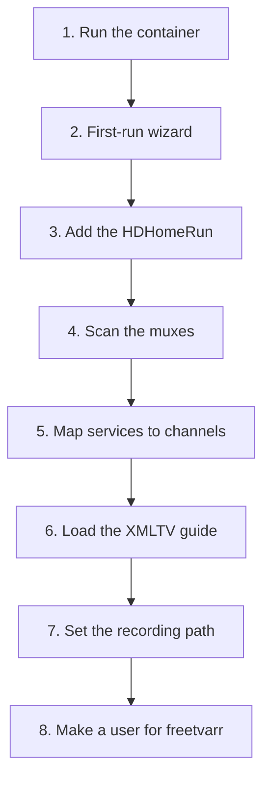

# TVHeadend

TVHeadend is the recorder. It drives the tuner, holds the channel list and the guide, runs the timers, and writes the files. freetvarr reads all of that over TVHeadend's HTTP API, so TVHeadend has to work on its own before freetvarr is any use.

Set it up in this order. Each step depends on the one before it.



## 1. Run the container

Add TVHeadend to the same compose file as freetvarr:

```yaml
services:
  tvheadend:
    image: lscr.io/linuxserver/tvheadend:latest
    container_name: tvheadend
    restart: unless-stopped
    network_mode: host
    environment:
      - PUID=${PUID:-1000}
      - PGID=${PGID:-1000}
      - TZ=${TZ:-Australia/Sydney} # example default; set TZ in your .env
    volumes:
      - ${CONFIG_PATH}/tvheadend:/config
      - ${DATA_PATH}/recordings:/recordings
```

The image documents four environment variables: `PUID`, `PGID`, `TZ`, and an optional `RUN_OPTS` for extra launch arguments. `/config` holds TVHeadend's own configuration; `/recordings` is where it writes.

> [!IMPORTANT]<br>
> Use `network_mode: host`. TVHeadend finds an HDHomeRun by broadcasting on the local network, and those broadcasts don't cross Docker's private bridge network. Under host networking there is no `ports:` mapping; TVHeadend binds `9981` (web UI and API) and `9982` (its own streaming protocol) straight onto the host.

Run `docker compose up -d tvheadend`, then open `http://<host-ip>:9981`.

> [!NOTE]<br>
> Give TVHeadend and freetvarr the same `PUID`/`PGID`. freetvarr imports by hardlink where it can, and it deletes the TVHeadend copy afterwards; both need the same owner on the recordings folder.

## 2. First-run wizard

The first visit opens a wizard. What matters:

1. **Language.** Set the interface and EPG languages you want.
2. **Access control.** Set the allowed network prefix to your LAN (`192.168.1.0/24`, or whatever yours is), then set an admin username and password. Do this properly; the next steps assume a login exists.
3. **Tuner and network.** The wizard offers to assign a network to each tuner it found. You can skip that here and do it deliberately in step 3.
4. **Mux scan and service mapping.** Skip both. Steps 4 and 5 cover them.

## 3. Add the HDHomeRun

The linuxserver image is built with `--enable-hdhomerun_client`, so TVHeadend discovers HDHomeRun tuners on the LAN by itself.

Go to **Configuration → DVB Inputs → TV adapters**. The four tuners of a Flex Quatro appear as separate entries, each naming the device ID. If nothing appears, TVHeadend is not on the host network; go back to step 1.

Now create the network the tuners will use:

1. **Configuration → DVB Inputs → Networks → Add.**
2. Network type: pick what your country broadcasts. **DVB-T Network** in Australia, New Zealand, the UK, and Europe; **ATSC-T Network** in North America; **DVB-C Network** on cable.
3. Give it a name (`Free-to-air`, say).
4. **Pre-defined muxes**: pick the entry for your transmitter (details in step 4).
5. Save, then go back to **TV adapters**, select each tuner, and set its **Networks** field to the network you just made.

## 4. Scan the muxes

TVHeadend ships the community [`dtv-scan-tables`](https://github.com/tvheadend/dtv-scan-tables/tree/master/dvb-t), so you don't have to enter frequencies. The list covers every country, and each file is named by country code and by city or transmitter. Pick your own country's entry; the Australian ones below are the example this page follows.

The Australian files are named `au-<Location>`: `au-Sydney`, `au-Melbourne`, `au-Brisbane`, `au-Perth`, `au-Adelaide`, `au-Darwin`, `au-Hobart`, `au-canberra` and `au-Canberra-Black-Mt`, plus around thirty regional transmitters (`au-Newcastle`, `au-Wollongong`, `au-GoldCoast`, `au-Cairns`, `au-Townsville`, `au-Gippsland`, and more). Pick the transmitter your antenna points at, not the nearest capital city. `au-ALL` exists but scans every Australian frequency, which takes a long time and finds muxes you cannot receive.

Saving the network with a pre-defined mux list starts the scan. Watch **Configuration → DVB Inputs → Muxes**: each row moves from `PEND` to `ACTIVE` to `OK`, and the **Services** count fills in. A mux that ends `FAIL` is one your antenna can't reach, which is normal for a few of them.

## 5. Map services to channels

A service is a stream inside a mux. A channel is what you watch. Go to **Configuration → DVB Inputs → Services**, press **Map all**, and tick:

- **Check availability**: only map services that actually tune.
- **Merge same name**: fold duplicate listings of one channel together.

Leave **Include encrypted** off; free-to-air carries nothing encrypted worth having.

The channels land in **Configuration → Channel/EPG → Channels**. Fix the numbering there if you want `ABC` on `2` rather than whatever the broadcaster's service numbering gave it. Delete the radio and data services you will never record.

## 6. Load the XMLTV guide

Broadcast guide data in Australia runs about a day ahead and carries thin metadata. An XMLTV feed gives seven days with episode numbers, which is what makes series recording and Plex naming work. The Australian feed below is the example; [Outside Australia](#outside-australia) lists the source to use in other countries.

### Matt Huisman's free feed

[Matt Huisman](https://i.mjh.nz/au/) publishes free Australian XMLTV per region, updated daily. The regions are `Adelaide`, `Brisbane`, `Canberra`, `Darwin`, `Hobart`, `Melbourne`, `Perth`, and `Sydney`. Each has:

| URL | What it is |
| --- | --- |
| `https://i.mjh.nz/au/<Region>/epg.xml` | The guide, plain XML (about `6.6 MB` for Sydney) |
| `https://i.mjh.nz/au/<Region>/epg.xml.gz` | The same file gzipped (about `700 KB`) |

The linuxserver image ships a small grabber called **XMLTV URL grabber** (`/usr/bin/tv_grab_url`). It takes the feed URL as its argument and runs `curl` on it, so no script install is needed.

1. **Configuration → Channel/EPG → EPG Grabber Modules.**
2. Select **Internal: XMLTV: XMLTV URL grabber**, tick **Enabled**, and set **Extra arguments** to `https://i.mjh.nz/au/<Region>/epg.xml` with your region substituted.
3. Save.
4. **Configuration → Channel/EPG → EPG Grabber**: set **Cron multi-line** to a quiet hour, one line per run. `0 4 * * *` fetches the guide at 4am daily.
5. Press **Re-run internal EPG grabbers** to fetch once now rather than waiting for the cron. The log (**Status → Log**) shows `tv_grab_url: channels tot= …` when it has run; Sydney lists about `120` channels.

### IceTV, if you would rather pay

[IceTV](https://www.icetv.com.au/xmltv-subscription/) sells an Australian XMLTV subscription at `$3.99` per month (their month is `30 days`) and publish their own TVHeadend setup guide. It is the fallback if the free feed ever stops; nothing in freetvarr cares which one you use.

### Outside Australia

The mjh feed covers Australia and New Zealand only. Elsewhere, pick the guide source TVHeadend already supports for your country; freetvarr does not care which one feeds it:

| Region | Guide source | Where in TVHeadend |
| --- | --- | --- |
| UK | Over-the-air Freeview EIT, `7` days, free | **EPG Grabber Modules → Over-the-air: EIT: DVB Grabber**, enabled by default |
| Europe | Over-the-air EIT (often `1–7` days) or a national XMLTV feed | Same EIT module, or the **XMLTV URL grabber** with the feed URL |
| United States, Canada | [Schedules Direct](https://www.schedulesdirect.org/), about `US$35` a year | **Internal: XMLTV: Schedules Direct JSON API**, which the linuxserver image bundles |
| New Zealand | `https://i.mjh.nz/nz/epg.xml`, free | **XMLTV URL grabber**, as above |

TVHeadend also bundles the `tv_grab_*` grabbers, so a national XMLTV service your broadcaster or a third party publishes works too. The scan list in [step 4](#_4-scan-the-muxes) changes as well: TVHeadend ships predefined mux lists for every country under **Pre-defined muxes**, named by country code and city or transmitter.

### Linking the guide to your channels

The feed's channel names and your scanned channel names will not all match. Go to **Configuration → Channel/EPG → EPG Grabber Channels**. Each row is a channel the feed offers; the **Channels** column is the TVHeadend channel it feeds. TVHeadend matches what it can by name automatically, so fix the leftovers by hand.

Check the result in the **Electronic Program Guide** tab. Every channel you care about should show seven days of programmes with names. A channel showing nothing is an unlinked row here.

## 7. Set the recording path

Go to **Configuration → Recording → Digital Video Recorder Profiles** and open the default profile. Set **Recording system path** to `/recordings`.

Leave the file-naming options alone. TVHeadend's own layout does not matter, because freetvarr renames every file as it imports it into Plex's library ([Following shows](/guide/following-shows)).

Two settings worth knowing, both of which freetvarr also sets per recording:

- **Pre-recording padding**: `2` minutes.
- **Post-recording padding**: `10` minutes. Free-to-air broadcasts run late; ten minutes is the difference between catching the end of a drama and not.

## 8. Make a user for freetvarr

freetvarr signs in as an ordinary TVHeadend user. Give it its own.

1. **Configuration → Users → Access Entries → Add.**
2. Username and password: whatever you like; you type these into freetvarr once.
3. Allowed networks: your LAN prefix.
4. Tick **Admin**, **Streaming**, and **Video recorder** rights.

Admin is not optional. freetvarr creates and deletes autorec rules, edits recording entries, and reads the tuner and hardware status, and TVHeadend gates all of that behind admin.

> [!NOTE]<br>
> Access entries are an ordered list, evaluated top to bottom. A broad anonymous entry above your new one can hand out rights you did not intend, so check the order after you add it.

## Where next

- **[Getting started](/guide/getting-started)**: run freetvarr and point it at this TVHeadend.
- **[TV Guide](/guide/tv-guide)**: once the XMLTV feed is in, browse and schedule from freetvarr instead of TVHeadend's own UI.
