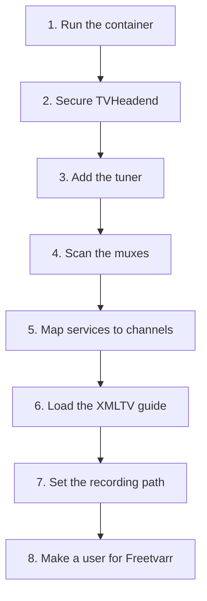
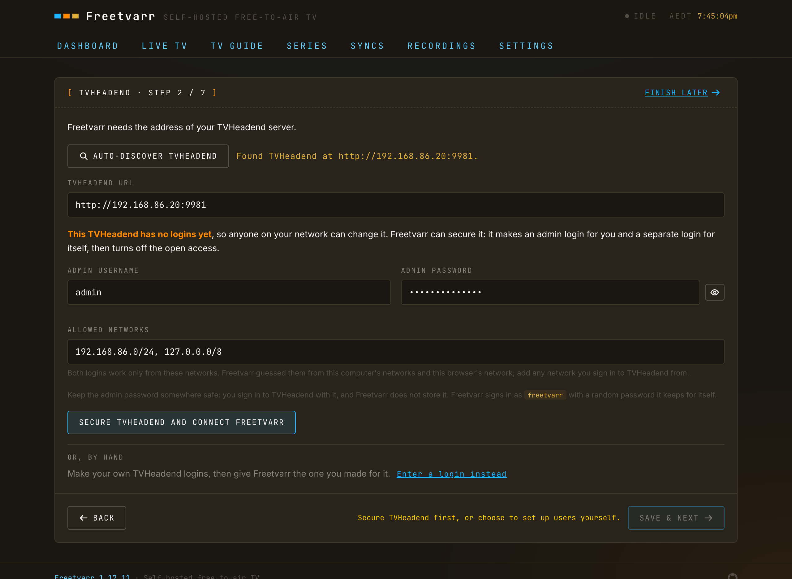

# TVHeadend

TVHeadend is the recorder. It drives the tuner, holds the channel list and the TV guide, runs the timers, and writes the files. Freetvarr reads all of that over TVHeadend's HTTP API, so TVHeadend has to work on its own before Freetvarr is any use.

Set it up in this order. Each step depends on the one before it. Any TVHeadend-compatible tuner works here. The steps change only where they name a device or a country.

> [!NOTE]<br>
> The HDHomeRun tuner, the `au-Sydney` mux list, and the Sydney XMLTV feed on this page are the author's own setup in Australia. They are the worked example, not a requirement. Substitute your own tuner, transmitter, and TV guide source. [Outside Australia](#outside-australia) lists the guide sources and mux lists for other countries.


```mermaid
flowchart TD
  a["1. Run the container"] --> b["2. Secure TVHeadend"]
  b --> c["3. Add the tuner"]
  c --> d["4. Scan the muxes"]
  d --> e["5. Map services to channels"]
  e --> f["6. Load the XMLTV guide"]
  f --> g["7. Set the recording path"]
  g --> h["8. Make a user for Freetvarr"]
```

## 1. Run the container

The example Docker compose file already defines TVHeadend next to Freetvarr. Do [step 1 of Getting started](/guide/getting-started#_1-install) first (download the Docker compose file, or run the install script), then come back here. The TVHeadend service in that file looks like this:

```yaml
services:
  tvheadend:
    image: lscr.io/linuxserver/tvheadend:latest
    container_name: tvheadend
    restart: unless-stopped
    network_mode: host
    environment:
      - PUID=${PUID:-1000}
      - PGID=${PGID:-1000}
      - TZ
    volumes:
      - ${CONFIG_PATH}/tvheadend:/config
      - ${DATA_PATH}/recordings:/recordings
      - /etc/localtime:/etc/localtime:ro
```

The image documents four environment variables: `PUID`, `PGID`, `TZ`, and an optional `RUN_OPTS` for extra launch arguments. The read-only `/etc/localtime` mount gives the TVHeadend Docker container the host's time zone, so TVHeadend needs no `TZ`. The bare `TZ` line passes `TZ` through only when your `.env` sets it, to override the host zone. Freetvarr does not use this mount. Freetvarr asks for its time zone in its setup wizard instead. `/config` holds TVHeadend's own configuration. `/recordings` is where TVHeadend writes its recordings. Remember that path: step 7 sets it as TVHeadend's recording path. Freetvarr mounts the same host folder through `${DATA_PATH}`, at `/data/recordings`.

> [!IMPORTANT]<br>
> Use `network_mode: host` for a tuner TVHeadend finds by network broadcast, such as an HDHomeRun or a SAT>IP server (those broadcasts don't cross Docker's private bridge network). A USB stick or a PCIe card needs no discovery, so you can drop host networking, map `9981` and `9982` as ports, and pass the `/dev/dvb` devices in instead. Under host networking there is no `ports:` mapping. TVHeadend binds `9981` (web interface and API) and `9982` (its own streaming protocol) straight onto the host.

In a terminal in the `freetvarr` folder, run `docker compose up -d tvheadend` to start the TVHeadend Docker container. Then open `http://<host-ip>:9981` in a browser to reach TVHeadend's web interface.

> [!NOTE]<br>
> Give TVHeadend and Freetvarr the same `PUID`/`PGID`. Freetvarr imports by hardlink where it can, and it deletes the TVHeadend copy afterwards. Both need the same owner on the recordings folder.

## 2. Secure TVHeadend

A fresh linuxserver TVHeadend has no logins. It starts with a default access entry, username `*`, that gives anyone on any network full admin rights. Freetvarr's setup wizard replaces that entry with real logins, so run it now: install Freetvarr ([Getting started](/guide/getting-started#_1-install)) and open its wizard ([step 2](/guide/getting-started#_2-run-the-wizard)).

When the wizard finds a TVHeadend with only the default entry, it asks for three things:

- **An admin username and password.** You sign in to TVHeadend's web interface with these. Freetvarr sends them to TVHeadend once and does not store them. The password has one field with a show and hide button, so check it for typos before you continue.
- **The allowed networks.** Both logins work only from these address ranges. The wizard fills in one `/24` range for each address of the Freetvarr host and for the network of your browser, plus `127.0.0.0/8` (a host at `192.168.86.254` gives `192.168.86.0/24`). Add any other network you sign in from.
- **Confirmation.** Press `SECURE TVHEADEND AND CONNECT FREETVARR` to create the admin login and a `freetvarr` login with a random password, which Freetvarr keeps.

<!-- markdownlint-disable MD033 -->
<BrowserFrame label="http://freetvarr.lan/#/welcome">
  
</BrowserFrame>
<!-- markdownlint-enable MD033 -->

Freetvarr signs in with both new logins before it removes the default entry. If either login fails, Freetvarr deletes the logins it created and keeps the open access, so a typo cannot lock you out. It then checks that TVHeadend asks for a login. To put the default entry back, press **Settings → TVHEADEND → RESTORE OPEN ACCESS** in Freetvarr.

If you installed TVHeadend yourself, the wizard asks for the TVHeadend username and password you created for Freetvarr instead ([step 8](#_8-make-a-user-for-freetvarr)) and uses that. The [Doctor](/guide/doctor#tvh-open) warns while the default entry is still there.

In TVHeadend's web interface, set the interface and TV guide (EPG) languages under **Configuration → General → Base**.

### Securing by hand

Use TVHeadend's own wizard instead if you already set up TVHeadend users, or you do not use Freetvarr's wizard. Recent linuxserver builds do not open it on the first visit. Start it yourself in TVHeadend's web interface: **Configuration → General → Base → Start wizard**. What matters:

1. **Language.** Set the interface and EPG languages you want.
2. **Access control.** Set the allowed network prefix to your own home network (LAN), as above. Then set an admin username and password. Leave the user login empty. Step 8 creates the user Freetvarr needs.
3. **Tuner and network.** The wizard offers to assign a network to each tuner it found. You can skip that here and do it deliberately in step 3.
4. **Mux scan and service mapping.** Skip both. Steps 4 and 5 cover them.

**Finish** removes the default open entry. From then on, TVHeadend's web interface asks for the admin login.

Finish or cancel the wizard, even if you configured TVHeadend by hand. An unfinished wizard leaves the `wizard` value set in **Configuration → General → Base**, and the wizard opens again on every page load. Finishing or cancelling it clears the value.

> [!WARNING]<br>
> TVHeadend's password field has no confirm box, and a typo or a password manager's autofill leaves you locked out with `403 Forbidden`. To get back in, add `RUN_OPTS=--noacl` to the `environment:` of the `tvheadend` service in `docker-compose.yml`, then run `docker compose up -d tvheadend` to restart TVHeadend. That option switches off all access checks. Set a new password in **Configuration → Users → Passwords**, then remove `--noacl` and run `docker compose up -d tvheadend` again.

## 3. Add the tuner

The **Channels** step of the Freetvarr wizard does steps 3 to 5 for an antenna or cable tuner, and sets **Re-record if errors** from step 7. Follow steps 3 to 5 by hand for a satellite tuner, or to choose each setting yourself.

The linuxserver image is built with `--enable-hdhomerun_client`, so TVHeadend discovers HDHomeRun tuners on your home network by itself. The author's tuner is an HDHomeRun Flex Quatro, and the screens below follow it.

In TVHeadend's web interface, go to **Configuration → DVB Inputs → TV adapters**. The four tuners of a Flex Quatro appear as separate entries, each naming the device ID. If nothing appears, TVHeadend is not on the host network. Go back to step 1.

A USB stick or a PCIe card appears on the same **TV adapters** screen, once you pass its `/dev/dvb` devices into the TVHeadend Docker container. The rest of this step is the same for either.

Now create the network the tuners will use:

1. **Configuration → DVB Inputs → Networks → Add.**
2. Network type: pick what your country broadcasts. **DVB-T Network** in Australia, New Zealand, the UK, and Europe; **ATSC-T Network** in North America; **DVB-C Network** on cable.
3. Give it a name (for example, `Free-to-air`).
4. **Pre-defined muxes**: pick the entry for your transmitter (details in step 4).
5. Press **Save**. Then go back to **TV adapters**, select each tuner, tick **Enabled**, set its **Networks** field to the network you just created, and press **Save**.

## 4. Scan the muxes

TVHeadend ships the community [`dtv-scan-tables`](https://github.com/tvheadend/dtv-scan-tables/tree/master/dvb-t), so you don't have to enter frequencies. The list covers every country, and each file is named by country code and by city or transmitter. Pick your own country's entry. The Australian ones below are the author's example. [Outside Australia](#outside-australia) says how the list is named for other countries.

The Australian files are named `au-<Location>`, such as `au-Sydney` or `au-Newcastle`, and cover the capital cities and the regional transmitters. Pick the transmitter your antenna points at, not the nearest capital city. Avoid `au-ALL`: it scans every Australian frequency, takes a long time, and finds muxes you cannot receive.

The current linuxserver build drops the last letter of every name in the list, so `au-Sydney` shows as `au-Sydne` and `au-Brisbane` as `au-Brisban`. Pick by the stem. A search for the full city name finds only the longer entries, such as `au-Sydney_Kings_Cros`. That one is the Kings Cross repeater: an antenna aimed at the main Sydney transmitter fails every mux on it.

Saving the network with a pre-defined mux list starts the scan. Check progress in **Configuration → DVB Inputs → Muxes**. The scan is done when each mux shows `OK` or `FAIL`. A few `FAIL` results are normal: the antenna can't reach that mux, or the list entry is out of date. In the author's Sydney scan, five VHF muxes found 59 services, and `536.625 MHz` failed because SBS now broadcasts on `184.5 MHz`. Delete a failed mux so TVHeadend stops retrying it.

## 5. Map services to channels

A service is a stream inside a mux. A channel is what you watch. In TVHeadend's web interface, go to **Configuration → DVB Inputs → Services**, press **Map all**, and tick:

- **Check availability**: only map services that actually tune.
- **Merge same name**: fold duplicate listings of one channel together.

Leave **Include encrypted** off (free-to-air carries nothing encrypted worth having).

The channels appear in **Configuration → Channel/EPG → Channels**. Fix the numbering there if you want your own order rather than whatever the broadcaster's service numbering gave it (in Australia, for example, `ABC` on `2`). Delete the radio and data services you will never record.

## 6. Load the XMLTV guide

The **Guide** step of the Freetvarr wizard does this step in Australia and New Zealand, and for any XMLTV address you enter. It links each channel by channel number, then by name, and lists the channels it could not link. A +1 channel gets the listings of its main channel, one hour later ([+1 channels](#_1-channels)). Follow this step by hand to choose each setting yourself.

Broadcast guide data in Australia runs about a day ahead and carries thin metadata. An XMLTV feed gives seven days with episode numbers, which is what makes series recording and episode naming work. The Australian feed below is the example. [Outside Australia](#outside-australia) lists the source to use in other countries.

### Matt Huisman's free feed

[Matt Huisman](https://i.mjh.nz/au/) publishes free Australian XMLTV per region, updated daily. The regions are `Adelaide`, `Brisbane`, `Canberra`, `Darwin`, `Hobart`, `Melbourne`, `Perth`, and `Sydney`. Each has:

| URL                                       | What it is                                      |
| ----------------------------------------- | ----------------------------------------------- |
| `https://i.mjh.nz/au/<Region>/epg.xml`    | The guide, plain XML (about `6.6MB` for Sydney) |
| `https://i.mjh.nz/au/<Region>/epg.xml.gz` | The same file gzipped (about `700KB`)           |

The linuxserver image ships a small grabber called **XMLTV URL grabber** (`/usr/bin/tv_grab_url`). It takes the feed URL as its argument and runs `curl` on it, so no script install is needed.

1. In TVHeadend's web interface, open **Configuration → Channel/EPG → EPG Grabber Modules**.
2. Select **Internal: XMLTV: XMLTV URL grabber**, tick **Enabled**, and set **Extra arguments** to `https://i.mjh.nz/au/<Region>/epg.xml` with your region substituted.
3. Press **Save**.
4. Open **Configuration → Channel/EPG → EPG Grabber** and set **Cron multi-line** to a quiet hour, one line per run. `0 4 * * *` fetches the TV guide at 4am daily.
5. Press **Re-run internal EPG grabbers** to fetch once now rather than waiting for the cron. The log (**Status → Log**) shows `tv_grab_url: channels tot= …` when it has run; Sydney lists about `170` channels.

### IceTV, if you would rather pay

[IceTV](https://www.icetv.com.au/xmltv-subscription/) sells an Australian XMLTV subscription at `$3.99` per month (their month is `30 days`) and publish their own TVHeadend setup guide. It is the fallback if the free feed ever stops. Freetvarr works with either feed.

### Outside Australia

The mjh feed covers Australia and New Zealand only. Elsewhere, pick the TV guide source TVHeadend already supports for your country. Freetvarr works with any of them:

| Region                | Guide source                                                               | Where in TVHeadend                                                                  |
| --------------------- | -------------------------------------------------------------------------- | ----------------------------------------------------------------------------------- |
| UK                    | Over-the-air Freeview EIT, `7` days, free                                  | **EPG Grabber Modules → Over-the-air: EIT: DVB Grabber**, enabled by default        |
| Europe                | Over-the-air EIT (often `1–7` days) or a national XMLTV feed               | Same EIT module, or the **XMLTV URL grabber** with the feed URL                     |
| United States, Canada | [Schedules Direct](https://www.schedulesdirect.org/), about `US$35` a year | **Internal: XMLTV: Schedules Direct JSON API**, which the linuxserver image bundles |
| New Zealand           | `https://i.mjh.nz/nz/epg.xml`, free                                        | **XMLTV URL grabber**, as above                                                     |

TVHeadend also bundles the `tv_grab_*` grabbers, so a national XMLTV service your broadcaster or a third party publishes works too. The scan list in [step 4](#_4-scan-the-muxes) changes as well: TVHeadend ships predefined mux lists for every country under **Pre-defined muxes**, named by country code and city or transmitter.

### Linking the guide to your channels

The feed's channel names and your scanned channel names rarely match. The mjh feed calls a channel `Seven`, `9Gem`, or `ABC TV`; the broadcast calls it `7 Sydney`, `9GemHD Sydney`, or `ABCTV`. TVHeadend links a feed channel only when the names match, so in the author's Sydney setup it linked none, and every channel needed a hand link. The first guide fetch reports `broadcasts tot= 0` in the log until the links exist.

In TVHeadend's web interface, go to **Configuration → Channel/EPG → EPG Grabber Channels**. Each row is a channel the feed offers. The **Channels** column is the TVHeadend channel it feeds. Set it for every channel you watch, then press **Re-run internal EPG grabbers** again. Some broadcast channels have no row in the feed at all (in Sydney these are SBS WorldWatch, Extra, and 10 HD +1).

### +1 channels

The mjh feed has no +1 channels. For each channel whose name ends in `+1` or `+2`, Freetvarr serves TVHeadend a copy of the feed at `http://<freetvarr-host>:3733/guide/xmltv.xml`. The copy adds a guide channel with the name of the +1 channel and its channel number. That guide channel lists every programme of the main channel, one or two hours later. Freetvarr downloads the feed you chose each time TVHeadend asks for the copy.

The wizard sets **Extra arguments** of the XMLTV URL grabber to that address, then links the +1 channel to its guide channel. If TVHeadend does not ask for the copy within `150` seconds, the wizard sets **Extra arguments** back to the feed address, and +1 channels stay without listings. To use the copy without the wizard, set **Extra arguments** to the Freetvarr address, press **Re-run internal EPG grabbers**, and link the +1 channel to its new row in **EPG Grabber Channels**.

If Freetvarr is stopped when TVHeadend downloads the guide, TVHeadend keeps the listings it has until the next download. If a +1 channel leaves out a programme that the main channel shows, the copy still lists that programme.

Check the result in TVHeadend's **Electronic Program Guide** tab. Every channel you care about should show seven days of programmes with names. A channel showing nothing is an unlinked row here.

The feed also supplies channel logos and programme images, which Freetvarr shows when TVHeadend has none of its own. Over-the-air guide data has no programme images.

### Guide priority

When an XMLTV grabber and the over-the-air EIT grabber are both enabled, the module priority decides which one supplies a programme. XMLTV has priority `3` by default and EIT has `1`, so XMLTV wins. Set the priorities in **Configuration → Channel/EPG → EPG Grabber Modules** and keep XMLTV above EIT.

Some broadcasters send EIT with the wrong UTC offset for dates after a daylight-saving change. Until the XMLTV feed covers those dates, TVHeadend shows them from EIT, and the times are an hour out. In the author's Sydney setup the change on `2026-10-04` produced this. Press **Re-run internal EPG grabbers** under **Configuration → Channel/EPG → EPG Grabber** to load the XMLTV times. [Troubleshooting](/guide/troubleshooting#recordings-an-hour-out-after-a-clock-change) has the symptom.

### Saving the guide

TVHeadend holds the TV guide in memory. The linuxserver build leaves both save options off, so a crash or restart loses the whole TV guide, and the series recordings (autorecs) remove their scheduled recordings until the TV guide reloads. In TVHeadend's web interface, open **Configuration → Channel/EPG → EPG Grabber** and set:

- **Periodic save** (`epgdb_periodicsave`) to `1` hour.
- **Save after import** (`epgdb_saveafterimport`) on.

Switch the view level to Advanced or Expert if the fields are hidden.

## 7. Set the recording path

In TVHeadend's web interface, go to **Configuration → Recording → Digital Video Recorder Profiles** and open the default profile (the one with an empty name, listed as `(Default profile)`). Freetvarr records with that profile and reads its path. Set **Recording system path** to `/recordings`, the container path from step 1, and press **Save**.

The path is the one inside the TVHeadend Docker container, not the host path. Freetvarr sees the same host folder at `/data/recordings` and rewrites the `/recordings` prefix to that path. The Freetvarr wizard's `CHECK TVHEADEND` button compares the two.

Leave the file-naming options alone. TVHeadend's own layout does not matter, because Freetvarr renames every file as it imports it into your library ([Series](/guide/series)).

Freetvarr also sets these two on each recording it schedules:

- **Pre-recording padding**: `2` minutes.
- **Post-recording padding**: `10` minutes, because free-to-air broadcasts often run late.

Set **Re-record if errors** (`rerecord-errors`) on the same profile to `0` (off). With the default of `10`, a few seconds of bad reception makes TVHeadend record the episode a second time. Freetvarr shows a recording with errors as Recorded with a warning, not as failed.

## 8. Make a user for Freetvarr

Freetvarr signs in as an ordinary TVHeadend user with its own login. If Freetvarr's wizard secured TVHeadend in [step 2](#_2-secure-tvheadend), Freetvarr already created this user, `freetvarr`, with the rights in the table below. Skip to the table.

If you already set up TVHeadend users, create one for Freetvarr by hand in TVHeadend's web interface. TVHeadend keeps a user in two places: the access entry holds the rights, and a separate password entry holds the password. Create both, with the same username.

1. Open **Configuration → Users → Access Entries** and press **Add**.
2. Tick **Enabled**. Set **Username** to `freetvarr` (or any name you like).
3. **Allowed networks**: your home network's prefix (LAN prefix), the same one as the admin entry (`192.168.86.0/24` for a host at `192.168.86.254`). Freetvarr connects from the host's own LAN address, so that address has to fall inside the prefix.
4. **Change parameters**: keep **Rights** ticked, or the entry grants nothing.
5. Tick the rights in the table below, then press **Save**.
6. Open **Configuration → Users → Passwords** and press **Add**. Tick **Enabled**, enter the same username, set a password, and press **Save**. You enter this username and password in Freetvarr's setup wizard once.

| Right              | Tick                              | Why Freetvarr needs it                                                                                                                            |
| ------------------ | --------------------------------- | ------------------------------------------------------------------------------------------------------------------------------------------------- |
| **Admin**          | On                                | Tuner status and signal readings, the channel icons from the guide feed, and TVHeadend's DVR profile (for `CHECK TVHEADEND`)                      |
| **Video recorder** | `Basic`, `View all`, `Manage all` | Scheduling, series recordings, the list of finished recordings, and delete-after-import, including recordings someone else scheduled in TVHeadend |
| **Streaming**      | `Basic`, `Advanced`, `HTSP`       | [Live TV](/guide/live-tv)                                                                                                                         |
| **Web interface**  | Optional                          | Only for signing in to TVHeadend's own web interface as this user                                                                                 |

Admin is not optional. TVHeadend serves the tuner status and the guide feed's channel list to admin users only. Without admin, `TEST CONNECTION` still passes but reports `0` tuners, and channels without a TVHeadend icon show no logo.

TVHeadend's default configuration accepts only HTTP Digest logins. Freetvarr answers whichever challenge TVHeadend sends, Digest or Basic, so leave TVHeadend's authentication setting as it is.

> [!NOTE]<br>
> Access entries are an ordered list, evaluated top to bottom. A broad anonymous entry above your new one can hand out rights you did not intend, so check the order after you add it.

To check the user before you open Freetvarr, run this command in a terminal on any computer on your home network. A `200` means the login works. [Troubleshooting](/guide/troubleshooting#tvheadend-401-or-403) explains a `401` or a `403`.

```sh
curl --digest -u freetvarr:<password> -o /dev/null -w '%{http_code}\n' \
  http://<host-ip>:9981/api/serverinfo
```

## Where next

- **[Getting started](/guide/getting-started)**: run Freetvarr and point it at this TVHeadend.
- **[TV Guide](/guide/tv-guide)**: once the XMLTV feed is in, browse and schedule from Freetvarr instead of TVHeadend's own web interface.
